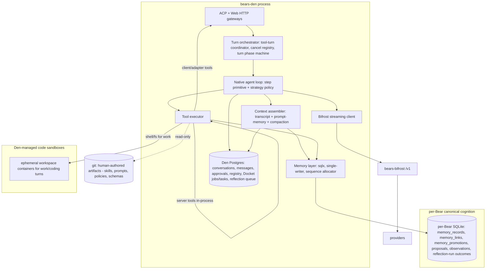

# Den-Native Runtime (Target Architecture)

**Status:** Target architecture (direction set 2026-06). Supersedes the Letta-backed runtime described in older architecture and roadmap docs.

This document is the canonical description of the **post-Letta** Bear Den runtime. It is the architecture source of truth that the migration plan in [`../roadmap/DEN_NATIVE_RUNTIME_PLAN.md`](../roadmap/DEN_NATIVE_RUNTIME_PLAN.md) drives toward.

It rests on three decisions:

- [ADR-0031 — SQLite-first canonical store for Bear memory](../decisions/adr-0031-sqlite-first-canonical-store-for-bear-agent-memory-and-tasks.md)
- [ADR-0033 — Model tasks layer](../decisions/adr-0033-model-tasks-layer.md)
- [ADR-0034 — Jobs and tasks work-management (Docket)](../decisions/adr-0034-jobs-and-tasks-work-management.md)

## Why this exists (the direction change)

The earlier plan converged on a clean trait seam (`RuntimeTurnBackend` / `RuntimeCancellationBackend` / `RuntimeConversationBackend`) whose only implementation was Letta. That seam is a faithful re-model of Letta's HTTP **process boundary** — it enshrines "Den control plane + Letta execution process," a split that only ever existed because we built on Letta, an external project.

The target removes that split entirely. There is **no Letta server, no Letta Code SDK, no Codepool harness process, and no git-backed MemFS memory sidecar**. Den runs a single, native, in-process agent loop for every role, talks directly to Bifrost for inference, and stores all Bear memory/cognition in per-Bear SQLite. The runtime is no longer pluggable "for optionality": the native loop *is* the runtime.

## Guiding principles

- **One agent loop, in-process, for every role.** The Letta-era "harness-backed (`chat`/`work` via Codepool/Letta Code) vs API-direct (`pair`/`review`/`watch`)" distinction is deleted. Roles differ only by **capability profile**: tool roster, memory scope, approval/autonomy policy, and whether they get a code sandbox.
- **One loop primitive, patterns as policy.** The step (assemble context -> stream model -> execute tools -> persist) is the primitive. Reasoning "patterns" are a thin, data-driven **strategy policy** over it, not forked runtimes. See [Loop strategies](#loop-strategies).
- **A turn is a Tokio task owned by Den**, not an HTTP call to another service. Cancellation is a `CancellationToken`, not external run-ids.
- **Den owns conversation identity, message/context state, approvals, and compaction.** No conversation "materialization", no run-ids, no approval-deny recovery, no synthetic `TurnCompleted`.
- **Bifrost is the inference substrate** (OpenAI-compatible), called directly by Den.
- **Bear memory and cognition is canonical in per-Bear SQLite** (ADR-0031). The git MemFS sidecar is removed; git is retained only for human-authored artifacts.
- **Tasks/jobs are not Bear memory.** They are Docket-canonical in Den Postgres (ADR-0034). The bear/Den boundary is drawn at memory, not tasks.

## Target architecture

## Concurrency model

- **Turn = a spawned async task.** At most one active turn per (bear, role, channel), enforced by the existing tool-turn coordinator.
- **Cancellation = `CancellationToken` / `watch`.** Letta `run_ids` and `POST /messages/cancel` are dropped.
- **Tool calls:** server tools run in-process; client/adapter tools become obligations awaited on a `oneshot`; shell/fs tools for `work` run in a Den-managed sandbox.
- **Approvals:** a turn pauses awaiting a Den-stored decision and resumes the same in-process task. This replaces Letta's `requires_approval` stop_reason plus deny/cleanup recovery.
- **Streaming:** the loop yields semantic events directly into the existing SSE mapper; the Letta-SSE byte reparse is deleted.

## Storage boundary: Bear cognition vs Den control plane

This is the most important conceptual line in the target, and it is not "content vs records." Per-Bear SQLite already holds *operational* records (the promotion/review audit trail and the change-tracking sequence). The real boundary is:

- **Bear cognition -> per-Bear SQLite** (canonical, via `sqlx`): role-local + shared/promoted memory, references, memory proposals, watch observations, promotion/curate decisions and audit, and reflection-run **outcome** records. This is the durable record of what the Bear knows and how it decided to know it.
- **Control-plane infrastructure the Bear plugs into -> Den Postgres**: conversations/transcript, approvals, the role-runtime registry, **Docket** jobs/tasks (ADR-0034), and the reflection **scheduler/queue**.

The metaphor (from ADR-0034): a Bear *uses* Den's schedulers and trackers the way a person uses a project tracker. The tracker is infrastructure, not part of the Bear.

### The reflection-run split

A reflection run has two natures, so it is split across the boundary rather than forced wholly into one store:

- The **scheduler/queue** (trigger, claim, status, timing; the global multi-Bear index) stays control-plane in **Den Postgres**.
- The **canonical run record + its outcomes** (proposals considered, curate decisions) live in **per-Bear SQLite**, next to `memory_promotions`, as one self-contained cognition graph (run -> proposals -> promotions).

The Postgres queue row references the SQLite run id; once a run completes, Postgres retains only ephemeral scheduling state. The only cross-store link is a single id pointer on a transient queue row — never an audit-graph seam.

**Cross-store discipline:** control plane references cognition by id only. There is no content sync seam between Postgres and SQLite.

## Memory model under SQLite

Per ADR-0031, canonical memory is append-only records, not a markdown file tree:

- `memory_records` (append-only; `scope_type` `role_local`|`shared`, `scope_role`, `kind`, `entity_ref`, `content_text`, `supersedes_memory_id`, `visibility`), `memory_links`, `memory_promotions`, plus a Bear-wide monotonic **sequence allocator** for replay/export/"what changed since X".
- Operational defaults: `PRAGMA journal_mode=WAL`, `synchronous=NORMAL`, `busy_timeout=5000`; a single logical write path (dedicated `SqlitePool`, `max_connections(1)`).
- **Logical-path projection.** The Bear-facing memory model (the `core/` and role-branch anchor tree from [`memory-model.md`](memory-model.md), e.g. `core/work_surfaces/<slug>/architecture.md`) is preserved as a projection: a logical path maps to (`scope_type`, `scope_role`, `work_surface_ref`, `kind`). `memory_browse`/`memory_read` keep their stable-anchor UX over rows instead of files. The file tree is a view, not the store.

### Git's remaining role

Git is retained **only** for human-authored artifacts: skills documentation, prompts, policies, schema definitions/migrations, design artifacts, tests/fixtures, and optionally exported curated summaries. It is no longer canonical for any live machine-written Bear memory.

### Semantic retrieval

Letta Archives are removed with Letta. Semantic recall, if needed, is a Den-owned derived index over the SQLite canonical sources — not a separate source of truth and (per repo policy) not a justification for a new general-purpose vector store.

## Loop strategies

Most "agent patterns" (Plan & Solve, Reflexion, Reflection, REWOO, STORM, LATS, LLM Compiler) are compositions over a tool-calling step, not separate runtimes. ReAct is the substrate the others build on. We expose the high-value ones as a small fixed set of composable knobs over the single loop:

- `plan?` — decompose before executing. Largely already realized by **Docket**: a job's task tree *is* the plan, and `work` executes beads one turn each (ADR-0034). Interactive planning is pair plan-mode. No in-loop planner is needed for job work.
- `reflect_on_fail?` — Reflexion-style retry. Realized by Docket `command` acceptance criteria (e.g. `cargo test` exits 0): on failure, write a reflection note to per-Bear SQLite memory and re-dispatch the run. The episodic failure memory is the SQLite store.
- `critique?` — an optional post-step critique/revise pass (Reflection) for quality-sensitive turns.
- `fanout_n` — multi-perspective/exploration (STORM, best-of-N, LATS-lite) as **Docket child task runs / spawned subagent turns**, reusing the turn=task concurrency model and its observability — not an in-loop tree/DAG engine.

**Selection is data-driven** via the [ADR-0033](../decisions/adr-0033-model-tasks-layer.md) model-tasks policy layer, which already maps task `difficulty`/`effort_hint` to model + effort. The same mapping emits a `strategy_profile` keyed on signals already stored: job category, `task.kind` (`execution | investigation | decision`), difficulty, and whether `command` criteria exist. "Code job -> reflect-on-fail; research job -> fan-out" is a policy row, not branching runtimes.

**Explicitly deferred** (high complexity, narrow gain, very high call cost): true LATS tree search and LLM Compiler DAG engines. We do **not** build a pluggable "agent-pattern" framework; that would re-introduce the speculative abstraction this migration exists to delete.

## Role model and provisioning

- A per-role "agent" becomes a **Den-owned runtime profile**: a compiled system prompt + model + tool roster + memory scope + approval policy + sandbox flag. There is no external agent create/patch/recompile/drift.
- `bears.letta_agent_id` is deprecated; role identity is a Den-native binding. Letta provisioning, drift detection, and Letta tool-catalog resolution are removed. The model catalog comes from Bifrost's model list.

## What this supersedes

- The "Den -> Letta Code -> Letta" and Codepool `bear_channel` runtime paths.
- The harness-backed vs API-direct role split.
- MemFS/git as canonical for live Bear memory, and "Letta-native memory only / no Den memory store."
- The MemFS file-based task pipeline (`chat/tasks` -> `core/tasks` -> `work/results`) for human-initiated work, replaced by Docket (ADR-0034).
- Decisions written against the Letta-backed model (notably ADR-0005, ADR-0013, ADR-0014, and the MemFS/Letta-Archives assumptions in ADR-0021/0022) are superseded by ADR-0031/0033/0034 on the points above.

## Related documents

- Migration plan and phasing: [`../roadmap/DEN_NATIVE_RUNTIME_PLAN.md`](../roadmap/DEN_NATIVE_RUNTIME_PLAN.md)
- Memory model (Bear-facing): [`memory-model.md`](memory-model.md)
- Historical Letta dependency inventory: [`letta-dependency-matrix.md`](letta-dependency-matrix.md)
- Data backfill/rollback: [`../roadmap/den-migration-backfill-and-rollback-plan.md`](../roadmap/den-migration-backfill-and-rollback-plan.md)
