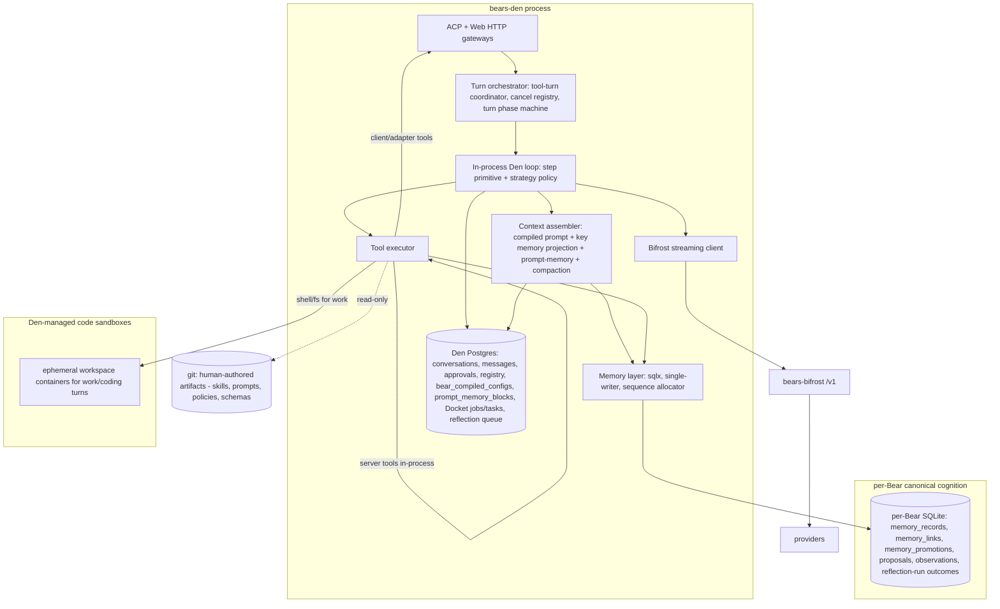

# Den Runtime

**Status:** Canonical runtime architecture.

This document is the architecture source of truth for the live Bear Den runtime model.

The file path retains the historical `den-native-runtime.md` name for link compatibility, but the preferred architecture term is **Den runtime** or **in-process Den runtime**, not "native runtime".

It rests on these decisions:

- [ADR-0031 — SQLite-first canonical store for Bear memory](../decisions/adr-0031-sqlite-first-canonical-store-for-bear-agent-memory-and-tasks.md)
- [ADR-0033 — Model tasks layer](../decisions/adr-0033-model-tasks-layer.md)
- [ADR-0034 — Jobs and tasks work-management (Docket)](../decisions/adr-0034-jobs-and-tasks-work-management.md)
- [ADR-0037 — Work sandbox, egress gateway, and upstream auth](../decisions/adr-0037-work-sandbox-egress-gateway-and-upstream-auth.md) — Phase 7 execution isolation and multi-identity GitHub policy
- [ADR-0043 — ACP is an edge adapter; the Den runtime is protocol-agnostic](../decisions/adr-0043-acp-as-edge-adapter-protocol-agnostic-core.md) — the runtime below owns turns/sessions/events under neutral names; ACP is one edge
- [ADR-0046 — File-backed prompt fragments and compiled runtime prompts](../decisions/adr-0046-file-backed-prompt-fragments-and-compiled-runtime-prompts.md) — repository-authored prompt fragments + runtime-authored compile-time-only prompt content compiled into hot-path prompt bases

## Why this architecture exists

The earlier plan converged on a clean trait seam (`RuntimeTurnBackend` / `RuntimeCancellationBackend` / `RuntimeConversationBackend`) whose only implementation was Letta. That seam is a faithful re-model of Letta's HTTP **process boundary** — it enshrines "Den control plane + Letta execution process," a split that only ever existed because we built on Letta, an external project.

The target removes that split entirely. There is **no Letta server, no Letta Code SDK, no Codepool harness process, and no git-backed MemFS memory sidecar**. Den runs a single in-process agent loop for every stance, talks directly to Bifrost for inference, and stores all Bear memory/cognition in per-Bear SQLite. The runtime is no longer pluggable "for optionality": the in-process Den loop *is* the runtime.

## Guiding principles

- **One agent loop, in-process, for every stance.** The Letta-era split between different runtime families is deleted. Stances differ only by **capability profile**: tool roster, memory scope, approval/autonomy policy, and whether they get a code sandbox.
- **One loop primitive, patterns as policy.** The step (assemble context -> stream model -> execute tools -> persist) is the primitive. Reasoning "patterns" are a thin, data-driven **strategy policy** over it, not forked runtimes. See [Loop strategies](#loop-strategies).
- **A turn is a Tokio task owned by Den**, not an HTTP call to another service. Cancellation is a `CancellationToken`, not external run-ids.
- **Den owns conversation identity, message/context state, approvals, and compaction.** No conversation "materialization", no run-ids, no approval-deny recovery, no synthetic `TurnCompleted`.
- **Tool exchanges must be replayable transcript state.** Tool requests/results that affect model behavior are first-class model-history artifacts: stable tool-call id, canonical tool name, typed arguments, matching result/error, and bounded output/summary. ACP/BearWire/web projections may render them differently, but no edge cache may be the only record of what tool ran or what happened.
- **Bifrost is the inference substrate** (OpenAI-compatible), called directly by Den.
- **The loop is protocol-agnostic; ACP is an edge adapter** ([ADR-0043](../decisions/adr-0043-acp-as-edge-adapter-protocol-agnostic-core.md)). The turn controller, tool-turn coordinator, session machinery, and semantic event stream are core organs of this loop — they carry neutral names and live in the runtime, not behind any wire protocol. ACP (like REST and the web UI) is a sibling adapter that projects the canonical BearWire semantic events ([ADR-0029](../decisions/adr-0029-den-structured-runtime-events.md)/[ADR-0030](../decisions/adr-0030-bearwire-resource-oriented-event-model.md)) to/from its wire format. The current `acp_*` naming inside `den-runtime` is historical drift that ADR-0043 corrects, not evidence those organs belong to ACP.
- **Bear memory and cognition is canonical in per-Bear SQLite** (ADR-0031). The git MemFS sidecar is removed; git is retained only for human-authored artifacts.
- **Tasks/jobs are not Bear memory.** They are Docket-canonical in Den Postgres (ADR-0034). The bear/Den boundary is drawn at memory, not tasks.

## Runtime architecture



## Concurrency model

- **Turn = a spawned async task.** At most one active turn per (bear, stance, channel), enforced by the existing tool-turn coordinator.
- **Cancellation = `CancellationToken` / `watch`.** Letta `run_ids` and `POST /messages/cancel` are dropped.
- **Tool calls:** server tools run in-process; client/adapter tools become obligations awaited on a `oneshot`; shell/fs tools for `work` run in a Den-managed sandbox.
- **Approvals:** a turn pauses awaiting a Den-stored decision and resumes the same in-process task. This replaces Letta's `requires_approval` stop_reason plus deny/cleanup recovery.
- **Streaming:** the loop yields semantic events directly into the existing SSE mapper; the Letta-SSE byte reparse is deleted.

## Storage boundary: Bear cognition vs Den control plane

This is the most important conceptual line in the target, and it is not "content vs records." Per-Bear SQLite already holds *operational* records (the promotion/review audit trail and the change-tracking sequence). The real boundary is:

- **Bear cognition -> per-Bear SQLite** (canonical, via `sqlx`): stance-local + shared/promoted memory, references, memory proposals, watch observations, promotion/curate decisions and audit, and reflection-run **outcome** records. This is the durable record of what the Bear knows and how it decided to know it.
- **Control-plane infrastructure the Bear plugs into -> Den Postgres**: conversations/transcript, approvals, the stance-runtime registry, **Docket** jobs/tasks (ADR-0034), and the reflection **scheduler/queue**.

The metaphor (from ADR-0034): a Bear *uses* Den's schedulers and trackers the way a person uses a project tracker. The tracker is infrastructure, not part of the Bear.

### The reflection-run split

A reflection run has two natures, so it is split across the boundary rather than forced wholly into one store:

- The **scheduler/queue** (trigger, claim, status, timing; the global multi-Bear index) stays control-plane in **Den Postgres**.
- The **canonical run record + its outcomes** (proposals considered, curate decisions) live in **per-Bear SQLite**, next to `memory_promotions`, as one self-contained cognition graph (run -> proposals -> promotions).

The Postgres queue row references the SQLite run id; once a run completes, Postgres retains only ephemeral scheduling state. The only cross-store link is a single id pointer on a transient queue row — never an audit-graph seam.

**Cross-store discipline:** control plane references cognition by id only. There is no content sync seam between Postgres and SQLite.

## Turn context assembly

Every turn builds **Turn Context** by projecting the Bear Operating Environment into a stance-appropriate slice. The assembler is Den-owned end-to-end; there is no provider-side prompt or memory injection.

### Layer 1 — Compiled system prompt (`bear_compiled_configs`)

For Bears with a managed `context_profile`, the **system message base** comes from **`bear_compiled_configs.rendered_prompts_json[profile]`** — the same materialized prompt Letta provisioning already uses via `profile_prompt_text`.

Compilation merges:

- published **`system_blocks`** (Den-global, versioned fragments such as `den_baseline`, `space_instruction.*`),
- per-Bear **`bear_block_bindings`** (`inherit` vs `custom` overrides),
- Bear-local **`context_profile`** fields (`user_steering`, `bear_context`, and stance-contract fallbacks).

Under [ADR-0046](../decisions/adr-0046-file-backed-prompt-fragments-and-compiled-runtime-prompts.md), this layer evolves into a **hybrid prompt source model**:

- **repository-authored fragments** live in Git as Markdown + YAML frontmatter and are loaded into a startup prompt registry,
- **runtime-authored prompt content** (for example Bear Admin-authored text) remains data-backed in Postgres,
- both source classes are normalized and compiled into `bear_compiled_configs`.

The architecture and rollout details live in [prompt-fragment-registry.md](prompt-fragment-registry.md) and the [Prompt Fragment Registry implementation plan](../roadmap/PROMPT_FRAGMENT_REGISTRY_IMPLEMENTATION_PLAN.md).

The row is written by `compile_and_store_managed_config_for_bear` and keyed by `config_hash` / per-stance `rendered_prompt_hashes_json` for drift checks on stance bindings (`bear_profile_bindings` during the compatibility migration).

**Target invariant:** the native agent loop **must** read compiled prompts from `bear_compiled_configs`. It must **not** recompose prompts via `compose_role_context(..., resolved: None)`, which bypasses managed-block resolution and diverges from Letta-era behavior.

Additional invariant from ADR-0046: the turn hot path must not parse frontmatter, read prompt files from disk, or render runtime-authored database templates. Runtime-authored prompt content is compile-time-only; turn-time templating is reserved for explicitly approved repository-owned fragments.

Legacy Bears without `context_profile` continue to use `bears.system_prompt` until migrated.

Recompile triggers match provisioning today: bear create/update, managed-block binding changes, and reconcile when `context_profile` is present.

### Layer 2 — Key memory projection (SQLite)

Letta previously injected **persona/human-style blocks** every turn from provider-owned agent state. Under ADR-0031 that durable knowledge lives in **per-Bear SQLite**, but the model still needs a **bounded, proactive subset** in Turn Context — not the whole memory bank, and not only what tools retrieve mid-turn.

**Key memory projection** is Den’s deliberate selection of SQLite `memory_records` (and linked anchor summaries) to append after the compiled system prompt in a dedicated `# Projected memory` section, subject to a character/record budget.

This is distinct from:

| Mechanism | Purpose |
|-----------|------|
| **Compiled system prompt** | Identity, stance contract, operator steering — from `bear_compiled_configs` |
| **Prompt memory blocks** | Editable in-context state in Den Postgres — session/work-surface/stance scoped ([prompt-memory contract](den-prompt-memory-block-contract.md)) |
| **Key memory projection** | Read-only proactive slice of **canonical SQLite memory** (path anchors) |
| **Derived recall** | Vector search over chunked passages ([ADR-0038](../decisions/adr-0038-platform-embedding-standard-and-derived-recall-index.md)); bounded turn-start + hybrid `memory_search` |
| **`memory_search` / `memory_read` tools** | On-demand retrieval; `memory_search` becomes hybrid when Qdrant is configured |

#### v1 selection policy (locked)

Projection follows the **work-surface-first** precedence in [`memory-model.md`](memory-model.md), stays stance-scoped, and remains small enough for every turn. Implementation lives in the context assembler (`core/agent_loop/`), reading through the memory store manager — not ad hoc in gateways.

**Tiers** (ordered; stop when the global character budget is exhausted):

1. **Shared identity anchors** — latest-head `scope_type=shared` records at Bear-global anchor paths, in order: `core/bear-overview.md`, `core/bear-glossary.md`, `core/shared-conventions.md`. Include only `visibility=normal` in v1.
2. **Active work-surface anchors** — latest-head shared records at canonical surface paths for the primary work surface (see work-surface gating below): `core/work_surfaces/<slug>/index.md`, `overview.md`, `glossary.md`, `architecture.md`, `decisions.md`, `conventions.md`.
3. **Stance-local highlights** — latest-head `scope_type=role_local` records for the active stance; prefer rows with `work_surface_ref` matching the primary slug when tier 2 is active, otherwise recent Bear-global stance-local rows by `sequence_no`.
4. **Situation/session briefing** — optional short trusted briefing records when modeled (not transcript); at most one record in v1.

**Explicitly excluded from proactive projection** (tools or curate review only):

- raw unpromoted proposals and pending observations,
- full stance branches (`pair/` raw history for `work`, etc.),
- promotion/audit graphs and reflection-run machinery,
- Docket/task state (Postgres control plane),
- conversation transcript (separate message list),
- superseded record bodies and per-path history chains.

#### v1 budgets

Budgets are in **characters** (Den has no model tokenizer). Per-tier quotas apply inside a per-stance global cap:

| Profile | Global char cap |
|---------|-----------------|
| `pair`, `chat`, `work` | 8 000 |
| `curate` | 6 000 |
| `watch` | 4 000 |

| Tier | Max records | Per-record cap | Tier soft cap |
|------|-------------|----------------|---------------|
| 1 Shared identity | 4 | 1 500 | 3 000 |
| 2 Work-surface anchors | 6 | 1 200 | 3 500 |
| 3 Role-local highlights | 4 | 800 | 2 000 |
| 4 Situation briefing | 1 | 1 000 | 1 000 |

Assembly stops when the global cap is reached. Emit a `key_memory_projection` diagnostic (included paths/ids, omitted-by-budget, omitted-because-no-surface) alongside prompt-memory diagnostics where practical.

#### v1 supersede policy

**Latest head only** — no short history in proactive projection.

For each `logical_path`, or when `logical_path` is null each `(scope_type, scope_role, work_surface_ref, kind)` group, include at most one row: the current head (highest `sequence_no` among rows not superseded by a newer row). Chained history remains tool-mediated via `memory_read` / `memory_search`.

#### v1 work-surface gating

Primary slug selection uses the same session signals as tools today (`work_surface_candidate_slug`: `runtime_target`, then `conversation_selection`, then `workspace_roots`).

| `session_info.work_surface.status` | Tier 2 behavior |
|-----------------------------------|-----------------|
| `unresolved`, `ambiguous` | **Skip** tier 2 |
| `candidate` | Include tier 2 **only if** SQLite has at least one canonical anchor for the candidate slug (`core/work_surfaces/<slug>/index.md` or `overview.md`) |
| `resolved`, `confirmed` | Include tier 2 for that slug (full tier 2 quota) |

**Anchor-required for candidates:** a normalized workspace slug alone is not enough; tier 2 requires proof in canonical memory. This avoids projecting the wrong surface from weak session hints.

**Deferred (v1.1):** when conversation-persisted `primary_work_surface` lands ([work-surface resolution plan](../roadmap/WORK_SURFACE_RESOLUTION_IMPLEMENTATION_PLAN.md)), projection prefers **conversation binding → session slug → workspace roots**, with the same anchor-required rule for `candidate`.

#### v1 rendering

Keep compiled prompts hash-stable. Append projection as a separate block after `bear_compiled_configs.rendered_prompts_json[stance]`:

```text
<compiled stance prompt>

# Projected memory
## Shared anchors
…
## Work surface: <slug>    (omit section if tier 2 skipped)
…
## Stance highlights (<stance>)
…
## Situation                  (omit if empty)
…
```

Layer 3 supplements (prompt memory blocks, compaction, channel reminders) follow this block — see [prompt-memory contract](den-prompt-memory-block-contract.md).

#### v1 caching

Cache projection **per agent-loop turn** (one user prompt, multiple tool steps). Reuse across ReAct steps 1…N within the same `AgentLoopSession`.

**Cache key:** `(bear_id, stance, conversation_id, primary_surface_slug | None, sqlite_sequence_high_water, compiled_config_hash)` where `sqlite_sequence_high_water` is `MAX(sequence_no)` at build time.

**Invalidate when:** a new human message starts a turn, `sequence_high_water` advances, the primary surface slug changes, or the compiled config hash changes. Do not cache across conversations or Den restarts in v1.

### Layer 3 — Runtime supplements (per turn)

After compiled prompt + key memory projection, the assembler appends **turn-local** Den-owned supplements when applicable:

- **ACP / channel runtime context** — plan mode, workboard, trusted-session mode, tool-surface reminders (today’s `<system-reminder>` envelope for `pair`),
- **prompt memory blocks** — selected from `prompt_memory_blocks` for `(bear, stance, session, work_surfaces)`,
- **compaction envelope** — Den-owned transcript bounding artifacts.

These supplements remain distinct from the compiled prompt base even after file-backed prompt extraction. Repository-owned prompt fragments may contribute narrowly-scoped turn-time templated supplements (for example date or budget reminders), but runtime-authored prompt content remains pre-turn compiled.

Order target:

```text
system:  [compiled stance prompt]
       + [key memory projection — path anchors]
       + [derived recall — optional vector passages]
       + [runtime supplements: prompt-memory, compaction, channel reminders]
messages: [canonical transcript, including replayable tool calls/results] + [current user/tool step]
tools:    [merged Den + client descriptors]
```

See also [`agent-and-bear-environments.md`](agent-and-bear-environments.md) (Environment Projection → Turn Context).

For scenario-oriented examples of how these layers combine, see [Context Compilation Scenarios](context-compilation-scenarios.md).

## Memory model under SQLite

Per ADR-0031, canonical memory is append-only records, not a markdown file tree:

- `memory_records` (append-only; `scope_type` `role_local`|`shared`, `scope_role`, `kind`, `entity_ref`, `content_text`, `supersedes_memory_id`, `visibility`), `memory_links`, `memory_promotions`, plus a Bear-wide monotonic **sequence allocator** for replay/export/"what changed since X".
- Operational defaults: `PRAGMA journal_mode=WAL`, `synchronous=NORMAL`, `busy_timeout=5000`; a single logical write path (dedicated `SqlitePool`, `max_connections(1)`).
- **Logical-path projection.** The Bear-facing memory model (the `core/` and stance-branch anchor tree from [`memory-model.md`](memory-model.md), e.g. `core/work_surfaces/<slug>/architecture.md`) is preserved as a projection: a logical path maps to (`scope_type`, `scope_role`, `work_surface_ref`, `kind`). `memory_browse`/`memory_read` keep their stable-anchor UX over rows instead of files. The file tree is a view, not the store.

### Git's remaining place

Git is retained **only** for human-authored artifacts: skills documentation, prompts, policies, schema definitions/migrations, design artifacts, tests/fixtures, and optionally exported curated summaries. It is no longer canonical for any live machine-written Bear memory.

### Semantic retrieval (derived recall)

Letta Archives and Letta pgvector are removed with Letta. Semantic recall is a **Den-owned derived index** — not a second canonical memory store.

- **Platform embedding standard:** versioned contract shared by Bear memory and Cabinet ([ADR-0038](../decisions/adr-0038-platform-embedding-standard-and-derived-recall-index.md)); initial id `bears-embed-v1` (`text-embedding-3-small`, 1536d via Bifrost).
- **Vector store:** Qdrant collections named per embedding standard; passage metadata in Den Postgres; vectors are disposable (rebuild from SQLite / Cabinet sources).
- **Complements key memory projection:** anchors = fixed logical paths; recall = fuzzy / cross-corpus passages when policy allows.
- **Implementation:** [Derived recall index plan](../roadmap/DERIVED_RECALL_INDEX_IMPLEMENTATION_PLAN.md).

## Loop strategies

Most "agent patterns" (Plan & Solve, Reflexion, Reflection, REWOO, STORM, LATS, LLM Compiler) are compositions over a tool-calling step, not separate runtimes. ReAct is the substrate the others build on. We expose the high-value ones as a small fixed set of composable knobs over the single loop:

- `plan?` — decompose before executing. Largely already realized by **Docket**: a job's task tree *is* the plan, and `work` executes beads one turn each (ADR-0034). Interactive planning is pair plan-mode. No in-loop planner is needed for job work.
- `reflect_on_fail?` — Reflexion-style retry. Realized by Docket `command` acceptance criteria (e.g. `cargo test` exits 0): on failure, write a reflection note to per-Bear SQLite memory and re-dispatch the run. The episodic failure memory is the SQLite store.
- `critique?` — an optional post-step critique/revise pass (Reflection) for quality-sensitive turns.
- `fanout_n` — multi-perspective/exploration (STORM, best-of-N, LATS-lite) as **Docket child task runs / spawned subagent turns**, reusing the turn=task concurrency model and its observability — not an in-loop tree/DAG engine.

**Selection is data-driven** via the [ADR-0033](../decisions/adr-0033-model-tasks-layer.md) model-tasks policy layer, which already maps task `difficulty`/`effort_hint` to model + effort. The same mapping emits a `strategy_profile` keyed on signals already stored: job category, `task.kind` (`execution | investigation | decision`), difficulty, and whether `command` criteria exist. "Code job -> reflect-on-fail; research job -> fan-out" is a policy row, not branching runtimes.

**Explicitly deferred** (high complexity, narrow gain, very high call cost): true LATS tree search and LLM Compiler DAG engines. We do **not** build a pluggable "agent-pattern" framework; that would re-introduce the speculative abstraction this migration exists to delete.

## Stance model and provisioning

- A former per-role "agent" becomes a **Den-owned runtime stance**: **`bear_compiled_configs` system prompt** + **key memory projection policy** + model + tool roster + memory scope + approval policy + sandbox flag. There is no external agent create/patch/recompile/drift.
- Reconcile compares the stance binding `config_hash` (`bear_profile_bindings.config_hash` during the compatibility migration) to the current compiled prompt hash; the in-process Den runtime re-reads compiled prompts on each turn rather than caching stale text in an external agent.
- `bears.letta_agent_id` is deprecated; stance identity is a Den-owned binding. Letta provisioning, drift detection, and Letta tool-catalog resolution are removed. The model catalog comes from Bifrost's model list.

### Current gap (implementation)

Phase 3–4 native wiring now loads **`bear_compiled_configs`** via `profile_prompt_text` and projects **key memory** from per-Bear SQLite in the context assembler (`core/agent_loop/key_memory_projection.rs`) for all stances including `chat`. **Derived recall** (Qdrant + platform embedding standard, [ADR-0038](../decisions/adr-0038-platform-embedding-standard-and-derived-recall-index.md)) is wired for turn-start injection and hybrid `memory_search` when `QDRANT_URL` is set. Remaining parity gaps: conversation-persisted work-surface binding (v1.1), richer situation briefing records, and golden ACP traces validating end-to-end grounding.

## What this supersedes

- The "Den -> Letta Code -> Letta" and Codepool `bear_channel` runtime paths.
- The historical split between different stance runtime families.
- MemFS/git as canonical for live Bear memory, and "Letta-native memory only / no Den memory store."
- The MemFS file-based task pipeline (`chat/tasks` -> `core/tasks` -> `work/results`) for human-initiated work, replaced by Docket (ADR-0034).
- Decisions written against the Letta-backed model (notably ADR-0005, ADR-0013, ADR-0014, and the MemFS/Letta-Archives assumptions in ADR-0021/0022) are superseded by ADR-0031/0033/0034 on the points above.

## Related documents

- Migration plan and phasing: [`../roadmap/DEN_NATIVE_RUNTIME_PLAN.md`](../roadmap/DEN_NATIVE_RUNTIME_PLAN.md)
- Derived recall (Qdrant + embeddings): [ADR-0038](../decisions/adr-0038-platform-embedding-standard-and-derived-recall-index.md), [`../roadmap/DERIVED_RECALL_INDEX_IMPLEMENTATION_PLAN.md`](../roadmap/DERIVED_RECALL_INDEX_IMPLEMENTATION_PLAN.md)
- Bear package format (portable export/import): [`../guides/bear-package.md`](../guides/bear-package.md)
- Memory model (Bear-facing): [`memory-model.md`](memory-model.md)
- Historical Letta dependency inventory: [`letta-dependency-matrix.md`](letta-dependency-matrix.md)
- Historical backfill/rollback planning: [`../roadmap/den-migration-backfill-and-rollback-plan.md`](../roadmap/den-migration-backfill-and-rollback-plan.md) (production Phase 8 backfill retired)
