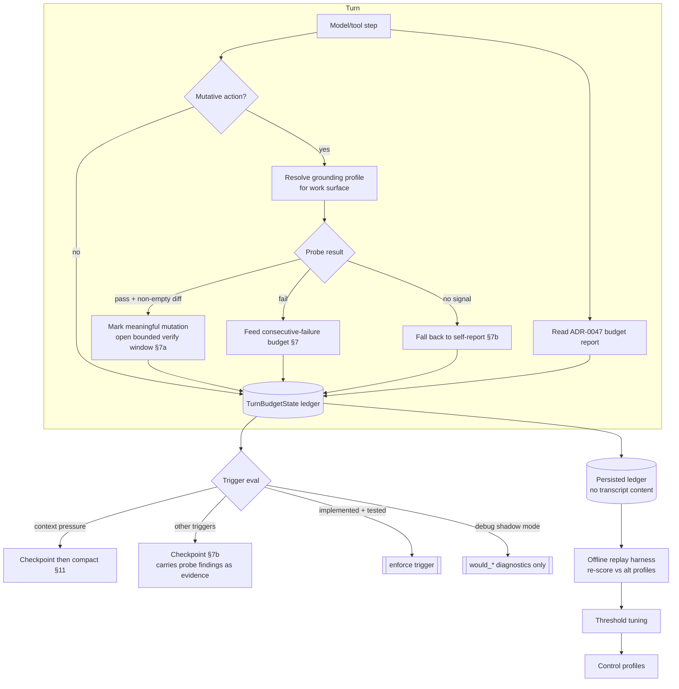

# Agent Loop Control — Grounding, Context Budget, and Tuning Plan

## Status

Planned. Implements the 2026-07-06 amendment to [ADR-0050 — Agent Loop Control, Adaptive Budgets, and Runtime Checkpoints](../decisions/adr-0050-agent-loop-control-adaptive-budgets-and-runtime-checkpoints.md) (§7c grounding probes, §11 context/token budget as a loop dimension, and the replayable ledger/tuning loop).

This plan is a **companion to** [AGENT_LOOP_CONTROL_IMPLEMENTATION_PLAN.md](AGENT_LOOP_CONTROL_IMPLEMENTATION_PLAN.md), which delivers the core control levels, governance/focused-Job inputs, profiles, budgets, ko/failure state, structured checkpoints, and client **Focus** projection. Read that plan first; this one adds three capabilities on top of it and keeps loop-control tuning measurable through replayable ledgers and Reflection assessments. Den is pre-release: staged development is sensible, but completed slices are active by default once tested rather than spending a long observe-only rollout period. Where the two plans overlap, the phase mapping is called out inline.

Depends on:

- [ADR-0006 — Bear work surfaces](../decisions/adr-0006-bear-work-surfaces.md) and [WORK_SURFACE_RESOLUTION_IMPLEMENTATION_PLAN.md](WORK_SURFACE_RESOLUTION_IMPLEMENTATION_PLAN.md) for surface kinds and anchors.
- [ADR-0047 — Context window budget](../decisions/adr-0047-context-window-budget-and-token-estimation.md) and [CONTEXT_WINDOW_BUDGET_IMPLEMENTATION_PLAN.md](CONTEXT_WINDOW_BUDGET_IMPLEMENTATION_PLAN.md) for the budget report object.
- [ADR-0032 — Den context compaction](../decisions/adr-0032-den-context-compaction-architecture.md) and [DEN_CONTEXT_COMPACTION_IMPLEMENTATION_PLAN.md](DEN_CONTEXT_COMPACTION_IMPLEMENTATION_PLAN.md) for compaction sequencing.
- [ADR-0018 — Reflection system](../decisions/adr-0018-reflection-system.md) and [ADR-0051 — Reflection performance assessments](../decisions/adr-0051-reflection-performance-assessments.md) for the `curate` assessment/tuning lanes in Part E.

## Goal

Make ADR-0050's adaptive loop control **grounded** (evidence, not self-report), **context-aware** (compaction is a loop decision, not a side channel), and **tunable** (a replayable ledger plus offline replay harness), so the policy's complexity is justified by measured behavior rather than intuition. A fourth, **deferred** capability (Part D) adds optional cheap-model classifier signals for the residual in-run judgment calls — strictly advisory and ledgered. A fifth (Part E) gives the tuning loop its **owner**: since a small, non-technical userbase has no maintainer to read ledgers, Reflection's `curate` role runs the [ADR-0051](../decisions/adr-0051-reflection-performance-assessments.md) `observe → assess → propose → apply` pipeline — producing longitudinal performance assessments (valuable on their own) and, under governance, proposing per-model profile deltas.

## Why this plan exists

Comparative review against OpenCode, Cursor, Letta Code, and Claude Code surfaced three gaps in the original ADR-0050:

1. **No policy-requested environment-grounded feedback.** OpenCode feeds LSP diagnostics back after each edit; ADR-0050 checkpoints relied on model self-report. We want policy-triggered grounding without assuming every Bear works on code or probing every mutation.
2. **Context budget lived outside the controller.** Claude Code treats compaction as loop control; ADR-0050 deferred it to ADR-0047 as a "future extension," so the two most important end-of-turn behaviors (checkpoint, compact) could not coordinate.
3. **Best-when-tuned, but no tuning machinery.** The typed design shines fine-tuned, yet Bear Den is a personal project with no eval platform. Without automated measurement the complexity is unjustified.

## Core invariants (in addition to the base plan's)

1. **Grounding probes are validators, never mutators or LLM reviewers.** A probe answers an objective question the work surface can answer about itself. It must not edit the surface and must not be an LLM "is this good?" pass.
2. **No probe, no problem.** A surface kind with no declared grounding profile degrades to §7b self-report plus the generic non-empty-diff/parse floor. The runtime never fabricates a probe for a surface that has none.
3. **Probes are budgeted and time-bounded.** A probe that errors or times out yields `NoSignal`, never a turn failure, and its spend counts against normal tool-class budgets.
4. **Context budget is read, not recomputed.** The loop controller consumes the ADR-0047 budget report; it does not re-implement tokenization.
5. **Checkpoint-then-compact is a preference, not an invariant.** When the window is too tight to afford a checkpoint turn, compaction runs first.
6. **Completed slices are active by default.** Debug/kill switches are acceptable during development, but Den is pre-release; normal delivery should not depend on long observe-only rollout periods. Ko, focused-`work` requirements, trust/permission gates, and the emergency hard-step fuse are always enforced.
7. **The ledger is replayable without model calls.** Persist typed signals, not transcript content, so any recorded turn can be re-scored against alternative profiles offline and cheaply.

## Conceptual model



---

## Part A — Surface-declared grounding probes (ADR-0050 §7c)

Builds on the base plan's Phase 4 (checkpoint trigger state, tool classification) and Phase 5 (checkpoint request/response, `evidence_refs`).

### A1 — Grounding profile types and resolution

Suggested types:

```rust
pub enum WorkSurfaceKind {
    Repository,
    Document,
    MediaMetadata,
    StructuredData,
    Other(String),
}

pub struct GroundingProfile {
    pub surface_kind: WorkSurfaceKind,
    pub probes: Vec<GroundingProbeSpec>, // ordered, cheap-first
}

pub struct GroundingProbeSpec {
    pub id: ProbeId,
    pub kind: GroundingProbeKind,   // Diagnostics | TypeCheck | Lint | TestSubset | SchemaValidate | ParseRoundTrip | NonEmptyDiff ...
    pub timeout_ms: u32,
    pub tool_class: ToolClass,      // budgeted like any other spend
    pub mutates: bool,              // must be false; validated at registration
}

pub enum GroundingSignal {
    Pass { findings: Vec<GroundingFinding> },  // may still carry warnings
    Fail { findings: Vec<GroundingFinding> },
    NoSignal { reason: NoSignalReason },       // timeout | error | no-probe | surface-unresolved
}
```

| Task | Done when |
| --- | --- |
| Define grounding types | Profile, probe spec, and signal types are typed and serializable. |
| Enforce non-mutation at registration | A probe with `mutates = true` is rejected; probes cannot be file-writing tools. |
| Resolve profile from surface metadata | Given a resolved work surface (ADR-0006 anchors), the runtime resolves its grounding profile or an empty profile. |
| Provide generic floor | Every surface, including `Other`, has the non-empty-diff/parse floor available. |
| Add tests | Repository, document, media, and no-profile surfaces resolve deterministically. |

**Exit gate:** grounding profiles resolve per surface without executing anything.

### A2 — Policy-requested probe execution

Grounding probes are not an unconditional post-mutation hook. The controller executes them only when requested by the resolved loop-control profile, checkpoint policy, or explicit verification/task criteria. A mutative step may therefore produce no probe if current policy does not need one.

| Task | Done when |
| --- | --- |
| Gate probe execution through policy | After a relevant event, the controller asks the resolved policy whether a grounding probe is required before running the surface's ordered probes. |
| Budget and time-bound probes | Probe spend counts against tool-class budgets; a probe exceeding `timeout_ms` yields `NoSignal`, not a hang. |
| Never fail the turn on probe error | Probe crash/timeout degrades to `NoSignal` with a reason; the turn continues. |
| Emit probe diagnostics | Runtime emits `grounding_probe_result` diagnostics with probe id, signal, duration, and requesting policy reason. |
| Add tests | Not-requested, passing, failing, timeout, error, and no-probe paths each produce the correct signal without turn failure. |

**Exit gate:** probes run only when policy requests them, are bounded, and produce typed signals with zero turn-failure risk.

### A3 — Wire grounding into §7a replenishment and §7b checkpoints

| Task | Done when |
| --- | --- |
| Arbitrate meaningful mutation when requested | When policy requests a probe, a `Pass` over a non-empty diff marks the mutation meaningful and opens the bounded §7a verification window; a `Fail` does not, and feeds §7 consecutive-failure state instead. |
| Guard against no-op windows | A no-op/empty-diff mutation never earns a fresh exploration window regardless of probe outcome. |
| Attach findings as checkpoint evidence | Checkpoint requests (base plan Phase 5) carry recent `GroundingFinding`s as `evidence_refs`. |
| Fall back cleanly | `NoSignal` reverts §7a to prior heuristic behavior and §7b to self-report only. |
| Add tests | Replenishment fires only on requested `Pass`+non-empty diff; checkpoint requests include probe evidence when present. |

**Exit gate:** grounding can arbitrate "meaningful mutation" and enrich checkpoint synthesis when policy requests it, degrading safely where absent or not requested.

### A4 — Initial probe sets

| Task | Done when |
| --- | --- |
| Repository probes | At minimum: non-empty diff, plus one language diagnostic/type check available in the current sandbox (e.g. `cargo check` / `tsc`), behind capability detection. |
| Generic floor | Non-empty-diff and parse/open checks work for any surface. |
| Document probes (stretch) | Prose/link/frontmatter validators registered for the document surface kind. |
| Media probes (stretch) | Parse round-trip and required-field checks for the media-metadata kind. |
| Add tests | Repository and generic floor covered; document/media behind feature flags. |

**Exit gate:** repository + generic grounding usable in real runs; other surfaces incrementally added.

---

## Part B — Context/token budget as a loop dimension (ADR-0050 §11)

Extends the base plan's Phase 3 (budget integration) and Phase 7 (checkpoint enforcement).

### B1 — Consume the ADR-0047 budget report in TurnBudgetState

| Task | Done when |
| --- | --- |
| Add context dimension to ledger | `TurnBudgetState` stores the latest ADR-0047 budget snapshot (total, reserve, precision, over/near flags). |
| Add level-tuned context thresholds | Control profiles carry near-budget/low-budget context thresholds; `careful`/`strict` trip earlier than `light`. |
| Evaluate context alongside other triggers | Low-remaining-context is evaluated in the same trigger pass as ko/failure/wall-clock. |
| Respect precision labeling | Approximate estimates widen safety margins; diagnostics record precision. |
| Add tests | Context near/low thresholds fire per level; approximate estimates behave conservatively. |

**Exit gate:** context pressure is a first-class trigger evaluated in the controller, with enforcement active once the trigger implementation is tested.

### B2 — Checkpoint-then-compact sequencing

| Task | Done when |
| --- | --- |
| Sequence checkpoint before compaction | On context-pressure checkpoint, the controller requests a checkpoint (base plan Phase 5/7) before invoking compaction. |
| Seed compaction from checkpoint | The structured checkpoint response is passed to compaction (ADR-0032) as the summary seed. |
| Handle critical pressure | When the window cannot afford a checkpoint turn, compaction runs first and the checkpoint is deferred; ordering never exhausts the window. |
| Keep compaction subordinate | Compaction mutates neither task-list/Docket state nor conversation history semantics. |
| Add tests | Normal pressure → checkpoint-then-compact; critical pressure → compact-first; seed is used by the compactor. |

**Exit gate:** compaction is a coordinated loop-control action seeded by forced synthesis.

---

## Part C — Ledger persistence and offline tuning

Tightens the base plan's Phase 11 into a measurable, single-maintainer loop. This is the prerequisite that justifies the whole policy's complexity. It is not a long observe-only rollout plan: Den is pre-release, so completed trigger classes should enforce by default once tested. Debug shadow/observe modes are still useful for development and replay comparison.

### C1 — Active-by-default trigger implementation

| Task | Done when |
| --- | --- |
| Add debug shadow mode per trigger class | A development-only `observe`/shadow setting can emit `would_stop` / `would_checkpoint` diagnostics for comparison, but normal pre-release behavior is enforce-once-tested. |
| Enforce completed triggers | Each trigger class enforces when its implementation and tests land; ko, focused-`work` requirements, trust/permission gates, and emergency fuse are always enforced. |
| Wire all launch levels | `light`, `standard`, `careful`, and `strict` are available; product defaults choose `standard`/`careful`/strict gates as defined in the base plan. |
| Add diagnostics | Every decision is logged with reason, threshold, profile source, and observed ledger values. |
| Add tests | Enforced trigger classes act; debug shadow mode does not alter behavior; always-on floors cannot be disabled. |

**Exit gate:** the controller can enforce implemented trigger classes in normal pre-release runs while still producing replayable diagnostics.

### C2 — Persisted replayable ledger

Preferred shape:

```text
bear_loop_ledger_turns
- id uuid primary key
- run_id text not null
- turn_id text not null
- stance text not null
- resolved_level text not null
- resolved_source text not null
- profile_hash text not null          -- which thresholds were in effect
- events jsonb not null               -- ordered typed signals, NO transcript content
- context_snapshots jsonb not null    -- ADR-0047 budget snapshots over the turn
- grounding_signals jsonb not null    -- probe outcomes over the turn
- outcome text not null               -- completed | stopped_ko | stopped_fuse | stopped_advisory_would | error
- outcome_label text nullable         -- heuristic: likely_false_positive | likely_false_negative | ok | unknown
- created_at timestamptz not null
```

`events` entries are typed signals only — tool signature hash, tool class, timestamp, failure flag, gate-rejection signature, checkpoint-would markers — never assistant/user text.

| Task | Done when |
| --- | --- |
| Add ledger schema/service | Per-turn ledgers persist with typed events and no transcript content. |
| Capture context + grounding | ADR-0047 snapshots and probe outcomes are recorded per turn. |
| Record profile hash | Each turn records which thresholds were in effect for fair replay comparison. |
| Privacy check | No transcript, no file contents, no user text lands in the ledger. |
| Add tests | Ledger round-trips; a recorded turn contains enough to re-score triggers. |

**Exit gate:** every real turn produces a compact, transcript-free record sufficient for offline scoring.

### C3 — Offline replay harness

| Task | Done when |
| --- | --- |
| Build replay entrypoint | A CLI/test tool re-scores persisted turns against an arbitrary control profile with zero model calls. |
| Report counterfactuals | Output answers "would profile X have stopped/checkpointed this turn, and how much earlier/later?" across a run corpus. |
| Diff profiles | The harness compares two profiles over the same corpus (stop rate, checkpoint rate, over/under-cut counts). |
| Add fixtures | A small corpus of recorded turns (thrash, productive-long, failure-loop, gate-loop, context-pressure) is checked in. |
| Add tests | Replay is deterministic and model-call-free; known fixtures produce expected counterfactuals. |

**Exit gate:** thresholds can be tuned against recorded reality without spending tokens.

### C4 — Heuristic outcome labeling

| Task | Done when |
| --- | --- |
| Label likely false positives | A stop (or `would_stop`) immediately followed by user "continue"/re-ask is labeled `likely_false_positive`. |
| Label likely false negatives | A normal end after a long read-only tail with no mutation is labeled `likely_false_negative`. |
| Feed labels to replay | The harness reports label rates per profile so tuning has a target signal. |
| Keep labels advisory | Labels are heuristics for trend lines, never authoritative outcome truth. |
| Add tests | Labeling rules fire on constructed transcripts; labels surface in replay summaries. |

**Exit gate:** a tuning trend line exists without human annotation.

### C5 — Threshold tuning criteria

Replay over the accumulated corpus should tune trigger thresholds after they land:

| Trigger class | Tune using |
| --- | --- |
| Over-exploration checkpoint | correlation with `likely_false_negative` tails, probe-`Pass` density, and false-positive rate |
| Consecutive-failure stop | whether stops precede abandoned/re-asked runs and avoid productive-run cuts |
| Task-gate rejection escalation | repeated identical gate-rejection signatures and successful reconciliation rates |
| Low-context checkpoint | whether context-pressure checkpoints precede compaction cleanly without cutting productive work |

| Task | Done when |
| --- | --- |
| Document target rates | Concrete false-positive/false-negative targets per trigger class are recorded here and in run diagnostics. |
| Wire profile updates | Threshold changes are profile/config updates, not rollout toggles. |
| Add tests | Profile changes alter thresholds deterministically; ko/fuse floors remain always-on. |

**Exit gate:** enforcement stays active while thresholds are tuned from evidence rather than intuition.

---

## Part D — Optional cheap-model classifier signals (ADR-0050 §7d, deferred)

A cheap model may supply **classifier signals** for the residual judgment calls the deterministic signals (base plan) and objective grounding probes (Part A) cannot make. This is deliberately the **last** part to land: it depends on the advisory + ledger + replay foundation from Part C, and it must never become an authoritative overseer. Classification, not evaluation; advisory, not authoritative; ledgered, not ephemeral.

### D1 — Classifier signal source and typed verdicts

Suggested types:

```rust
pub enum ClassifierSignalKind {
    TaskGateIntent,      // legitimate blocked/N-A/waived vs evasion (§6a)
    SemanticKo,          // near-duplicate churn missed by normalized-signature ko (§6)
    NoProbeCoherence,    // coherence check where §7c declares no objective probe
    CheckpointAdherence, // did the checkpoint commit to a different next action, or narrate? (§7b)
}

pub struct ClassifierVerdict {
    pub kind: ClassifierSignalKind,
    pub label: String,        // typed per kind, e.g. Evasion | Legitimate | Duplicate | Distinct
    pub confidence: f32,
    pub model_handle: String, // which cheap model produced it
    pub latency_ms: u32,
    pub bounded_to: TriggerBoundary, // checkpoint | gate_rejection | no_probe_mutation
}
```

| Task | Done when |
| --- | --- |
| Define verdict types | Classifier kinds and verdicts are typed and serializable. |
| Bound invocation to triggers | The classifier runs only at defined trigger boundaries, never per step. |
| Budget the classifier | Classifier calls count against a dedicated small budget with a hard cap per turn. |
| Degrade on failure | Classifier timeout/error yields "no verdict," never a turn failure or a stop. |
| Add tests | Each kind produces a typed verdict; invocation is bounded; failure degrades cleanly. |

**Exit gate:** classifier verdicts exist as typed, bounded, fail-safe signals.

### D2 — Advisory-only wiring and ledgered replay

| Task | Done when |
| --- | --- |
| Feed verdicts as advisory signals | A verdict may raise a checkpoint or a `would_stop` diagnostic; it never overrules deterministic budget/ko/failure or vetoes an action. |
| Record verdicts in the ledger | Every verdict that influences a decision is persisted in `bear_loop_ledger_turns.events` as a typed signal. |
| Preserve zero-model-call replay | Offline replay (C3) reads recorded verdicts; it never re-invokes the classifier. A verdict that cannot be recorded cannot gate behavior. |
| Guard against correctness review | The classifier is never invoked to judge correctness of the primary model's work; that path routes to grounding probes (Part A). |
| Add tests | Verdicts are advisory only; replay is deterministic with recorded verdicts; no correctness-evaluation path exists. |

**Exit gate:** classifier signals strengthen the advisory layer while replayability and the deterministic-authority boundary stay intact.

### D3 — Graduation (advisory classifier → enforcing trigger)

Same discipline as C5: a classifier-derived trigger enforces only when replay over recorded verdicts shows it improves outcomes.

| Task | Done when |
| --- | --- |
| Score classifier value in replay | Replay reports whether classifier-flagged turns correlate with `likely_false_negative`/abandonment better than deterministic signals alone. |
| Calibrate confidence thresholds | A per-kind confidence floor is chosen from recorded verdicts, not guessed. |
| Promote per kind | Each classifier kind graduates independently; none is on by default. |
| Add tests | Promotion is per-kind; unpromoted kinds stay advisory; ko/fuse remain the only always-on stops. |

**Exit gate:** cheap-model classification enforces only where recorded evidence supports it, per kind.

---

## Part E — `curate` assessment and tuning lanes (ADR-0051)

Parts A–D produce evidence and in-run signals; they do not decide *who* learns from runs and adjusts model profiles over time. For a small, non-technical userbase there is no maintainer to read ledgers, so that owner is Reflection's `curate` role. This part implements the [ADR-0051](../decisions/adr-0051-reflection-performance-assessments.md) pipeline on top of the Part C foundation:

```text
observe  →  assess  →  propose  →  apply
(Parts A–D)  (E1–E2)    (E3)       (E4, governed)
```

`assess` is separable from and prerequisite to `propose`; it has standalone longitudinal value and lands first. `apply` inherits ADR-0018's High-risk governance for behavior-changing adaptation. The hard safety floor (ko, emergency fuse) is never tuned.

### E1 — Assessment records and scopes

Suggested types:

```rust
pub enum AssessmentScope { Run, Session, Model }

pub struct PerformanceAssessment {
    pub id: AssessmentId,
    pub scope: AssessmentScope,
    pub subject: AssessmentSubject,     // bear/role/model handle(s)
    pub profile_hash: String,           // control profile in effect
    pub dimensions: Vec<DimensionScore>,// churn, recovery, grounding, efficiency, outcome-label ...
    pub confidence: f32,
    pub sample: SampleContext,          // n, window, floor-met?
    pub evidence_refs: Vec<LedgerRef>,  // into bear_loop_ledger_turns
    pub produced_by: AssessmentSource,  // lane + optional classifier model handle
    pub created_at: DateTime<Utc>,
}
```

| Task | Done when |
| --- | --- |
| Define assessment types | Scope, dimensions, confidence, sample context, and evidence refs are typed and serializable. |
| Reuse Reflection tables | Assessments use ADR-0018 shared run/event tables plus a lane-specific assessment table, not a bespoke store. |
| Enforce model-invisibility | Assessments are never injected into model context, task-list/Docket state, or conversation history by default. |
| Make assessments reproducible | An assessment can be recomputed from the referenced ledger evidence. |
| Add tests | Run/session assessments round-trip; model-invisibility and reproducibility are covered. |

**Exit gate:** typed, reproducible, model-invisible assessment records exist.

### E2 — Assessment lane (`introspection` extension)

| Task | Done when |
| --- | --- |
| Consume ledger/replay | The lane reads `bear_loop_ledger_turns` (and the replay harness) to score runs and sessions offline, model-call-free where possible. |
| Emit run + session assessments | Runs and sessions are assessed on the typed dimensions. |
| Roll up model assessments | Model-scoped assessments are derived from run/session records with an explicit sample floor and confidence function. |
| Encode thin-data discipline | Below the sample floor, model assessments report low confidence rather than a firm conclusion; under-cutting is weighted at least as heavily as over-running. |
| Budget the lane | The lane runs under Reflection budgets/cadence per ADR-0018. |
| Add tests | Sparse-data cases report low confidence; rollups honor the floor; scoring is deterministic given the ledger. |

**Exit gate:** `curate` produces longitudinal assessments with honest confidence — valuable even with no tuning attached.

### E3 — Tuning lane: proposals (`skill_review` sibling)

| Task | Done when |
| --- | --- |
| Generate proposals from assessments | A tuning proposal recommends a bounded per-model profile delta and cites the assessments justifying it. |
| Gate on confidence | Low-confidence assessments cannot justify a proposal. |
| Exclude the safety floor | Proposals can adjust advisory thresholds only; ko and emergency fuse are off-limits. |
| Keep proposals inert | A proposal changes nothing until accepted/applied. |
| Add tests | Proposal requires citing assessments above the confidence floor; proposals never touch the safety floor. |

**Exit gate:** proposals exist as governed, inert recommendations grounded in assessments.

### E4 — Tuning lane: apply (`skill_apply` sibling, governed)

| Task | Done when |
| --- | --- |
| Version profiles | Control profiles are versioned and reversible; every applied delta is auditable. |
| Bound the envelope | An applied delta is small and within a configured envelope; large deltas require escalation. |
| Escalate to human review | Low-confidence or large-delta proposals route to ADR-0018 `human_review_escalation` rather than auto-applying. |
| Scope registry vs override | Model-registry (shared) changes are more conservative and more escalation-prone than per-Bear/per-stance overrides. |
| Add tests | Apply is reversible; envelope and escalation thresholds hold; registry-level changes require stricter gates. |

**Exit gate:** learned tuning can change behavior only within a bounded, reversible, governed envelope.

---

## Delivery order

1. **Ledger + enforcement diagnostics** (C1–C2): persist replayable ledgers while enforcing completed trigger classes by default.
2. **Replay + labels** (C3–C4): stand up offline scoring and heuristic labels over the growing corpus.
3. **Context dimension** (B1): add context pressure as an enforced trigger once tested.
4. **Grounding, repository + floor** (A1–A3, A4 repository): arbitrate §7a and enrich checkpoint evidence.
5. **Threshold tuning** (C5): tune consecutive-failure, over-exploration, task-gate, and context thresholds from replay.
6. **Checkpoint-then-compact** (B2): coordinate compaction with checkpoints.
7. **Additional grounding surfaces** (A4 document/media) and level refinements as evidence accrues.
8. **Assessment lane** (E1–E2): `curate` produces run/session/model assessments from the ledger — standalone longitudinal value. Can start as early as replay (step 2) is usable.
9. **Cheap-model classifier signals** (D1–D2, advisory): only after replay is mature; feed verdicts as advisory signals, ledgered.
10. **Classifier-backed trigger tuning** (D3): tune/promote per kind where recorded verdicts show value, while preserving deterministic authority.
11. **Tuning proposals** (E3): turn assessments into inert, cited per-model profile deltas.
12. **Governed apply** (E4): bounded, reversible, escalation-gated application of accepted proposals.

## Validation matrix

| Area | Required tests |
| --- | --- |
| Grounding types | non-mutation enforced, deterministic profile resolution, generic floor present |
| Probe execution | pass/fail/timeout/error/no-probe all typed, budgeted, never fail the turn |
| Grounding wiring | replenishment only on pass+non-empty diff; failing probe feeds failure budget; findings attached to checkpoints |
| Context dimension | near/low thresholds per level; approximate estimates conservative |
| Checkpoint-then-compact | normal → checkpoint-then-compact; critical → compact-first; seed used |
| Advisory mode | observe never stops except ko/fuse; enforce acts; per-trigger toggles |
| Ledger | transcript-free, replay-sufficient, profile-hash recorded |
| Replay harness | deterministic, zero model calls, correct counterfactuals on fixtures |
| Labeling | false-positive/false-negative rules fire; labels surface in replay |
| Graduation | per-class promotion independent; ko/fuse always enforced |
| Classifier signals | bounded to trigger points, budgeted, fail-safe; advisory only; never evaluates correctness |
| Classifier replay | verdicts recorded in ledger; replay reads recorded verdicts with zero model calls; unrecordable verdict cannot gate |
| Assessments | run/session round-trip; model-invisible; reproducible from ledger; sparse data → low confidence, not firm conclusions |
| Tuning proposals | require cited assessments above confidence floor; never touch ko/fuse; inert until applied |
| Governed apply | reversible/versioned; envelope + escalation enforced; registry changes stricter than per-Bear overrides |

## First implementation slice

The safest first slice is Part C's foundation, because it is the measurement machinery everything else is justified by:

1. add the `bear_loop_ledger_turns` schema/service (transcript-free);
2. run the existing/base loop controller in `observe` mode, emitting `would_*` diagnostics;
3. record ADR-0047 context snapshots per turn (read-only consumption, no new triggers yet);
4. build the offline replay harness with a small checked-in fixture corpus;
5. add heuristic outcome labeling.

This produces a working tuning loop before any new enforcement, grounding, or compaction behavior changes how Bears actually run — which is exactly the guarantee the ADR-0050 amendment asks for.
