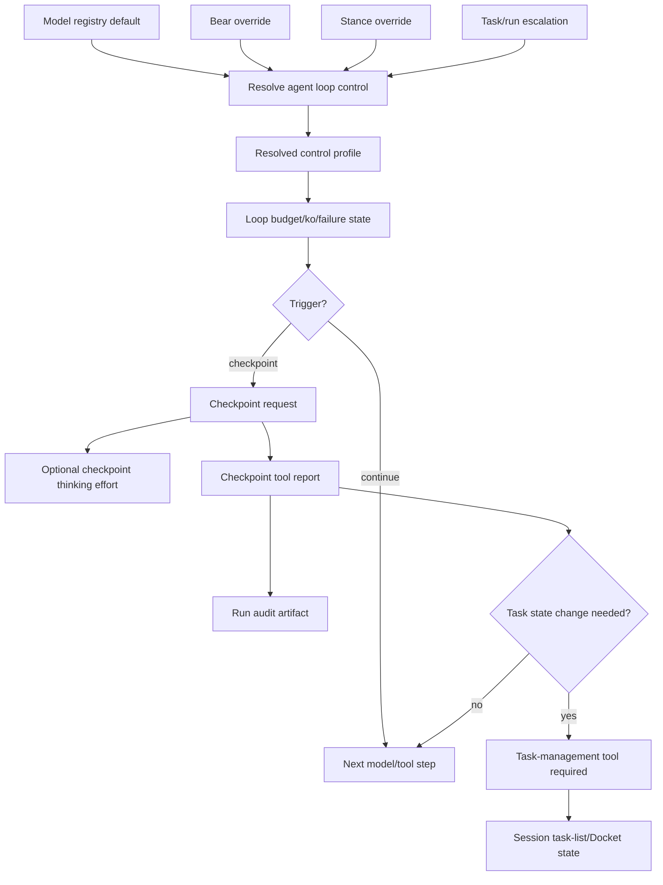

# Agent Loop Control Implementation Plan

## Status

In progress. Implements [ADR-0050 — Agent Loop Control, Adaptive Budgets, and Runtime Checkpoints](../decisions/adr-0050-agent-loop-control-adaptive-budgets-and-runtime-checkpoints.md), and depends on the task-list/Docket boundaries in [ADR-0045](../decisions/adr-0045-session-task-lists-and-docket-checkout.md) and [ADR-0034](../decisions/adr-0034-jobs-and-tasks-work-management.md). The runtime state axes and required invariants live in [Den state machine inventory](../architecture/den-state-machine-inventory.md); loop-control work that changes focus, orientation, completion, obligations, budgets, or governance must update that inventory in the same change.

> **Companion plan (2026-07-06, revised 2026-07-13):** [AGENT_LOOP_CONTROL_GROUNDING_AND_TUNING_PLAN.md](AGENT_LOOP_CONTROL_GROUNDING_AND_TUNING_PLAN.md) delivers the ADR-0050 amendment — surface-declared grounding probes (§7c), context/token budget as a loop dimension (§11), and a persisted replayable ledger/offline tuning harness. Because Den is still pre-release, development is staged but completed loop-control slices are active by default once tested; feature flags and long observation-only rollout periods are not the normal delivery mechanism. Land the companion plan's ledger foundation early; it is the measurement loop the rest of this plan is tuned against.

### Architecture revision — 2026-07-16

> **This revision supersedes the plan's prior product model of conversation-scoped “focused Jobs,” `/focus`, and `ResolvedFocus`.** Those sections describe implementation already present or underway, not the target architecture. Do not extend that model; migrate it deliberately.

The loop-control object is a **session current task**, not a focus mode:

```text
Session ── current task? ──► task-oriented loop behavior
Worker run ── explicit assignment ──► work-execution behavior
Docket Job ── optional durable outcome/task-tree container
```

- A Pair session has zero or one current task. It may be session-local or reference a task in an explicitly created Docket Job. Having a current task gives the session its objective; it neither creates a worker nor changes trust/permissions.
- A Work loop has a bounded, explicit assignment. Its authority to execute and settle applies to that assignment, not to whichever task Pair happens to have current.
- A Docket Job is for explicitly requested durable planning/tracking, journals, recovery, delivery contracts, or isolated background execution. Do not create one merely to give Pair ordinary work.
- **Pair works its current task directly by default.** A future local `delegate_task` creates a separate local subagent loop for a bounded child task. Its first version is read-only until Den has workspace/path reservation for concurrent mutation.
- Docket `dispatch_work` is isolated-sandbox execution only. Remove its public `local` target and all defaults/UX that treat local execution as Docket dispatch.
- Delegation and dispatch are explicit and do not alter Pair's current task. Pair should not create Jobs or dispatch them unless the user requests durable tracking, a plan/workstream, or background execution.

Migration requirements:

1. Replace `ConversationSnapshot.durable_focus_pointer` and `ResolvedFocus` with a resolved `current_task` model that can represent a session-local task or a Docket task reference.
2. Replace client-facing Focus/Focused UI and `/focus` with current-task projection and task assignment/clear actions. Do not retain a distinct “Focused” permission/mode.
3. Bind every WorkRun to an explicit Docket Job task or bounded task subtree. Work execution requires that assignment, not conversation focus.
4. Preserve existing focus records only as migration input/compatibility state; they must not remain a second canonical continuation authority.
5. Update the state-machine inventory, prompts, tool surfaces, diagnostics, and tests in the same implementation slice. A task's current/assigned state—not cached prompts or task-list projections—is the sole continuation input.

### Current implementation status — 2026-07-15

Recent slices have moved the plan through the governance/focus/orientation foundation and through the first replayable measurement spine. We are intentionally stopping short of a full policy simulator; the current replay layer is a transcript-free comparison/summary harness for tuning real recorded decisions. Broad policy-driven enforcement is still future work:

- **Phase 2 / 2a partially complete:** runtime sessions carry governance, session info exposes governance/orientation/focus snapshots, final-gate continuations now mark governance as `autonomous_continuation`, and `work` stance is rejected before model invocation unless objective orientation is `focused`.
- **Phase 2a focus persistence is intentionally minimal:** the current durable focus source is the conversation-linked Docket execution session (`docket_execution_sessions`) restored by live session id, ACP/client session id, then conversation id. Do not add a separate conversation-focus table unless we need history labels, explicit clear reasons, multi-job focus stacks, or richer title provenance.
- **Phase 2b minimal UX is live:** armature has `/focus <job_id>` for exact UUID focus through the existing `execute_job` path, and runtime clears Docket focus on session mode changes. Search/matching and elicitation remain deferred UX work. Chat/runtime tool surfaces still need a first-class focus affordance if the assistant is expected to request focus for the current session without relying on an armature slash command.
- **Phase 2c mostly complete for orientation/focus boundaries:** runtime has objective-orientation-derived prompt/session diagnostics and derives task snapshots from orientation. Focused work takes precedence where wired, closed freeform no longer exposes or server-executes task-definition/delegation tools when `may_define_task = false`, and server-side `create_task`/`update_task` enforce oriented child count/depth caps plus immutable-focused decomposition rejection. Budget-profile differences are still incomplete.
- **Diagnostics/history improved:** armature `/status` shows runtime focus/orientation/governance, Docket task create/update events include task definitions, focus selection is logged as a lightweight Docket job event, BearWire conversation history surfaces focus/task-definition diagnostics including focused task titles, and persisted objective-orientation events are projected into conversation surface history.
- **Checkpoint protocol is enforced enough for normal development:** runtime can request structured `checkpoint` tool calls with typed next-action fields, and enforce mode now requires a pending checkpoint to be answered through the checkpoint tool before another non-checkpoint tool call or final answer. The assistant-text/fenced-JSON fallback path has been removed. Artifact retention is still future work.
- **Replay/measurement spine landed at the useful-minimum level:** the companion plan's transcript-free `bear_loop_control_ledger` exists and records checkpoint requests, context-budget pressure decisions, and grounding-probe results with typed metadata/evidence refs. Runtime now has pure replay helpers for typed decision observations, per-turn aggregates, expected-turn/profile comparisons, profile summaries, DB-backed `run_id -> profile summary` loading, profile-level reason counts, turn-level reason comparison, and checkpoint profile fingerprints. No full policy simulator is planned unless real tuning needs outgrow these comparisons.
- **Context budget is integrated as the first real loop budget dimension:** latest ADR-0047 context-budget reports are carried in `TurnBudgetState`, near/over-budget pressure can be written to the ledger, near-budget pressure emits a loop-control diagnostic, and active overflow recovery attempts emergency compaction before stopping an over-budget model call. Low-budget checkpoint gating now distinguishes real budget-pressure warnings from KO/failure warnings. Code review currently supports deferring checkpoint-before-growth until recorded evidence shows compact-first behavior is insufficient.
- **Grounding probes are integrated at the generic MVP level:** mutation-like tool results now produce grounding-probe decisions tied to tool-call evidence refs, and failed probe signals prevent mutation replenishment/checkpoint reset. Tool-observation lookup now requires matching tool-call attribution instead of falling back to an ambiguous run-level probe signal. The MVP producer deliberately uses tool status/error-shaped content; stronger read-after-write or diff probes should be added only for surfaces where recorded runs show this is too weak.
- **Initial checkpoint/KO tuning has started from live recorded behavior:** light/standard exploratory-read checkpoint cadence has been relaxed to reduce noisy `over_exploration` checkpoints during bounded roadmap-directed investigation, checkpoint decisions now persist a stable profile fingerprint for profile-aware tuning, while careful/strict profiles, failure thresholds, same-signature KO thresholds, and hard-stop paths remain unchanged.

### Implementation review and adjustments

- Prefer **events over new state tables** for diagnostics. Focus and task-definition history fit well as existing Docket events; orientation transitions should use an existing conversation/BearWire event stream or similarly lightweight log rather than a new heavy table.
- Keep **durable focus** and **diagnostic history** separate. The current Docket execution-session record can remain the focus source of truth; event logs explain how focus/orientation changed over time.
- Treat `/focus` matching as a UX layer, not a runtime primitive. Exact-id focus is enough for now; empty `/focus` may use current-conversation Job association before falling back to recent Jobs. Broader fuzzy search and elicitation should be added only after the projection/clear/title semantics are stable.
- Do not build a generic `FocusTarget`. The implementation experience still supports the existing constraint: durable focus is a Docket Job; task focus is derived and ephemeral.
- Keep broad budget enforcement behind the replay/tuning spine. The ledger/replay slices are now in place; next budget/checkpoint changes should either be replayable through the existing summary/comparison helpers or recorded as typed loop-control decisions.
- Reconcile this plan with the grounding/tuning companion before Phase 3/4 enforcement. Context-pressure and grounding signals now have ledger hooks and enough replay support to compare observed behavior against expected decision/profile shapes. Prefer those small comparisons over building a speculative policy simulator.

Recommended next slices:

1. **Evaluate the latest checkpoint/KO tuning against recorded ledger summaries.** Checkpoint responses are authoritative in enforce mode, light/standard exploratory cadence has been relaxed, KO warnings are surfaced to model context, low-budget checkpointing now ignores non-budget warning codes, and checkpoint decisions carry profile fingerprints. Next compare recorded reason distributions/profile summaries after those changes before moving thresholds again.
2. **Refine context-budget policy with recorded evidence.** Add checkpoint-before-growth only where ledger/replay summaries show emergency compact-first behavior is insufficient; current code review supports deferring another context policy layer.
3. **Strengthen grounding probes only where attribution-backed runs show the MVP is too weak.** Tool-observation lookup now requires tool-call attribution, so the next probe slice should be surface-specific rather than another generic fallback.
4. **Only add more replay machinery when a concrete tuning question needs it.** The current no-simulator harness has profile reason counts, turn-level reason comparison, and profile fingerprints. Avoid a full policy simulator unless production traces prove summaries/comparators are too weak.

### Roadmap item — collapse state authority dimensions

The current [Den state machine inventory](../architecture/den-state-machine-inventory.md) is deliberately explicit, but several axes should be simplified before loop-control enforcement grows more complicated. The goal is not one giant enum; it is fewer canonical owners and more derived projections.

Target canonical runtime objects:

1. **`ActorContext`** is the resolved actor/access input for the run: Bear identity, user membership/access, and trust profile. It is not a derivation engine: membership may constrain authority, but must not silently change trust profile, and trust profile must not imply user access.
2. **`ConversationSnapshot`** owns durable conversation inputs captured for the turn/run, including model-selection snapshot and the durable focus pointer. Ordinary policy decisions use the snapshot; mid-run changes enter through typed transitions rather than ad hoc row reads.
3. **`TurnAuthority`** is the compiled authority view for a turn. It consumes trust/profile defaults, governance, session permission mode, workplan/approval state, armature capabilities, and tool descriptors, then produces mutation/execution gates, allowed tool classes, and approval requirements. Governance remains a run-supervision input; `TurnAuthority` owns only the derived permission surface.
4. **`ResolvedFocus`** is the only focus input to completion policy. It may include Docket task state only after resolving the current durable focus pointer. Cached task lists, prompt diagnostics, and session-local task projections may inform display/model context, but cannot become focus or force continuation.
5. **`TurnRunState`** owns lifecycle plus active wait reason. Waiting states should structurally carry their obligation handles. Terminal transitions should close/cancel open obligations transactionally and idempotently so late results are ignored by construction; retrying terminalization must not reopen obligations, schedule another continuation, or change a previously settled terminal outcome except through an explicit recovery transition.
6. **`RunControl`** owns budgets, checkpoint state, failure/KO counters, retry policy, and recovery disposition. It may decide or record recovery, but lifecycle changes still occur through `TurnRunState`, and recovery must not mutate focus or authority except via explicit typed transitions.

Derivation direction is one-way:

```text
ActorContext
ConversationSnapshot
Session/client capability snapshot
Docket/workplan state
Tool descriptors
Governance
        │
        ▼
TurnAuthority ───────► tool routing / prompt authority block / client projection

ConversationSnapshot.current_task
        │
        ▼
ResolvedSessionTask ──► Pair completion policy / task-orientation prompt projection

WorkRun.assignment
        │
        ▼
ResolvedWorkAssignment ► Work completion policy / execution prompt projection

TurnRunState + obligations
        │
        ▼
continuation / wait / terminal behavior

RunControl
        │
        ▼
budget / checkpoint / retry decisions
```

Projections do not feed back into authority. A cached task-list projection cannot itself be a current-task or assignment source; at most it can be reused as a display/cache optimization after identity/version checks against the canonical record.

Demote these from state authorities to projections/caches or owned subrecords:

- active-task display, derived from `ResolvedSessionTask` or `ResolvedWorkAssignment` plus task state;
- cached task lists and operational-status labels;
- prompt/context/compaction state, as prompt projection over canonical runtime objects;
- model choice as an input/capability snapshot, not an authority source;
- work surface/sandbox state, owned by Docket `WorkRun` rather than Pair's current task;
- standalone recovery state, folded into `RunControl`.

Do not collapse these boundaries:

- trust profile vs governance;
- session current task vs Work assignment vs work surface;
- authority vs prompt/client labels;
- user membership/access vs trust profile.

Anti-goals:

- do not introduce a monolithic `EffectiveTurnState` object that every subsystem mutates;
- do not make prompt/client labels canonical state;
- do not let cached projections participate in completion or permission decisions;
- do not make model selection, compaction, title updates, or current-task display updates authority sources;
- do not collapse trust profile into governance or governance into permission mode.

Implementation slices:

| Slice | Done when |
| --- | --- |
| Introduce authority compiler seam | Tool routing, prompt assembly, and client projection all consume the same `TurnAuthority` result for write/mutation decisions, and no separate prompt/client/session-mode path can independently expand allowed tool classes. |
| Make current-task completion input explicit | Completion policy accepts the resolved session current task or Work assignment only. Cached task-list projections are not accepted by the completion API and cannot manufacture continuation state. |
| Reify wait reasons in turn-run state | Waiting `TurnRunState` variants carry obligation ids, and terminal transitions reject or close open obligations transactionally and idempotently. |
| Move work-surface ownership to WorkRun | Sandbox/workspace/branch state is resolved through Docket work execution records, not the Pair session task. |
| Demote projection-only axes | Prompt, compaction, client labels, and cached task lists cannot create current tasks, assignments, permissions, obligations, or governance. |
| Update inventory/tests | The state-machine inventory documents the reduced authority model and keeps seam tests for stale current-task/assignment records, submitted plans, terminal obligations, late results, and projection-only state. |

Exit gate: a turn's mutation authority, task-driven continuation, and active obligations each have exactly one canonical owner, with projections unable to expand authority or manufacture work.

## Goal

Give Den a typed **agent loop control** layer that governs tool-using turns across model calls and tool results: when to continue, checkpoint, retry, warn, stop, escalate thinking effort, or require task-state reconciliation.

The implementation must make Bear runs more efficient and auditable without letting runtime checkpoint prose become task state, memory, or ordinary conversation history.

## Scope

In scope:

- progressive agent loop control levels (`light`, `standard`, `careful`, `strict`),
- governance as the continuation-pressure input (`interactive`, `grace`, `autonomous_continuation`, `observational`, `frozen`),
- session current tasks and explicit Work assignments as objective inputs for continuation,
- objective orientation as the current outcome state (`freeform`, `task_oriented`, `work_execution`),
- freeform task-definition policy that controls whether the model may be told it can define a task and leave freeform mode,
- model default control levels,
- Bear-level and stance-level overrides mirroring model selection,
- task/run escalation for risk, difficulty, or governance,
- profile-owned budgets, ko/failure thresholds, checkpoint triggers, and task-gate behavior,
- optional checkpoint-turn thinking-level escalation,
- structured checkpoint artifacts/events,
- audit-oriented checkpoint retention for `work` runs,
- explicit projection/replay/history boundaries.

Out of scope:

- replacing Docket task/job state with checkpoint artifacts,
- using checkpoint prose to satisfy task gates,
- free-form transcript parsing to detect loops,
- hardcoded per-model runtime behavior,
- verbose chain-of-thought capture,
- provider reasoning-stream persistence as conversation history.

## Core invariants

1. **Loop control is stance-wide, not focus-specific.** The same runtime regime governs freeform Pair work, task-oriented Pair work, and assigned Work execution. A current task or assignment supplies the objective; neither is a separate permissions or loop-control flavor.
2. **Runtime controls continuation; task tools control task state.** Checkpoints may identify that task state should change, but only `update_task_list`, `sync_task_list`, `checkout_task_list`, `request_task_list_handoff`, or Docket service APIs may mutate session task-list/Docket state.
3. **Checkpoints are structured artifacts, not informal prose.** A checkpoint report should arrive as a runtime-owned `checkpoint` tool call whose arguments are parsed into typed fields. Assistant prose/JSON fallback is degraded and never the primary control path.
4. **Checkpoint artifacts can be auditable without becoming Docket events.** `work` runs may retain checkpoint artifacts as run audit evidence, but Docket `bear_task_events`/`bear_job_events` remain the report-visible source of task progress, blockers, completion, and criteria evaluation.
5. **Checkpoint advice cannot expand authority.** Checkpoint reports are advisory inputs to runtime policy. They cannot expand budgets, reset stop conditions, bypass trust gates, or authorize actions the resolved loop-control profile disallows.
6. **Thinking effort is a quality knob, not a safety boundary.** Budget, ko, task-gate, and stop enforcement remain runtime-authoritative even if a provider ignores thinking-level metadata.
7. **Runtime code consumes resolved typed profiles.** Model names and provider quirks belong in registry/configuration; the runtime must not scatter model-name `match` arms.

## Conceptual model



## Phase 0 — Baseline inventory

**Goal:** identify current seams before changing behavior.

| Task | Done when |
| --- | --- |
| Inventory budget state | Existing `TurnBudgetPolicy`/ledger structures and enforcement points are documented. |
| Inventory model selection | The current model resolution precedence for system/Bear/stance/conversation is documented. |
| Inventory request metadata | The Bifrost/provider request path that can carry thinking/reasoning effort metadata is identified. |
| Inventory task gates | Current session task-list continuation gates and task-gate rejection handling are documented. |
| Inventory persistence | Conversation history, hidden model-visible records, BearWire events, Docket events, and run telemetry stores are distinguished. |

**Exit gate:** a short implementation note identifies exact files/modules for type definitions, resolver, request metadata, loop state, checkpoint artifacts, and projections.

## Phase 1 — Agent loop control types and profiles

**Goal:** introduce typed policy without changing runtime behavior.

Suggested types:

```rust
pub enum AgentLoopControlLevel {
    Light,
    Standard,
    Careful,
    Strict,
}

pub enum AgentLoopControlSource {
    ModelDefault,
    BearOverride,
    StanceOverride,
    TaskEscalation,
    SystemDefault,
}

pub struct ResolvedAgentLoopControl {
    pub level: AgentLoopControlLevel,
    pub source: AgentLoopControlSource,
    pub profile: AgentLoopControlProfile,
}

pub struct AgentLoopControlProfile {
    pub budget: TurnBudgetPolicy,
    pub ko: KoPolicy,
    pub checkpoints: CheckpointPolicy,
    pub task_gate: TaskGatePolicy,
    pub thinking: CheckpointThinkingPolicy,
}
```

| Task | Done when |
| --- | --- |
| Add level enum | Control levels are serialized with stable snake_case names. |
| Add policy structs | Budget, ko, checkpoint, task-gate, and thinking policy have typed structs. |
| Add default profiles | `light`, `standard`, `careful`, and `strict` resolve to deterministic profiles. |
| Add monotonic ordering | Runtime can compare/escalate levels without string matching. |
| Add unit tests | Default profile thresholds and ordering are covered. |

**Exit gate:** profiles are typed and testable, but not yet enforced.

## Phase 2 — Model defaults and Bear/stance overrides

**Goal:** resolve control level the same way model selection is resolved.

Resolution order:

1. model registry default,
2. Bear-level override,
3. stance-level override,
4. task/run escalation.

Task/run escalation may raise intensity, but should not silently downgrade operator-configured Bear/stance policy.

| Task | Done when |
| --- | --- |
| Extend model metadata | Model registry can expose default `agent_loop_control_level`. |
| Add Bear override storage | Bear config can set a default loop control level. |
| Add stance override storage | Stance/profile config can override for `pair`, `chat`, `work`, etc. |
| Implement resolver | Runtime receives `ResolvedAgentLoopControl`, including source and profile. |
| Add diagnostics | Run logs/progress include level, source, and profile summary. |
| Add tests | Model default, Bear override, stance override, unknown model fallback, and escalation precedence are covered. |

**Exit gate:** runs can resolve and report a control profile without behavior changes.

## Phase 2a — Governance and session-task inputs

**Goal:** make the loop controller consume explicit supervision and a session current task before enforcement uses them.

> **Superseded design note:** the focused-Job shapes below are retained only as an implementation-history reference. The target is the architecture revision at the top of this plan: `current_task`, not a generic focus subsystem.

Target shape:

```rust
pub struct LoopControlContext {
    pub governance: Governance,
    pub current_task: Option<ResolvedSessionTask>,
}
```

A Pair session's current task is session-scoped and may be local or Docket-backed. A Work run instead carries an explicit durable task/subtree assignment. Neither is inferred from a client mode, prompt text, or cached task-list projection.

| Task | Done when |
| --- | --- |
| Persist current session task | The conversation can durably store a current session-local task or Docket task reference and clear/replace it across turns and reconnects. |
| Project current task | Live sessions show the active task/objective, not a special Focused mode. |
| Snapshot task into Pair runs | Each Pair run receives governance and its resolved current task as `LoopControlContext`. |
| Bind Work assignment | Each WorkRun persists an explicit Job task or bounded task-subtree assignment; no Work run starts without one. |
| Enforce work assignment | A `work` run without an assignment is rejected before model-driving continuation begins. |
| Derive task behavior | Completion/orientation consume only the resolved current task or Work assignment, as appropriate. |
| Add diagnostics | Run diagnostics include governance, current-task or assignment refs, and derived next-action refs without hidden gate internals. |
| Add tests | Pair with no task remains freeform; Pair with a task remains Pair; a Work run without assignment is rejected; assigned Work resolves its assigned task. |

**Exit gate:** loop control has explicit governance and session-task/worker-assignment inputs, with no client-facing focus mode.

## Phase 2b — Client projection for current task

**Goal:** let clients show and change a session's current task without turning it into a permission preset or a Docket-only workflow.

Clients project an optional **current task** as the session objective. It is not a permissions mode, does not grant authority, and does not start a worker. The minimal operations are assign/replace and clear; task selection can initially use exact identifiers where a Docket task is involved.

A task-like user request may create a session-local current task as part of ordinary Pair work. Creating or attaching a Docket Job remains explicit: Pair asks before durable tracking or background dispatch unless the user already requested it.

When a current task exists:

- the client displays its title/objective;
- the conversation title may reflect the task with simple blocked/done fallbacks;
- clearing or replacing it changes only the session objective;
- no client mode change is necessary or meaningful.

| Task | Done when |
| --- | --- |
| Define current-task projection | BearWire/ACP can project an optional session current task. |
| Keep Den authoritative | Clients request assignment/clear; Den validates Docket references and owns persistence/projection. |
| Add current-task affordance | Chat/pair can assign, replace, or clear the current task without a slash-command focus workflow. |
| Preserve session-local tasks | Ordinary task-shaped work can persist across turns without creating a Job. |
| Ask before durable escalation | Job creation/attachment and Docket dispatch require an explicit user request or approval. |
| Update titles | Task-bearing conversations/sessions reflect the task title with blocked/done fallbacks. |
| Prevent permission laundering | A current task does not grant tools, approvals, memory access, or outbound auth beyond effective policy. |
| Add projection tests | Current task appears/clears/replaces consistently and never changes the permission mode. |

**Exit gate:** clients can show and manage a current task without a Focused mode or implicit durable Job creation.

## Phase 2c — Objective orientation and task-definition policy

**Goal:** derive loop behavior from the session current task or the Work run assignment without introducing a separate focus state.

Objective orientation answers one question: **what concrete task, if any, is this loop currently pursuing?** It is distinct from governance/trust. Orientation may change steering strength, budget/grace profiles, task affordances, and prompt construction, but it must never expand authority, approvals, memory access, outbound auth, or destructive-action permissions.

Use exactly three orientation states:

1. **`freeform`** — Pair has no current task. Budget/grace limits are strict. The model is chatting unless the freeform policy permits it to establish a session task.
2. **`task_oriented`** — Pair has a resolved current task, either session-local or Docket-backed. The loop prioritizes advancing that task. A Docket-backed task does not make the Job itself an orientation state.
3. **`work_execution`** — a Work run has a concrete assigned Docket task or bounded subtree. The worker may act only within that assignment and settles against it.

```rust
pub enum ObjectiveOrientation {
    Freeform { policy: FreeformPolicy },
    TaskOriented(TaskOrientation),
    WorkExecution(WorkAssignmentOrientation),
}

pub struct TaskOrientation {
    pub task_ref: ResolvedSessionTaskRef,
    pub child_policy: SessionTaskChildPolicy,
}

pub struct WorkAssignmentOrientation {
    pub assignment: WorkAssignmentRef,
}
```

Resolution is deterministic:

1. a Work run with a valid assignment resolves `work_execution`; a Work run without one is rejected before model invocation;
2. otherwise, a resolved session current task resolves `task_oriented`;
3. otherwise resolve `freeform` with the run's `FreeformPolicy`.

The freeform task-definition policy controls whether the model may establish a lightweight session task. It does **not** authorize Job creation, durable dispatch, or local delegation without the separate user-request/approval rules described above.

- `may_define_task: false`: do not expose task-definition or delegation affordances; defensively reject them.
- `may_define_task: true`: the model may establish a concrete session task with completion criteria when sustained work is needed. It works that task directly by default.

A future `delegate_task` may create a bounded child task and a separate local read-only loop. Docket dispatch requires an existing Job and is always isolated; it does not consume or change Pair's current task.

### Boundary with checkpoints

Orientation owns the current objective and the policies that follow from it. Checkpoints are interrupts: low budget, stalled progress, risk, ambiguity, or attempted scope expansion. They must not select a task, create a Job, or act as a second continuation authority. Checkpoint context includes the resolved task/assignment reference and policy violation details.

### BearWire / ACP plan projection

Clients project the current task or Work assignment as the visible plan objective. This is a projection, not an additional source of task state. For a task tree, show the current task and same-level siblings; do not flatten an entire Docket tree. Projection edits round-trip through the relevant session-task or Docket mutation path and never alter orientation as a side effect.

| Task | Done when |
| --- | --- |
| Add orientation types | Runtime has typed freeform, task-oriented, and work-execution orientation types. |
| Resolve orientation per run | Pair resolves from its current task; Work resolves only from its explicit assignment. |
| Keep freeform prompt gated | Prompt construction exposes session-task establishment only when `may_define_task` is true. |
| Defensively enforce policy | Runtime rejects task establishment/delegation attempts from closed freeform runs. |
| Preserve durable boundary | Job creation, Docket dispatch, and attachment remain user-requested/approved operations, not consequences of task orientation. |
| Apply orientation budget profiles | Freeform uses strict budget/grace; task-oriented and work-execution use separately tunable progressing profiles. |
| Preserve trust boundaries | Orientation never grants tools, approvals, memory access, outbound auth, or destructive-action permission. |
| Add diagnostics and tests | Cover Pair with/without a current task, session-local and Docket-backed tasks, assigned/unassigned Work, closed freeform, and no implicit durable escalation. |

**Exit gate:** loop control has one objective authority per loop: current task for Pair, assignment for Work.

## Phase 3 — Budget/ko/failure integration

**Goal:** initialize loop budgets from the resolved control profile.

| Task | Done when |
| --- | --- |
| Wire profile into turn state | Turn state owns the resolved profile and budget ledger. |
| Replace hardcoded thresholds | Existing budgets/ko/failure limits come from the resolved profile. |
| Preserve global fuses | Wall-clock, total tool calls, repeated failures, and emergency hard steps remain turn-global. |
| Preserve verification windows | Read/search replenishment after meaningful mutation remains small and verification-oriented. |
| Add tests | Budget initialization, ko cutoff, failure cutoff, and verification replenishment use resolved profile values. |

**Exit gate:** existing budget behavior is policy-driven, with no checkpoint enforcement yet.

## Phase 4 — Checkpoint trigger state

**Goal:** track loop-health signals needed for runtime checkpoints.

Suggested state:

```rust
pub struct CheckpointState {
    pub read_search_since_mutation: u32,
    pub consecutive_failures: u32,
    pub same_signature_repeat_count: u32,
    pub last_checkpoint_at_step: Option<u32>,
    pub pending_checkpoint: Option<CheckpointRequest>,
}

pub enum CheckpointReason {
    OverExploration,
    ConsecutiveFailure,
    SameSignatureNearKo,
    TaskGateRejection,
    LowBudget,
    PreRiskMutation,
}
```

| Task | Done when |
| --- | --- |
| Classify tool calls | Read/search, mutative, execute, destructive, and no-op/failure outcomes are typed. |
| Track exploration since mutation | Read/search counter increments and resets only on meaningful mutation. |
| Track failure and repeat signals | Consecutive failures and repeated signatures feed checkpoint state. |
| Track task-gate rejection | Gate rejection state can request a checkpoint before stronger stop behavior. |
| Add observe-only diagnostics | Runtime can emit `runtime_checkpoint_would_trigger` without forcing behavior. |
| Add tests | Each trigger reason fires under profile-specific thresholds. |

**Exit gate:** checkpoint triggers are observable and tested but may still run in observe-only mode.

## Phase 5 — Structured checkpoint request and checkpoint tool protocol

**Goal:** implement Option B as a typed runtime-owned `checkpoint` tool call rather than unstructured assistant prose or assistant text JSON.

A checkpoint request should include enough context to make the response auditable:

```rust
pub struct RuntimeCheckpointRequest {
    pub checkpoint_id: CheckpointId,
    pub run_id: String,
    pub reason: CheckpointReason,
    pub control_level: AgentLoopControlLevel,
    pub active_objective: Option<String>,
    pub task_context: Option<CheckpointTaskContext>,
    pub evidence_refs: Vec<CheckpointEvidenceRef>,
    pub required_fields: Vec<CheckpointField>,
}
```

The model-facing response should be a `checkpoint(...)` tool call. Suggested tool argument schema:

```rust
pub struct RuntimeCheckpointResponse {
    pub checkpoint_id: CheckpointId,
    pub active_objective: String,
    pub summary: Option<String>, // short prose synthesis for audit
    pub more_exploration_justified: bool,
    pub next_action: CheckpointNextAction,
    pub task_state_change_needed: Option<TaskStateChangeIntent>,
    pub evidence_refs: Vec<CheckpointEvidenceRef>,
    pub confidence: Option<CheckpointConfidence>,
}
```

Do not force learned facts and uncertainty into required JSON arrays. Keep model reasoning/prose separate; structure only the decision fields and a short audit summary.

`CheckpointNextAction` should be a typed enum, for example:

- `call_tool`,
- `edit`,
- `validate`,
- `update_task_list`,
- `sync_task_list`,
- `request_handoff`,
- `final_if_gate_allows`,
- `stop_blocked`.

`TaskStateChangeIntent` is **intent only**. It does not mutate task state.

| Task | Done when |
| --- | --- |
| Define request/report DTOs | `RuntimeCheckpointRequest` and `RuntimeCheckpointResponse` are typed and serializable; the response DTO is the `checkpoint` tool argument shape. |
| Add checkpoint ids | Every request/report pair has a stable id scoped to run/turn. |
| Add model instruction fragment | Runtime asks the model to call the `checkpoint` tool, not to answer with JSON text. |
| Parse response at boundary | Tool arguments are parsed once at the runtime boundary into typed structs. Assistant-text JSON is degraded fallback only. |
| Validate required fields | Missing/invalid checkpoint tool fields produce a typed recovery nudge/advisory result; hard failure is reserved for emergency fuses or unrecoverable protocol loops. |
| Add tests | Valid, missing-field, invalid-next-action, stale-checkpoint-id, and degraded assistant-text fallback cases are covered. |

**Exit gate:** the runtime can request and parse a structured checkpoint tool report, but it still does not mutate task state from it.

## Phase 6 — Checkpoint artifact retention and audit policy

**Goal:** make checkpoints useful for `work` run audit without polluting conversation history or Docket task events.

Checkpoint reports are artifacts, not status reports. They are durable audit/debug payloads attached to a run, not user-facing progress prose, conversation history, model replay context, or Docket task/job events.

Preferred final shape: store checkpoint request/response payloads through the artifact-ref system as artifact kind `runtime_checkpoint`, then attach them with generic artifact links:

```text
artifact_links
- artifact_ref
- subject_kind = run
- subject_id = run_id
- role = checkpoint
```

When useful for audit/query, the same checkpoint artifact may also be linked to the Docket Job, current task, or Work assignment with an evidence/audit role. These links are evidence references only; they do not mutate task state and do not imply completion, blockage, waiver, or cancellation.

Until artifact refs exist, a small temporary `bear_run_checkpoints` table is acceptable, but it should be shaped as a mechanical migration path to artifact refs rather than a competing permanent checkpoint store:

```text
bear_run_checkpoints
- id uuid primary key
- run_id text not null
- turn_id text nullable
- checkpoint_id text not null
- reason text not null
- control_level text not null
- request jsonb not null
- response jsonb nullable
- validation_status text not null -- requested | valid | invalid | superseded
- replay_policy text not null -- none by default
- related_task_list_id text nullable
- related_task_item_id text nullable
- related_docket_task_id uuid nullable
- future_artifact_ref text nullable
- created_at timestamptz not null
```

Retention rules:

- `pair` default: live/debug telemetry or short retention unless needed for recovery.
- `work` default: audit-retained `runtime_checkpoint` artifact linked to the run.
- Docket report-visible history still requires Docket/task events.
- Model replay uses only explicit replay policies, never raw checkpoint prose by default.

| Task | Done when |
| --- | --- |
| Add checkpoint artifact API | Runtime can persist request/response payloads by run id, preferably as `runtime_checkpoint` artifact refs. |
| Keep artifact outside Docket events | Checkpoints do not appear as `bear_task_events` or `bear_job_events`. |
| Add `work` audit retention | `work` runs retain valid checkpoint artifacts with task refs where available. |
| Add pair/chat retention policy | Interactive stances avoid durable clutter unless recovery policy requires it. |
| Add read API for audits | Operator tooling can inspect checkpoint artifacts for a run/job. |
| Add tests | Checkpoints are retained for `work`, not conversation history, not task events, and not model replay unless policy says so. |

**Exit gate:** structured checkpoints are auditable for `work` while preserving Docket/task boundaries.

## Phase 7 — Checkpoint enforcement in the loop

**Goal:** make checkpoint triggers affect continuation without making checkpoint advice authoritative.

Runtime enforcement is dominant. A checkpoint report may choose among actions still allowed by the resolved loop-control profile, but it cannot expand a budget, reset an exhausted stop condition, bypass a trust/task gate, or authorize a risky action that runtime policy disallows. Runtime may always downgrade a checkpoint recommendation to a safer action such as bounded retry, reconciliation, stop, or human/operator review.

This enforcement model is not focus-specific. The same control regime applies across a spectrum of objective orientation:

- **freeform**: broad interactive conversation with lighter task pressure and more grace;
- **task-oriented**: Pair has an explicit session-local or Docket-backed current task;
- **work execution**: a `work` stance run has an explicit assigned Docket task/subtree, no user-interaction path, and stricter pre-model gates.

Each point on the spectrum can tune freedom, grace, checkpoint thresholds, and reconciliation strictness through the resolved profile/governance, but the same runtime enforcement rules apply.

When a trigger fires:

1. runtime creates `RuntimeCheckpointRequest`,
2. optional checkpoint thinking policy is resolved,
3. next model inference should call the runtime-owned `checkpoint` tool before more exploration/risky action,
4. runtime validates the tool arguments and records an advisory/audit artifact,
5. runtime computes the effective next action from deterministic loop signals plus advisory `next_action`/task-gate state, with runtime policy winning conflicts.

| Task | Done when |
| --- | --- |
| Enforce over-exploration checkpoints | Read/search threshold forces checkpoint before more read/search; the checkpoint can justify only a bounded fresh window, not unlimited exploration. |
| Enforce failure checkpoints | Consecutive failures force checkpoint before retry; retry is allowed only if runtime policy still permits it. |
| Enforce same-signature checkpoint | Near-ko repeated signature forces different action or checkpoint; ko exhaustion still stops even if the checkpoint recommends retry. |
| Enforce task-gate checkpoint | First/repeated gate rejection can require checkpoint before stronger gate behavior; checkpoint advice cannot satisfy the gate without task/Docket evidence. |
| Enforce pre-risk checkpoint | `careful`/`strict` can require checkpoint before broad/destructive actions; checkpoint advice cannot bypass trust policy or permission requirements. |
| Reset checkpoint observation window | A valid or degraded checkpoint report clears only checkpoint-trigger counters, giving the model a bounded fresh read/search or recovery window without resetting authoritative budgets/ko/fuses. |
| Add loop tests | Simulated turns prove checkpoint tool calls are handled internally, invalid checkpoint reports degrade without killing the run, valid reports can require task-tool follow-through, checkpoint reports open a fresh checkpoint-observation window, and checkpoint advice never expands budget/stop authority. |

**Exit gate:** checkpoints are part of runtime continuation, not merely diagnostics, and a checkpoint report prevents immediate re-triggering of the same checkpoint while preserving budget/ko authority.

## Phase 8 — Model-task routing and reasoning effort

**Goal:** route loop-control model calls through the model tasks layer, with reasoning effort as one provider-neutral request-profile field.

Loop control classifies the call, but it does not select raw provider/model identifiers directly. For foreground agent-loop calls, it passes `agent_primary` step metadata such as `ordinary_turn`, `planning`, `task_selection`, `execution`, `checkpoint`, `pre_risk_review`, `summarization`, or `cheap_probe` to the model tasks layer. The model tasks layer resolves an approved `ModelRequestProfile` from the Bear model library, registry capabilities, loop-control policy, risk, budget, governance, and objective orientation.

Reasoning effort is one optional routing dimension, not a separate control path. Unsupported provider-specific thinking metadata degrades to diagnostics only; runtime enforcement remains dominant.

Bounded delegation is allowed only through approved symbolic model refs. Capable controller/checkpoint models may recommend delegating routine scoped work to weaker or cheaper models; weaker models may request escalation. Runtime/model-task policy validates model eligibility, scope, risk, tools/files, and budget before any route changes.

| Task | Done when |
| --- | --- |
| Add `agent_primary` step metadata | Loop-control calls can classify ordinary turns, planning, task selection, execution, checkpoints, pre-risk review, summaries, and cheap probes without new top-level task classes. |
| Resolve `ModelRequestProfile` through model tasks | Runtime receives approved model ref plus optional reasoning effort and request parameters; it does not branch on raw provider model names. |
| Add capability detection | Model/provider support for reasoning effort is known or safely treated as best-effort. |
| Add bounded delegation/escalation checks | Delegation targets are Bear-library and registry approved, scoped, risk-aware, budgeted, and audited. |
| Emit diagnostics | Run diagnostics include requested/resolved model profile, applied/skipped reasoning override, delegation/escalation reason, and provider support status. |
| Add tests | Routing uses model-task policy; unsupported reasoning metadata degrades without failure; model recommendations cannot bypass budget, ko, task gates, trust policy, or permission checks. |

**Exit gate:** checkpoint/pre-risk and delegated foreground calls are routed through model-task policy, and reasoning effort/model delegation never changes budget/ko/task-gate authority.

## Phase 9 — Session-task and Docket integration

**Goal:** keep session current tasks, Work assignments, and Docket task state coherent without turning projections or checkpoints into a second authority.

Pair behavior:

- the optional current task is the session objective and may be session-local or a Docket task reference;
- Pair works its current task directly by default;
- establishing a session-local task does not create a Job, dispatch Work, or change permissions;
- attaching a Docket task, creating a Job, or dispatching durable background work requires the explicit user request/approval boundary from the architecture revision;
- a future local `delegate_task` creates a bounded child task and initially remains read-only.

Work behavior:

- every WorkRun has an explicit Docket task or bounded subtree assignment before continuation begins;
- isolated Docket dispatch is the only initial WorkRun execution surface;
- an assignment does not alter Pair's current task, and Pair's task does not alter the WorkRun assignment;
- mutable Jobs may change their task tree through Docket task tools; static/frozen Jobs reject or escalate unsupported decomposition.

Task selection within an assigned subtree is deterministic: an `in_progress` task wins; otherwise use the first actionable `pending` task in depth-first order; siblings order by `sibling_order`, creation time, then id. Parent tasks remain actionable unless their state says otherwise.

Checkpoint requests include the relevant current-task or assignment reference when available. `task_state_change_needed` is advisory only; state changes still require the appropriate session-task or Docket task tool and evidence. Checkpoint artifacts may reference job/task/run ids for audit but do not become task events or create continuation state.

| Task | Done when |
| --- | --- |
| Attach objective context | Checkpoint requests include the resolved session current-task or Work-assignment refs when available. |
| Preserve session-local boundary | Session task creation/replacement/clear never creates a Job or run implicitly. |
| Require explicit Work assignment | Work cannot continue without an assigned Docket task/subtree. |
| Keep delegation separate | Delegation creates a bounded child activity without replacing Pair's current task; local delegation remains read-only until reservation exists. |
| Validate task-state intent | Checkpoint reports can recommend update/sync/handoff but cannot mutate task state. |
| Require tool call for state changes | Runtime requires the relevant task-management tool when a state change is needed. |
| Add audit correlation | Work checkpoint artifacts can be queried by run/job/assignment refs. |
| Add tests | Cover no implicit Job/run creation, Pair/Work objective independence, unassigned Work rejection, and checkpoint “done” not completing a task. |

## Phase 10 — Visibility, BearWire, and operator UX

**Goal:** expose useful runtime legibility without confusing users or models.

Runtime/BearWire events:

- `run.progress kind=agent_loop_control_resolved`,
- `run.progress kind=runtime_checkpoint_required`,
- `run.progress kind=checkpoint_response_recorded`,
- `run.progress kind=checkpoint_thinking_override_applied`,
- `run.progress kind=checkpoint_invalid`.

Visibility defaults:

| Artifact | Pair/chat | Work |
| --- | --- | --- |
| Control level resolution | diagnostic/live progress | diagnostic/live progress |
| Checkpoint request | live progress | live progress + audit artifact |
| Checkpoint tool report | hidden/ephemeral unless useful | audit artifact, optionally operator-visible |
| Provider reasoning stream | live UI only | live UI only unless separate debug retention |
| Task progress | task-list/Docket tools only | task-list/Docket tools only |

| Task | Done when |
| --- | --- |
| Add BearWire projections | Runtime checkpoint events project as typed `run.progress` events. |
| Add operator read path | Work run checkpoint audit can be inspected from admin/operator surfaces. |
| Keep conversation history clean | Checkpoint artifacts do not appear as ordinary user-visible assistant messages. |
| Add replay rules | Only normalized model-visible hidden continuity notes replay, not raw provider reasoning or checkpoint prose by default. |

**Exit gate:** humans can understand why a run checkpointed, but task history and transcript remain clean.

## Phase 11 — Pre-release delivery posture

Den is pre-release, so loop control should be implemented aggressively. Development may still be staged for reviewability and testability, but completed slices are active by default once their tests pass. Do not make feature flags or long observation-only periods the primary safety mechanism. Safety comes from typed profiles, hard invariants, runtime-dominant enforcement, replayable ledgers, and tests.

Default control levels:

| Context | Default level |
| --- | --- |
| `pair`/`chat` freeform | `standard` |
| `pair` task-oriented | `standard` |
| `pair` Docket-backed current task | `careful` |
| `work` explicit assignment | `careful` |
| pre-risk/destructive/external mutation | `strict` gate, regardless of base level |

Implementation order:

1. **Types + resolver:** add typed profiles, resolution precedence, and diagnostics.
2. **Hard invariants:** immediately enforce explicit Work-assignment requirements, static/frozen Job blockers, trust/permission gates, and global fuses.
3. **Checkpoint protocol + artifacts:** add runtime-owned checkpoint calls and artifact-ref-style retention, especially for `work`.
4. **Checkpoint enforcement:** enforce repeated failure, over-exploration, task-state reconciliation, and bounded retry rules as each trigger class lands.
5. **Grounding probes:** execute only when requested by policy/checkpoint/task criteria; feed evidence without expanding budgets or bypassing stop conditions.
6. **Model-task routing:** resolve per-step `ModelRequestProfile` through ADR-0033; add reasoning effort and later bounded delegation.
7. **Tune thresholds:** adjust profile constants from dogfooding, replay ledgers, Reflection assessments, and tests rather than rollout flags.

## Validation matrix

| Area | Required tests |
| --- | --- |
| Resolver | model default, Bear override, stance override, task escalation, source attribution |
| Profiles | level ordering, thresholds, checkpoint thinking defaults |
| Budgets | wall-clock/tool/failure/ko limits from profile, global fuses preserved |
| Checkpoint triggers | over-exploration, failure, same-signature, task-gate, low-budget, pre-risk |
| Structured response | valid response, missing field, invalid next action, stale checkpoint id |
| Audit artifacts | `work` retention, pair/chat non-retention/default retention, query by run/job/task refs |
| Task boundary | checkpoint cannot complete/block/cancel/waive task; task tools can with evidence |
| Thinking escalation | supported/unsupported providers, bounded to checkpoint turn, diagnostics emitted |
| Projection | BearWire progress events, no ordinary conversation history pollution, no Docket event pollution |

## First implementation slice

The first implementation slice is:

1. add typed control levels/profiles;
2. add resolver with model default + Bear/stance override support;
3. emit `agent_loop_control_resolved` diagnostics;
4. enforce the already-decided hard invariants (`work` requires an explicit assignment; trust/permission gates and global fuses dominate);
5. add checkpoint request/response DTOs and checkpoint artifact retention for `work`;
6. add tests proving checkpoint artifacts are not conversation history, not model replay, and not Docket events.

This slice creates the typed foundation and audit model while enforcing the hard boundaries that are already product decisions.
