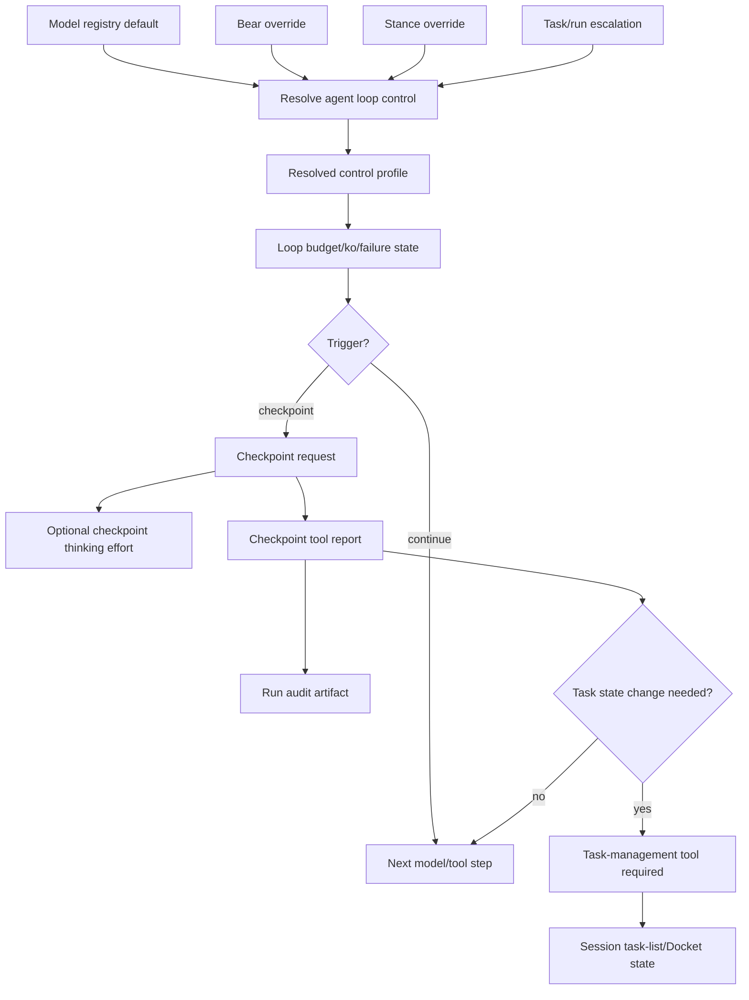

# Agent Loop Control Implementation Plan

## Status

Planned. Implements [ADR-0050 — Agent Loop Control, Adaptive Budgets, and Runtime Checkpoints](../decisions/adr-0050-agent-loop-control-adaptive-budgets-and-runtime-checkpoints.md), and depends on the task-list/Docket boundaries in [ADR-0045](../decisions/adr-0045-session-task-lists-and-docket-checkout.md) and [ADR-0034](../decisions/adr-0034-jobs-and-tasks-work-management.md).

> **Companion plan (2026-07-06):** [AGENT_LOOP_CONTROL_GROUNDING_AND_TUNING_PLAN.md](AGENT_LOOP_CONTROL_GROUNDING_AND_TUNING_PLAN.md) delivers the ADR-0050 amendment — surface-declared grounding probes (§7c), context/token budget as a loop dimension (§11), and an advisory-first rollout with a persisted replayable ledger and offline tuning harness. That plan reframes this plan's Phase 11 rollout as advisory-first and adds grounding as the arbiter for the "meaningful mutation" judgment in Phases 3–5. Land the companion plan's ledger + advisory foundation early; it is the measurement loop the rest of this plan is tuned against.

## Goal

Give Den a typed **agent loop control** layer that governs tool-using turns across model calls and tool results: when to continue, checkpoint, retry, warn, stop, escalate thinking effort, or require task-state reconciliation.

The implementation must make Bear runs more efficient and auditable without letting runtime checkpoint prose become task state, memory, or ordinary conversation history.

## Scope

In scope:

- progressive agent loop control levels (`light`, `standard`, `careful`, `strict`),
- model default control levels,
- Bear-level and stance-level overrides mirroring model selection,
- task/run escalation for risk, difficulty, or governance mode,
- profile-owned budgets, ko/failure thresholds, checkpoint triggers, and task-gate behavior,
- optional checkpoint-turn thinking-level escalation,
- structured checkpoint artifacts/events,
- audit-oriented checkpoint retention for `work` runs,
- explicit projection/replay/history boundaries.

Out of scope:

- replacing Docket task/job state with checkpoint artifacts,
- using checkpoint prose to satisfy task gates,
- free-form transcript parsing to detect loops,
- hardcoded per-model runtime behavior,
- verbose chain-of-thought capture,
- provider reasoning-stream persistence as conversation history.

## Core invariants

1. **Runtime controls continuation; task tools control task state.** Checkpoints may identify that task state should change, but only `update_task_list`, `sync_task_list`, `checkout_task_list`, `request_task_list_handoff`, or Docket service APIs may mutate session task-list/Docket state.
2. **Checkpoints are structured artifacts, not informal prose.** A checkpoint report should arrive as a runtime-owned `checkpoint` tool call whose arguments are parsed into typed fields. Assistant prose/JSON fallback is degraded and never the primary control path.
3. **Checkpoint artifacts can be auditable without becoming Docket events.** `work` runs may retain checkpoint artifacts as run audit evidence, but Docket `bear_task_events`/`bear_job_events` remain the report-visible source of task progress, blockers, completion, and criteria evaluation.
4. **Thinking effort is a quality knob, not a safety boundary.** Budget, ko, task-gate, and stop enforcement remain runtime-authoritative even if a provider ignores thinking-level metadata.
5. **Runtime code consumes resolved typed profiles.** Model names and provider quirks belong in registry/configuration; the runtime must not scatter model-name `match` arms.

## Conceptual model



## Phase 0 — Baseline inventory

**Goal:** identify current seams before changing behavior.

| Task | Done when |
| --- | --- |
| Inventory budget state | Existing `TurnBudgetPolicy`/ledger structures and enforcement points are documented. |
| Inventory model selection | The current model resolution precedence for system/Bear/stance/conversation is documented. |
| Inventory request metadata | The Bifrost/provider request path that can carry thinking/reasoning effort metadata is identified. |
| Inventory task gates | Current session task-list continuation gates and task-gate rejection handling are documented. |
| Inventory persistence | Conversation history, hidden model-visible records, BearWire events, Docket events, and run telemetry stores are distinguished. |

**Exit gate:** a short implementation note identifies exact files/modules for type definitions, resolver, request metadata, loop state, checkpoint artifacts, and projections.

## Phase 1 — Agent loop control types and profiles

**Goal:** introduce typed policy without changing runtime behavior.

Suggested types:

```rust
pub enum AgentLoopControlLevel {
    Light,
    Standard,
    Careful,
    Strict,
}

pub enum AgentLoopControlSource {
    ModelDefault,
    BearOverride,
    StanceOverride,
    TaskEscalation,
    SystemDefault,
}

pub struct ResolvedAgentLoopControl {
    pub level: AgentLoopControlLevel,
    pub source: AgentLoopControlSource,
    pub profile: AgentLoopControlProfile,
}

pub struct AgentLoopControlProfile {
    pub budget: TurnBudgetPolicy,
    pub ko: KoPolicy,
    pub checkpoints: CheckpointPolicy,
    pub task_gate: TaskGatePolicy,
    pub thinking: CheckpointThinkingPolicy,
}
```

| Task | Done when |
| --- | --- |
| Add level enum | Control levels are serialized with stable snake_case names. |
| Add policy structs | Budget, ko, checkpoint, task-gate, and thinking policy have typed structs. |
| Add default profiles | `light`, `standard`, `careful`, and `strict` resolve to deterministic profiles. |
| Add monotonic ordering | Runtime can compare/escalate levels without string matching. |
| Add unit tests | Default profile thresholds and ordering are covered. |

**Exit gate:** profiles are typed and testable, but not yet enforced.

## Phase 2 — Model defaults and Bear/stance overrides

**Goal:** resolve control level the same way model selection is resolved.

Resolution order:

1. model registry default,
2. Bear-level override,
3. stance-level override,
4. task/run escalation.

Task/run escalation may raise intensity, but should not silently downgrade operator-configured Bear/stance policy.

| Task | Done when |
| --- | --- |
| Extend model metadata | Model registry can expose default `agent_loop_control_level`. |
| Add Bear override storage | Bear config can set a default loop control level. |
| Add stance override storage | Stance/profile config can override for `pair`, `chat`, `work`, etc. |
| Implement resolver | Runtime receives `ResolvedAgentLoopControl`, including source and profile. |
| Add diagnostics | Run logs/progress include level, source, and profile summary. |
| Add tests | Model default, Bear override, stance override, unknown model fallback, and escalation precedence are covered. |

**Exit gate:** runs can resolve and report a control profile without behavior changes.

## Phase 3 — Budget/ko/failure integration

**Goal:** initialize loop budgets from the resolved control profile.

| Task | Done when |
| --- | --- |
| Wire profile into turn state | Turn state owns the resolved profile and budget ledger. |
| Replace hardcoded thresholds | Existing budgets/ko/failure limits come from the resolved profile. |
| Preserve global fuses | Wall-clock, total tool calls, repeated failures, and emergency hard steps remain turn-global. |
| Preserve verification windows | Read/search replenishment after meaningful mutation remains small and verification-oriented. |
| Add tests | Budget initialization, ko cutoff, failure cutoff, and verification replenishment use resolved profile values. |

**Exit gate:** existing budget behavior is policy-driven, with no checkpoint enforcement yet.

## Phase 4 — Checkpoint trigger state

**Goal:** track loop-health signals needed for runtime checkpoints.

Suggested state:

```rust
pub struct CheckpointState {
    pub read_search_since_mutation: u32,
    pub consecutive_failures: u32,
    pub same_signature_repeat_count: u32,
    pub last_checkpoint_at_step: Option<u32>,
    pub pending_checkpoint: Option<CheckpointRequest>,
}

pub enum CheckpointReason {
    OverExploration,
    ConsecutiveFailure,
    SameSignatureNearKo,
    TaskGateRejection,
    LowBudget,
    PreRiskMutation,
}
```

| Task | Done when |
| --- | --- |
| Classify tool calls | Read/search, mutative, execute, destructive, and no-op/failure outcomes are typed. |
| Track exploration since mutation | Read/search counter increments and resets only on meaningful mutation. |
| Track failure and repeat signals | Consecutive failures and repeated signatures feed checkpoint state. |
| Track task-gate rejection | Gate rejection state can request a checkpoint before stronger stop behavior. |
| Add observe-only diagnostics | Runtime can emit `runtime_checkpoint_would_trigger` without forcing behavior. |
| Add tests | Each trigger reason fires under profile-specific thresholds. |

**Exit gate:** checkpoint triggers are observable and tested but may still run in observe-only mode.

## Phase 5 — Structured checkpoint request and checkpoint tool protocol

**Goal:** implement Option B as a typed runtime-owned `checkpoint` tool call rather than unstructured assistant prose or assistant text JSON.

A checkpoint request should include enough context to make the response auditable:

```rust
pub struct RuntimeCheckpointRequest {
    pub checkpoint_id: CheckpointId,
    pub run_id: String,
    pub reason: CheckpointReason,
    pub control_level: AgentLoopControlLevel,
    pub active_objective: Option<String>,
    pub task_context: Option<CheckpointTaskContext>,
    pub evidence_refs: Vec<CheckpointEvidenceRef>,
    pub required_fields: Vec<CheckpointField>,
}
```

The model-facing response should be a `checkpoint(...)` tool call. Suggested tool argument schema:

```rust
pub struct RuntimeCheckpointResponse {
    pub checkpoint_id: CheckpointId,
    pub active_objective: String,
    pub summary: Option<String>, // short prose synthesis for audit
    pub more_exploration_justified: bool,
    pub next_action: CheckpointNextAction,
    pub task_state_change_needed: Option<TaskStateChangeIntent>,
    pub evidence_refs: Vec<CheckpointEvidenceRef>,
    pub confidence: Option<CheckpointConfidence>,
}
```

Do not force learned facts and uncertainty into required JSON arrays. Keep model reasoning/prose separate; structure only the decision fields and a short audit summary.

`CheckpointNextAction` should be a typed enum, for example:

- `call_tool`,
- `edit`,
- `validate`,
- `update_task_list`,
- `sync_task_list`,
- `request_handoff`,
- `final_if_gate_allows`,
- `stop_blocked`.

`TaskStateChangeIntent` is **intent only**. It does not mutate task state.

| Task | Done when |
| --- | --- |
| Define request/report DTOs | `RuntimeCheckpointRequest` and `RuntimeCheckpointResponse` are typed and serializable; the response DTO is the `checkpoint` tool argument shape. |
| Add checkpoint ids | Every request/report pair has a stable id scoped to run/turn. |
| Add model instruction fragment | Runtime asks the model to call the `checkpoint` tool, not to answer with JSON text. |
| Parse response at boundary | Tool arguments are parsed once at the runtime boundary into typed structs. Assistant-text JSON is degraded fallback only. |
| Validate required fields | Missing/invalid checkpoint tool fields produce a typed recovery nudge/advisory result; hard failure is reserved for emergency fuses or unrecoverable protocol loops. |
| Add tests | Valid, missing-field, invalid-next-action, stale-checkpoint-id, and degraded assistant-text fallback cases are covered. |

**Exit gate:** the runtime can request and parse a structured checkpoint tool report, but it still does not mutate task state from it.

## Phase 6 — Checkpoint artifact retention and audit policy

**Goal:** make checkpoints useful for `work` run audit without polluting conversation history or Docket task events.

Introduce a run-scoped checkpoint artifact store or event stream. Preferred shape:

```text
bear_run_checkpoints
- id uuid primary key
- run_id text not null
- turn_id text nullable
- checkpoint_id text not null
- reason text not null
- control_level text not null
- request jsonb not null
- response jsonb nullable
- validation_status text not null -- requested | valid | invalid | superseded
- visibility text not null -- audit_only | live_ephemeral | model_visible_hidden
- replay_policy text not null -- none | summary_once | until_superseded
- related_task_list_id text nullable
- related_task_item_id text nullable
- related_docket_task_id uuid nullable
- created_at timestamptz not null
```

Retention rules:

- `pair` default: live/debug telemetry or short retention unless needed for recovery.
- `work` default: audit-retained run artifact.
- Docket report-visible history still requires Docket/task events.
- Model replay uses only explicit replay policies, never raw checkpoint prose by default.

| Task | Done when |
| --- | --- |
| Add checkpoint artifact schema/service | Runtime can persist request/response artifacts by run id. |
| Keep artifact outside Docket events | Checkpoints do not appear as `bear_task_events` or `bear_job_events`. |
| Add `work` audit retention | `work` runs retain valid checkpoint artifacts with task refs where available. |
| Add pair/chat retention policy | Interactive stances avoid durable clutter unless recovery policy requires it. |
| Add read API for audits | Operator tooling can inspect checkpoint artifacts for a run/job. |
| Add tests | Checkpoints are retained for `work`, not conversation history, not task events, and not model replay unless policy says so. |

**Exit gate:** structured checkpoints are auditable for `work` while preserving Docket/task boundaries.

## Phase 7 — Checkpoint enforcement in the loop

**Goal:** make checkpoint triggers affect continuation.

When a trigger fires:

1. runtime creates `RuntimeCheckpointRequest`,
2. optional checkpoint thinking policy is resolved,
3. next model inference should call the runtime-owned `checkpoint` tool before more exploration/risky action,
4. runtime validates the tool arguments and records an advisory/audit artifact,
5. runtime continues according to deterministic loop signals plus advisory `next_action`/task-gate state.

| Task | Done when |
| --- | --- |
| Enforce over-exploration checkpoints | Read/search threshold forces checkpoint before more read/search. |
| Enforce failure checkpoints | Consecutive failures force checkpoint before retry. |
| Enforce same-signature checkpoint | Near-ko repeated signature forces different action or checkpoint. |
| Enforce task-gate checkpoint | First/repeated gate rejection can require checkpoint before stronger gate behavior. |
| Enforce pre-risk checkpoint | `careful`/`strict` can require checkpoint before broad/destructive actions. |
| Add loop tests | Simulated turns prove checkpoint tool calls are handled internally, invalid checkpoint reports degrade without killing the run, and valid reports can require task-tool follow-through. |

**Exit gate:** checkpoints are part of runtime continuation, not merely diagnostics.

## Phase 8 — Optional checkpoint thinking-level escalation

**Goal:** pair checkpoint turns with higher reasoning effort when policy/provider support allows.

| Task | Done when |
| --- | --- |
| Add thinking metadata type | Provider request metadata can carry low/medium/high or provider-equivalent effort. |
| Add capability detection | Model/provider support is known or safely treated as best-effort. |
| Apply only on checkpoint/pre-risk turns | Escalation is bounded to the inference that needs synthesis unless profile says otherwise. |
| Emit diagnostics | Run diagnostics include applied/skipped thinking override and reason. |
| Add tests | Supported provider receives metadata; unsupported provider degrades without failure; enforcement remains independent. |

**Exit gate:** checkpoint turns can request elevated thinking without changing budget/ko/task-gate authority.

## Phase 9 — Task-list/Docket integration

**Goal:** weave checkpoints elegantly into task management without conflicting with history-visible task records.

Checkpoint requests should include active task context when available:

```json
{
  "task_list_id": "...",
  "task_list_version": 12,
  "active_item_id": "...",
  "active_item_title": "...",
  "source_ref": {
    "kind": "docket_task",
    "job_id": "...",
    "task_id": "..."
  }
}
```

Required behavior:

- checkpoint `task_state_change_needed` is advisory intent only;
- task-state changes require `update_task_list`, `sync_task_list`, or `request_task_list_handoff`;
- Docket-backed changes follow source/sync policy;
- checkpoint artifacts may reference Docket task ids for audit, but do not become Docket events;
- continuation gate evaluates task-list/Docket state, not checkpoint text.

| Task | Done when |
| --- | --- |
| Attach active task context | Checkpoint requests include current task-list/Docket refs when available. |
| Validate task-state intent | Checkpoint tool report can recommend update/sync/handoff but cannot mutate state. |
| Require tool call for state changes | Runtime requires the appropriate task-management tool when task-state change is needed. |
| Preserve gate semantics | Checkpoint tool report alone cannot satisfy completion/blocker/non-applicable state. |
| Add Docket audit correlation | `work` checkpoint artifacts can be queried by run/job/task refs. |
| Add tests | Checkpoint saying “done” does not complete task; `update_task_list` with evidence does. |

**Exit gate:** checkpoints improve `work` auditability while Docket remains canonical for task history.

## Phase 10 — Visibility, BearWire, and operator UX

**Goal:** expose useful runtime legibility without confusing users or models.

Runtime/BearWire events:

- `run.progress kind=agent_loop_control_resolved`,
- `run.progress kind=runtime_checkpoint_required`,
- `run.progress kind=checkpoint_response_recorded`,
- `run.progress kind=checkpoint_thinking_override_applied`,
- `run.progress kind=checkpoint_invalid`.

Visibility defaults:

| Artifact | Pair/chat | Work |
| --- | --- | --- |
| Control level resolution | diagnostic/live progress | diagnostic/live progress |
| Checkpoint request | live progress | live progress + audit artifact |
| Checkpoint tool report | hidden/ephemeral unless useful | audit artifact, optionally operator-visible |
| Provider reasoning stream | live UI only | live UI only unless separate debug retention |
| Task progress | task-list/Docket tools only | task-list/Docket tools only |

| Task | Done when |
| --- | --- |
| Add BearWire projections | Runtime checkpoint events project as typed `run.progress` events. |
| Add operator read path | Work run checkpoint audit can be inspected from admin/operator surfaces. |
| Keep conversation history clean | Checkpoint artifacts do not appear as ordinary user-visible assistant messages. |
| Add replay rules | Only normalized model-visible hidden continuity notes replay, not raw provider reasoning or checkpoint prose by default. |

**Exit gate:** humans can understand why a run checkpointed, but task history and transcript remain clean.

## Phase 11 — Rollout

Recommended rollout flags:

```text
BEARS_AGENT_LOOP_CONTROL=off|observe|enforce
BEARS_AGENT_LOOP_CHECKPOINTS=off|on
BEARS_CHECKPOINT_THINKING=off|on
BEARS_CHECKPOINT_AUDIT=off|work|all
```

Rollout order:

1. **Observe:** resolve profiles and emit diagnostics; no enforcement.
2. **Checkpoint observe:** trigger would-checkpoint events and validate policy thresholds.
3. **Checkpoint enforce for failures/over-exploration:** enable `standard` for `pair`/`chat` and `work`.
4. **Checkpoint audit for `work`:** retain structured checkpoint request/response artifacts by run/job/task refs.
5. **Thinking escalation:** enable checkpoint/pre-risk thinking overrides for supported models.
6. **Strict/careful pre-risk:** enable broader `careful`/`strict` behaviors for high-risk workflows.

## Validation matrix

| Area | Required tests |
| --- | --- |
| Resolver | model default, Bear override, stance override, task escalation, source attribution |
| Profiles | level ordering, thresholds, checkpoint thinking defaults |
| Budgets | wall-clock/tool/failure/ko limits from profile, global fuses preserved |
| Checkpoint triggers | over-exploration, failure, same-signature, task-gate, low-budget, pre-risk |
| Structured response | valid response, missing field, invalid next action, stale checkpoint id |
| Audit artifacts | `work` retention, pair/chat non-retention/default retention, query by run/job/task refs |
| Task boundary | checkpoint cannot complete/block/cancel/waive task; task tools can with evidence |
| Thinking escalation | supported/unsupported providers, bounded to checkpoint turn, diagnostics emitted |
| Projection | BearWire progress events, no ordinary conversation history pollution, no Docket event pollution |

## First implementation slice

The safest first slice is:

1. add typed control levels/profiles;
2. add resolver with model default + Bear/stance override support;
3. emit `agent_loop_control_resolved` diagnostics;
4. add checkpoint request/response DTOs behind an observe-only flag;
5. add checkpoint artifact schema/service but retain only in `work` observe mode;
6. add tests proving checkpoint artifacts are not conversation history, not model replay, and not Docket events.

This slice creates the typed foundation and audit model before enforcement changes model behavior.
