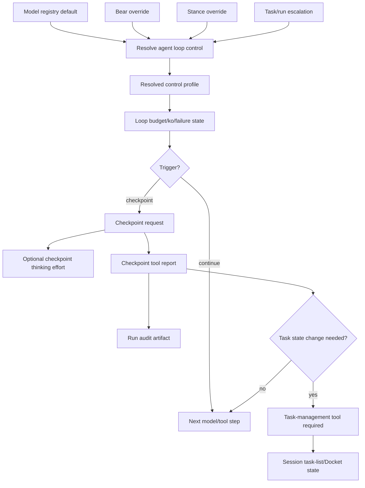

# Agent Loop Control Implementation Plan

## Status

Planned. Implements [ADR-0050 — Agent Loop Control, Adaptive Budgets, and Runtime Checkpoints](../decisions/adr-0050-agent-loop-control-adaptive-budgets-and-runtime-checkpoints.md), and depends on the task-list/Docket boundaries in [ADR-0045](../decisions/adr-0045-session-task-lists-and-docket-checkout.md) and [ADR-0034](../decisions/adr-0034-jobs-and-tasks-work-management.md).

> **Companion plan (2026-07-06, revised 2026-07-13):** [AGENT_LOOP_CONTROL_GROUNDING_AND_TUNING_PLAN.md](AGENT_LOOP_CONTROL_GROUNDING_AND_TUNING_PLAN.md) delivers the ADR-0050 amendment — surface-declared grounding probes (§7c), context/token budget as a loop dimension (§11), and a persisted replayable ledger/offline tuning harness. Because Den is still pre-release, development is staged but completed loop-control slices are active by default once tested; feature flags and long observation-only rollout periods are not the normal delivery mechanism. Land the companion plan's ledger foundation early; it is the measurement loop the rest of this plan is tuned against.

## Goal

Give Den a typed **agent loop control** layer that governs tool-using turns across model calls and tool results: when to continue, checkpoint, retry, warn, stop, escalate thinking effort, or require task-state reconciliation.

The implementation must make Bear runs more efficient and auditable without letting runtime checkpoint prose become task state, memory, or ordinary conversation history.

## Scope

In scope:

- progressive agent loop control levels (`light`, `standard`, `careful`, `strict`),
- governance as the continuation-pressure input (`interactive`, `grace`, `autonomous_continuation`, `observational`, `frozen`),
- focused Job as the Docket objective input for long-running continuation,
- objective orientation as the current outcome state (`freeform`, task-`oriented`, Job-`focused`),
- freeform task-definition policy that controls whether the model may be told it can define a task and leave freeform mode,
- model default control levels,
- Bear-level and stance-level overrides mirroring model selection,
- task/run escalation for risk, difficulty, or governance,
- profile-owned budgets, ko/failure thresholds, checkpoint triggers, and task-gate behavior,
- optional checkpoint-turn thinking-level escalation,
- structured checkpoint artifacts/events,
- audit-oriented checkpoint retention for `work` runs,
- explicit projection/replay/history boundaries.

Out of scope:

- replacing Docket task/job state with checkpoint artifacts,
- using checkpoint prose to satisfy task gates,
- free-form transcript parsing to detect loops,
- hardcoded per-model runtime behavior,
- verbose chain-of-thought capture,
- provider reasoning-stream persistence as conversation history.

## Core invariants

1. **Loop control is stance-wide, not focus-specific.** The same runtime regime governs freeform, task-oriented, focused, and autonomous runs. Focus is one objective-orientation state on a spectrum of freedom/grace; it is not a separate loop-control flavor.
2. **Runtime controls continuation; task tools control task state.** Checkpoints may identify that task state should change, but only `update_task_list`, `sync_task_list`, `checkout_task_list`, `request_task_list_handoff`, or Docket service APIs may mutate session task-list/Docket state.
3. **Checkpoints are structured artifacts, not informal prose.** A checkpoint report should arrive as a runtime-owned `checkpoint` tool call whose arguments are parsed into typed fields. Assistant prose/JSON fallback is degraded and never the primary control path.
4. **Checkpoint artifacts can be auditable without becoming Docket events.** `work` runs may retain checkpoint artifacts as run audit evidence, but Docket `bear_task_events`/`bear_job_events` remain the report-visible source of task progress, blockers, completion, and criteria evaluation.
5. **Checkpoint advice cannot expand authority.** Checkpoint reports are advisory inputs to runtime policy. They cannot expand budgets, reset stop conditions, bypass trust gates, or authorize actions the resolved loop-control profile disallows.
6. **Thinking effort is a quality knob, not a safety boundary.** Budget, ko, task-gate, and stop enforcement remain runtime-authoritative even if a provider ignores thinking-level metadata.
7. **Runtime code consumes resolved typed profiles.** Model names and provider quirks belong in registry/configuration; the runtime must not scatter model-name `match` arms.

## Conceptual model



## Phase 0 — Baseline inventory

**Goal:** identify current seams before changing behavior.

| Task | Done when |
| --- | --- |
| Inventory budget state | Existing `TurnBudgetPolicy`/ledger structures and enforcement points are documented. |
| Inventory model selection | The current model resolution precedence for system/Bear/stance/conversation is documented. |
| Inventory request metadata | The Bifrost/provider request path that can carry thinking/reasoning effort metadata is identified. |
| Inventory task gates | Current session task-list continuation gates and task-gate rejection handling are documented. |
| Inventory persistence | Conversation history, hidden model-visible records, BearWire events, Docket events, and run telemetry stores are distinguished. |

**Exit gate:** a short implementation note identifies exact files/modules for type definitions, resolver, request metadata, loop state, checkpoint artifacts, and projections.

## Phase 1 — Agent loop control types and profiles

**Goal:** introduce typed policy without changing runtime behavior.

Suggested types:

```rust
pub enum AgentLoopControlLevel {
    Light,
    Standard,
    Careful,
    Strict,
}

pub enum AgentLoopControlSource {
    ModelDefault,
    BearOverride,
    StanceOverride,
    TaskEscalation,
    SystemDefault,
}

pub struct ResolvedAgentLoopControl {
    pub level: AgentLoopControlLevel,
    pub source: AgentLoopControlSource,
    pub profile: AgentLoopControlProfile,
}

pub struct AgentLoopControlProfile {
    pub budget: TurnBudgetPolicy,
    pub ko: KoPolicy,
    pub checkpoints: CheckpointPolicy,
    pub task_gate: TaskGatePolicy,
    pub thinking: CheckpointThinkingPolicy,
}
```

| Task | Done when |
| --- | --- |
| Add level enum | Control levels are serialized with stable snake_case names. |
| Add policy structs | Budget, ko, checkpoint, task-gate, and thinking policy have typed structs. |
| Add default profiles | `light`, `standard`, `careful`, and `strict` resolve to deterministic profiles. |
| Add monotonic ordering | Runtime can compare/escalate levels without string matching. |
| Add unit tests | Default profile thresholds and ordering are covered. |

**Exit gate:** profiles are typed and testable, but not yet enforced.

## Phase 2 — Model defaults and Bear/stance overrides

**Goal:** resolve control level the same way model selection is resolved.

Resolution order:

1. model registry default,
2. Bear-level override,
3. stance-level override,
4. task/run escalation.

Task/run escalation may raise intensity, but should not silently downgrade operator-configured Bear/stance policy.

| Task | Done when |
| --- | --- |
| Extend model metadata | Model registry can expose default `agent_loop_control_level`. |
| Add Bear override storage | Bear config can set a default loop control level. |
| Add stance override storage | Stance/profile config can override for `pair`, `chat`, `work`, etc. |
| Implement resolver | Runtime receives `ResolvedAgentLoopControl`, including source and profile. |
| Add diagnostics | Run logs/progress include level, source, and profile summary. |
| Add tests | Model default, Bear override, stance override, unknown model fallback, and escalation precedence are covered. |

**Exit gate:** runs can resolve and report a control profile without behavior changes.

## Phase 2a — Governance and focused Job inputs

**Goal:** make the loop controller consume explicit supervision and objective inputs before enforcement uses them.

Suggested shape:

```rust
pub enum Governance {
    Interactive,
    Grace,
    AutonomousContinuation,
    Observational,
    Frozen,
}

pub struct LoopControlContext {
    pub governance: Governance,
    pub focused_job_id: Option<JobId>,
}
```

Do **not** introduce a generic `FocusTarget` enum yet. The only supported durable focus object is a Docket Job.

Focused Job ownership is conversation-scoped. The durable source of truth is the conversation's current focused Job; live sessions project that state into their UI, and each run receives a snapshot in `LoopControlContext`. Work runs should also record the focused Job they were launched under for auditability, but they do not own focus. Governance is resolved per run and is not the same durable state as the focused Job.

Minimal first shape:

```rust
pub struct ConversationFocusState {
    pub focused_job_id: Option<JobId>,
}
```

If debugging needs it, add timestamps/source later; do not build a broader focus subsystem up front.

| Task | Done when |
| --- | --- |
| Rename docs/projections toward governance | New runtime prose says **governance** for the supervision axis, while preserving existing `Governance` code/API compatibility where already decided by ADR-0039. |
| Persist conversation focus | The conversation can durably store `focused_job_id: Option<JobId>` as the source of truth for focus across turns and reconnects. |
| Project focus to sessions | Live sessions derive their displayed Focused state and title from conversation focus. |
| Snapshot focus into runs | Each run receives governance and the current focused Job as `LoopControlContext`; work runs persist the launched-under Job for audit. |
| Add focused Job to run context | Runtime context can carry `focused_job_id: Option<JobId>` independently from governance. |
| Enforce `work` designation | A `work` run must have a focused Job before model-driving continuation begins; missing Job is a hard rejection before model invocation. |
| Allow explicit `pair` focus | `pair` can designate a focused Job through Bear conversation or a client command without changing trust stance. |
| Derive task focus | Given governance + focused Job + Docket/task-list state, runtime derives the next logical incomplete/unblocked task as ephemeral task focus. |
| Add diagnostics | Run diagnostics include governance, focused Job id if any, and derived task-focus refs without leaking hidden task-gate internals. |
| Add tests | Normal `pair` has no focused Job; focused `pair` keeps `pair` trust stance; `work` without focused Job is rejected; `work` with focused Job derives a next task. |

**Exit gate:** loop control has explicit governance and focused-Job inputs, but no generic focus-target abstraction.

## Phase 2b — Client projection for Focus

**Goal:** let UI-providing clients expose focused-Job state without pretending it is a user-selectable approval preset.

UI-providing clients such as ACP should project focused-Job behavior as a special permissions/presentation state. The command and feature are called **Focus**; the visible permission/mode label while active is **Focused**. Focused is **not UI-selectable** as an ordinary permissions mode. It can be entered through Bear conversation or slash commands after Den designates a Job.

Command shape:

```text
/focus [job]
```

`[job]` resolution:

- exact Job ID: focus that Job and begin execution immediately;
- other text: search existing Jobs; if exactly one high-confidence match exists, focus it and begin execution immediately; otherwise show possible matches and ask the user to select one or begin defining a new Job;
- empty: show the 5 most recent Jobs and ask the user to select one or begin defining a new Job.

High-confidence focus matching is intentionally narrow. Exact Job IDs and explicit continuation references to the current focused Job qualify. Otherwise, a match needs strong lexical/semantic overlap plus recency, with no competing plausible Job. Ambiguous matches must elicit a choice. `work` requires an explicit focused Job and must not fuzzy-attach to a Job before model-driven continuation. `pair` may use conversational focus to suggest a Job, but must ask before making Docket-affecting focus/task updates. If no high-confidence match exists and the request is task-like, stay freeform or session-local and ask before creating a durable Job.

Selection is mediated through one model-visible elicitation tool. The model should not know whether the client rendered a native picker or sent numbered text options. Clients without elicitation UI present numbered options and ask the user to reply with a number; the runtime normalizes the result as the same elicitation response.

When focused:

- the client permission/mode label is **Focused**;
- the session title reflects focus;
- the conversation title is updated to `[Job name] - [current task]` with simple fallbacks such as `[Job name]`, `[Job name] - selecting next task`, `[Job name] - blocked`, or `[Job name] - complete`;
- changing the client mode away from Focused clears conversation focus and stops focused continuation.

| Task | Done when |
| --- | --- |
| Define Focus projection | BearWire/ACP can project **Focused** as a special non-selectable state tied to conversation `focused_job_id`. |
| Keep Den authoritative | Clients display Focus and may provide commands to request it, but Den validates/designates/clears the focused Job. |
| Add slash-command hook | ACP/client command plumbing can handle `/focus [job]` with exact-id, search, ambiguous-selection, empty-recent, and define-new paths. |
| Add focus matching policy | Focus matching considers at most 5 recent Jobs by default, auto-matches only exact/explicit or single high-confidence candidates, requires elicitation on ambiguity, and asks before durable Job creation or Docket-affecting `pair` attachment. |
| Add elicitation path | Job selection uses one model-visible elicitation tool; client adapters choose native UI or numbered text fallback without exposing that choice to the model. |
| Clear on mode change | If a client changes mode away from **Focused**, Den clears the conversation focused Job. |
| Update focused titles | Focused conversations/sessions update title as `[Job name] - [current task]` with blocked/complete/selection fallbacks. |
| Prevent permission laundering | Focus does not grant tools, approvals, memory access, or outbound auth beyond the effective policy from trust stance + governance + armature. |
| Add projection tests | Focused appears when a focused Job is active, cannot be selected directly from normal permission UI, clears when Den clears focus, and clears when the client mode changes. |

**Exit gate:** ACP-style clients can show/request Focus, but cannot select it as an ordinary permissions mode or use it to alter trust boundaries.

## Phase 2c — Objective orientation and freeform task-definition policy

**Goal:** make the loop controller consume an explicit objective-orientation state before budget/grace enforcement depends on it.

Objective orientation answers one question: **what concrete outcome, if any, is this run currently pursuing?** It is distinct from governance/trust. Orientation may change steering strength, budget/grace profiles, task-list affordances, and prompt construction, but it must never expand authority, approvals, memory access, outbound auth, or destructive-action permissions by itself.

Use exactly three orientation states:

1. **`focused`** — a Docket Job is defined and centered. The loop's top priority is to complete the Job. Steering is strong and budget/grace are lenient while progress is evident. If the Job is mutable, child tasks can be added without a runtime-oriented cap; immutable/static Jobs reject or escalate decomposition.
2. **`oriented`** — a Task is defined and is being worked on, but no focused Job is active. Steering and budget/grace are similar to focused but separately tunable. Task-scoped affordances may be available. Child task creation is capped: initially 6 children and 1 level below the oriented task.
3. **`freeform`** — no outcome is defined. Budget/grace limits are strict. The model is just chatting unless the freeform policy permits task definition.

Do **not** add a fourth orientation for "freeform but may orient/delegate." That is transition policy on `freeform`, not a different current-objective state. Orienting and delegation are locked behind the same gate: whether the model may define a task-shaped outcome.

Suggested minimal shape:

```rust
pub enum ObjectiveOrientation {
    Freeform { policy: FreeformPolicy },
    Oriented(TaskOrientation),
    Focused(JobOrientation),
}

pub struct FreeformPolicy {
    pub may_define_task: bool,
}

pub struct TaskOrientation {
    pub task_ref: OrientationTaskRef,
    pub child_policy: OrientedChildTaskPolicy,
}

pub struct JobOrientation {
    pub job_id: JobId,
    pub mutability: JobMutability,
    pub derived_task_ref: Option<OrientationTaskRef>,
}

pub enum OrientationTaskRef {
    SessionTaskListItem(TaskListItemId),
    DocketTask { job_id: Option<JobId>, task_id: TaskId },
}

pub struct OrientedChildTaskPolicy {
    pub max_children: u8,
    pub max_depth_below_oriented_task: u8,
}

pub const DEFAULT_ORIENTED_MAX_CHILDREN: u8 = 6;
pub const DEFAULT_ORIENTED_MAX_DEPTH: u8 = 1;
```

Resolution order is deterministic:

1. if a focused Job exists, resolve `Focused`;
2. else if there is an explicit active/current task, resolve `Oriented`;
3. else resolve `Freeform` with the run's resolved `FreeformPolicy`.

The freeform task-definition policy affects both runtime legality and model-visible affordances:

- `may_define_task: false`: do not tell the model that task definition, orientation, or delegation is possible. The runtime still defensively rejects task-definition/delegation attempts from this freeform run. The model should answer, ask a clarifying question, or stop within strict freeform limits.
- `may_define_task: true`: the prompt may say the model can define a concrete task with completion criteria when the request needs sustained work. Defining a task can lead to local `oriented` continuation or to delegation/handoff through existing Docket/task-list paths, subject to governance and approval policy.

ponytail: keep `may_define_task` as a single boolean until another real state is needed. Do not split `may_orient` and `may_delegate` while they are locked together.

### Boundary with checkpoints

Task orientation is state; checkpoints are interrupts. When orientation and checkpoint behavior overlap, prefer task orientation as the enforcement regime.

Orientation owns the current objective and the policies that directly follow from it:

- whether the run is `freeform`, `oriented`, or `focused`;
- whether freeform may define a task-shaped outcome;
- whether the model sees task-definition/orientation/delegation affordances;
- which budget/grace profile applies for freeform vs oriented vs focused work;
- whether child-task creation is allowed;
- the oriented child cap and depth cap;
- focused Job mutability/static-scope decomposition policy.

Checkpoints should not infer, select, or launder the current objective. Do not keep a separate "task gate" or "plan-mode gate" whose job is to decide that freeform work has become task-shaped. That decision belongs to `ObjectiveOrientation` plus `FreeformPolicy.may_define_task` and the task-definition transition path.

Checkpoints remain useful only as pause/continue/control boundaries, using the resolved orientation as context. Keep checkpoint triggers for boundaries such as:

- low or exhausted budget;
- stalled progress or repeated failures;
- risky, destructive, or externally visible actions;
- unresolved ambiguity that cannot be resolved locally;
- long-running autonomous continuation;
- attempted scope expansion beyond the current orientation policy;
- attempted child-task creation beyond the oriented cap;
- attempted decomposition of an immutable/static focused Job.

Cleanup rule: if a checkpoint reason duplicates orientation enforcement, delete it, rename it, or fold it into orientation/task-definition policy. If it is a real pause point, keep it, but include the resolved orientation, relevant task/job refs, and policy violation details in the checkpoint context.

### BearWire / ACP plan projection

A currently oriented task should be visible to armature clients through BearWire as an ACP plan. The projection is a client-facing view of the current working level, not a new source of task state.

ACP plan surfaces are treated as flat for this phase. If ACP has no native task-hierarchy concept, do not flatten an entire Docket tree into one visible plan and do not expose hidden descendants as peer items. Instead, project the plan at the level of the currently oriented task:

- the ACP plan title/objective represents the current working task, or the focused Job's derived current task when focused work is task-scoped;
- visible plan items are the current working task and its siblings at the same parent level;
- direct children of the oriented task remain Docket/task-list structure and may be exposed only through future explicit hierarchy support or a deliberate drill-down projection;
- when orientation changes, BearWire emits the corresponding plan replacement/update so the visible ACP plan follows the current working level;
- ACP plan edits/status changes must round-trip through the existing task-list/Docket mutation paths, not mutate orientation or Docket state by projection side effect.

This keeps the user-visible plan aligned with the current objective while avoiding a misleading flattened hierarchy. When in doubt, the oriented task's level is the projection boundary.

| Task | Done when |
| --- | --- |
| Add orientation types | Runtime has typed `ObjectiveOrientation`, `FreeformPolicy`, `TaskOrientation`, `JobOrientation`, and oriented child-task constants. |
| Resolve orientation per run | Runs resolve to exactly one of `freeform`, `oriented`, or `focused`; focused Job wins over active/current task. |
| Keep freeform prompt gated | Prompt construction includes task-definition/orientation/delegation affordances only when `FreeformPolicy.may_define_task` is true. |
| Defensively enforce freeform policy | Runtime rejects task-definition/delegation attempts from freeform runs where `may_define_task` is false, even though the prompt should not expose that option. |
| Apply orientation budget profiles | Freeform uses strict budget/grace; oriented and focused use separately tunable lenient-while-progressing profiles. |
| Enforce oriented child cap | Oriented runs can create at most 6 child tasks and only 1 level below the oriented task; attempts beyond the cap require finishing, focusing a Job, or handoff/escalation. |
| Preserve focused Job decomposition | Mutable focused Jobs are not subject to the oriented cap; immutable/static focused Jobs reject or escalate child-task creation. |
| Preserve trust boundaries | Orientation never grants tools, approvals, memory access, outbound auth, or destructive-action permission beyond effective governance/trust/armature policy. |
| Add diagnostics | Run diagnostics include orientation kind, relevant task/job refs, `may_define_task` for freeform, and child-policy summary without leaking hidden gate internals. |
| Add tests | Cover freeform closed prompt, freeform open → oriented, runtime rejection when closed, oriented child cap/depth cap, focused precedence over active task, focused mutable decomposition, and immutable focused Job rejection/escalation. |

**Exit gate:** loop control has explicit objective orientation and can gate freeform task-definition affordances before budget/grace enforcement is tuned around orientation.

## Phase 3 — Budget/ko/failure integration

**Goal:** initialize loop budgets from the resolved control profile.

| Task | Done when |
| --- | --- |
| Wire profile into turn state | Turn state owns the resolved profile and budget ledger. |
| Replace hardcoded thresholds | Existing budgets/ko/failure limits come from the resolved profile. |
| Preserve global fuses | Wall-clock, total tool calls, repeated failures, and emergency hard steps remain turn-global. |
| Preserve verification windows | Read/search replenishment after meaningful mutation remains small and verification-oriented. |
| Add tests | Budget initialization, ko cutoff, failure cutoff, and verification replenishment use resolved profile values. |

**Exit gate:** existing budget behavior is policy-driven, with no checkpoint enforcement yet.

## Phase 4 — Checkpoint trigger state

**Goal:** track loop-health signals needed for runtime checkpoints.

Suggested state:

```rust
pub struct CheckpointState {
    pub read_search_since_mutation: u32,
    pub consecutive_failures: u32,
    pub same_signature_repeat_count: u32,
    pub last_checkpoint_at_step: Option<u32>,
    pub pending_checkpoint: Option<CheckpointRequest>,
}

pub enum CheckpointReason {
    OverExploration,
    ConsecutiveFailure,
    SameSignatureNearKo,
    TaskGateRejection,
    LowBudget,
    PreRiskMutation,
}
```

| Task | Done when |
| --- | --- |
| Classify tool calls | Read/search, mutative, execute, destructive, and no-op/failure outcomes are typed. |
| Track exploration since mutation | Read/search counter increments and resets only on meaningful mutation. |
| Track failure and repeat signals | Consecutive failures and repeated signatures feed checkpoint state. |
| Track task-gate rejection | Gate rejection state can request a checkpoint before stronger stop behavior. |
| Add observe-only diagnostics | Runtime can emit `runtime_checkpoint_would_trigger` without forcing behavior. |
| Add tests | Each trigger reason fires under profile-specific thresholds. |

**Exit gate:** checkpoint triggers are observable and tested but may still run in observe-only mode.

## Phase 5 — Structured checkpoint request and checkpoint tool protocol

**Goal:** implement Option B as a typed runtime-owned `checkpoint` tool call rather than unstructured assistant prose or assistant text JSON.

A checkpoint request should include enough context to make the response auditable:

```rust
pub struct RuntimeCheckpointRequest {
    pub checkpoint_id: CheckpointId,
    pub run_id: String,
    pub reason: CheckpointReason,
    pub control_level: AgentLoopControlLevel,
    pub active_objective: Option<String>,
    pub task_context: Option<CheckpointTaskContext>,
    pub evidence_refs: Vec<CheckpointEvidenceRef>,
    pub required_fields: Vec<CheckpointField>,
}
```

The model-facing response should be a `checkpoint(...)` tool call. Suggested tool argument schema:

```rust
pub struct RuntimeCheckpointResponse {
    pub checkpoint_id: CheckpointId,
    pub active_objective: String,
    pub summary: Option<String>, // short prose synthesis for audit
    pub more_exploration_justified: bool,
    pub next_action: CheckpointNextAction,
    pub task_state_change_needed: Option<TaskStateChangeIntent>,
    pub evidence_refs: Vec<CheckpointEvidenceRef>,
    pub confidence: Option<CheckpointConfidence>,
}
```

Do not force learned facts and uncertainty into required JSON arrays. Keep model reasoning/prose separate; structure only the decision fields and a short audit summary.

`CheckpointNextAction` should be a typed enum, for example:

- `call_tool`,
- `edit`,
- `validate`,
- `update_task_list`,
- `sync_task_list`,
- `request_handoff`,
- `final_if_gate_allows`,
- `stop_blocked`.

`TaskStateChangeIntent` is **intent only**. It does not mutate task state.

| Task | Done when |
| --- | --- |
| Define request/report DTOs | `RuntimeCheckpointRequest` and `RuntimeCheckpointResponse` are typed and serializable; the response DTO is the `checkpoint` tool argument shape. |
| Add checkpoint ids | Every request/report pair has a stable id scoped to run/turn. |
| Add model instruction fragment | Runtime asks the model to call the `checkpoint` tool, not to answer with JSON text. |
| Parse response at boundary | Tool arguments are parsed once at the runtime boundary into typed structs. Assistant-text JSON is degraded fallback only. |
| Validate required fields | Missing/invalid checkpoint tool fields produce a typed recovery nudge/advisory result; hard failure is reserved for emergency fuses or unrecoverable protocol loops. |
| Add tests | Valid, missing-field, invalid-next-action, stale-checkpoint-id, and degraded assistant-text fallback cases are covered. |

**Exit gate:** the runtime can request and parse a structured checkpoint tool report, but it still does not mutate task state from it.

## Phase 6 — Checkpoint artifact retention and audit policy

**Goal:** make checkpoints useful for `work` run audit without polluting conversation history or Docket task events.

Checkpoint reports are artifacts, not status reports. They are durable audit/debug payloads attached to a run, not user-facing progress prose, conversation history, model replay context, or Docket task/job events.

Preferred final shape: store checkpoint request/response payloads through the artifact-ref system as artifact kind `runtime_checkpoint`, then attach them with generic artifact links:

```text
artifact_links
- artifact_ref
- subject_kind = run
- subject_id = run_id
- role = checkpoint
```

When useful for audit/query, the same checkpoint artifact may also be linked to the focused Job or current task with an evidence/audit role. These links are evidence references only; they do not mutate task state and do not imply completion, blockage, waiver, or cancellation.

Until artifact refs exist, a small temporary `bear_run_checkpoints` table is acceptable, but it should be shaped as a mechanical migration path to artifact refs rather than a competing permanent checkpoint store:

```text
bear_run_checkpoints
- id uuid primary key
- run_id text not null
- turn_id text nullable
- checkpoint_id text not null
- reason text not null
- control_level text not null
- request jsonb not null
- response jsonb nullable
- validation_status text not null -- requested | valid | invalid | superseded
- replay_policy text not null -- none by default
- related_task_list_id text nullable
- related_task_item_id text nullable
- related_docket_task_id uuid nullable
- future_artifact_ref text nullable
- created_at timestamptz not null
```

Retention rules:

- `pair` default: live/debug telemetry or short retention unless needed for recovery.
- `work` default: audit-retained `runtime_checkpoint` artifact linked to the run.
- Docket report-visible history still requires Docket/task events.
- Model replay uses only explicit replay policies, never raw checkpoint prose by default.

| Task | Done when |
| --- | --- |
| Add checkpoint artifact API | Runtime can persist request/response payloads by run id, preferably as `runtime_checkpoint` artifact refs. |
| Keep artifact outside Docket events | Checkpoints do not appear as `bear_task_events` or `bear_job_events`. |
| Add `work` audit retention | `work` runs retain valid checkpoint artifacts with task refs where available. |
| Add pair/chat retention policy | Interactive stances avoid durable clutter unless recovery policy requires it. |
| Add read API for audits | Operator tooling can inspect checkpoint artifacts for a run/job. |
| Add tests | Checkpoints are retained for `work`, not conversation history, not task events, and not model replay unless policy says so. |

**Exit gate:** structured checkpoints are auditable for `work` while preserving Docket/task boundaries.

## Phase 7 — Checkpoint enforcement in the loop

**Goal:** make checkpoint triggers affect continuation without making checkpoint advice authoritative.

Runtime enforcement is dominant. A checkpoint report may choose among actions still allowed by the resolved loop-control profile, but it cannot expand a budget, reset an exhausted stop condition, bypass a trust/task gate, or authorize a risky action that runtime policy disallows. Runtime may always downgrade a checkpoint recommendation to a safer action such as bounded retry, reconciliation, stop, or human/operator review.

This enforcement model is not focus-specific. The same control regime applies across a spectrum of objective orientation:

- **freeform**: broad interactive conversation with lighter task pressure and more grace;
- **task-oriented**: an explicit task or acceptance target is in play, but no durable focused Job is active;
- **focused**: a Docket Job is centered across turns/runs;
- **autonomous work**: focused Job plus `work` stance, with no user-interaction path and stricter pre-model gates.

Each point on the spectrum can tune freedom, grace, checkpoint thresholds, and reconciliation strictness through the resolved profile/governance, but the same runtime enforcement rules apply.

When a trigger fires:

1. runtime creates `RuntimeCheckpointRequest`,
2. optional checkpoint thinking policy is resolved,
3. next model inference should call the runtime-owned `checkpoint` tool before more exploration/risky action,
4. runtime validates the tool arguments and records an advisory/audit artifact,
5. runtime computes the effective next action from deterministic loop signals plus advisory `next_action`/task-gate state, with runtime policy winning conflicts.

| Task | Done when |
| --- | --- |
| Enforce over-exploration checkpoints | Read/search threshold forces checkpoint before more read/search; the checkpoint can justify only a bounded fresh window, not unlimited exploration. |
| Enforce failure checkpoints | Consecutive failures force checkpoint before retry; retry is allowed only if runtime policy still permits it. |
| Enforce same-signature checkpoint | Near-ko repeated signature forces different action or checkpoint; ko exhaustion still stops even if the checkpoint recommends retry. |
| Enforce task-gate checkpoint | First/repeated gate rejection can require checkpoint before stronger gate behavior; checkpoint advice cannot satisfy the gate without task/Docket evidence. |
| Enforce pre-risk checkpoint | `careful`/`strict` can require checkpoint before broad/destructive actions; checkpoint advice cannot bypass trust policy or permission requirements. |
| Reset checkpoint observation window | A valid or degraded checkpoint report clears only checkpoint-trigger counters, giving the model a bounded fresh read/search or recovery window without resetting authoritative budgets/ko/fuses. |
| Add loop tests | Simulated turns prove checkpoint tool calls are handled internally, invalid checkpoint reports degrade without killing the run, valid reports can require task-tool follow-through, checkpoint reports open a fresh checkpoint-observation window, and checkpoint advice never expands budget/stop authority. |

**Exit gate:** checkpoints are part of runtime continuation, not merely diagnostics, and a checkpoint report prevents immediate re-triggering of the same checkpoint while preserving budget/ko authority.

## Phase 8 — Model-task routing and reasoning effort

**Goal:** route loop-control model calls through the model tasks layer, with reasoning effort as one provider-neutral request-profile field.

Loop control classifies the call, but it does not select raw provider/model identifiers directly. For foreground agent-loop calls, it passes `agent_primary` step metadata such as `ordinary_turn`, `planning`, `task_selection`, `execution`, `checkpoint`, `pre_risk_review`, `summarization`, or `cheap_probe` to the model tasks layer. The model tasks layer resolves an approved `ModelRequestProfile` from the Bear model library, registry capabilities, loop-control policy, risk, budget, governance, and objective orientation.

Reasoning effort is one optional routing dimension, not a separate control path. Unsupported provider-specific thinking metadata degrades to diagnostics only; runtime enforcement remains dominant.

Bounded delegation is allowed only through approved symbolic model refs. Capable controller/checkpoint models may recommend delegating routine scoped work to weaker or cheaper models; weaker models may request escalation. Runtime/model-task policy validates model eligibility, scope, risk, tools/files, and budget before any route changes.

| Task | Done when |
| --- | --- |
| Add `agent_primary` step metadata | Loop-control calls can classify ordinary turns, planning, task selection, execution, checkpoints, pre-risk review, summaries, and cheap probes without new top-level task classes. |
| Resolve `ModelRequestProfile` through model tasks | Runtime receives approved model ref plus optional reasoning effort and request parameters; it does not branch on raw provider model names. |
| Add capability detection | Model/provider support for reasoning effort is known or safely treated as best-effort. |
| Add bounded delegation/escalation checks | Delegation targets are Bear-library and registry approved, scoped, risk-aware, budgeted, and audited. |
| Emit diagnostics | Run diagnostics include requested/resolved model profile, applied/skipped reasoning override, delegation/escalation reason, and provider support status. |
| Add tests | Routing uses model-task policy; unsupported reasoning metadata degrades without failure; model recommendations cannot bypass budget, ko, task gates, trust policy, or permission checks. |

**Exit gate:** checkpoint/pre-risk and delegated foreground calls are routed through model-task policy, and reasoning effort/model delegation never changes budget/ko/task-gate authority.

## Phase 9 — Task-list/Docket integration

**Goal:** weave checkpoints, focused Job, and task management together without conflicting with history-visible task records.

Focused Job behavior:

- `focused_job_id` identifies the Docket Job that should remain centered across model/tool steps;
- `work` dispatch requires a focused Job before autonomous continuation begins;
- `pair` may designate a focused Job explicitly through conversation or client command;
- focused Job does not itself mark tasks complete, blocked, cancelled, or waived;
- Jobs are mutatable by default, so an executing agent may update the task tree through task/Docket tools;
- a mutable focused Job with no tasks means the next work is defining the executable task tree, not declaring the Job complete;
- a static/frozen Job with no tasks, or only blocked/non-actionable tasks, is an exception that should be flagged before execution continues;
- task focus is derived from Docket/task-list state and remains ephemeral.

Task focus derivation:

- any `in_progress` task wins before pending work is considered;
- if multiple tasks are `in_progress`, choose the first in depth-first task-tree order and emit a diagnostic;
- otherwise choose the first actionable `pending` task in depth-first task-tree order;
- siblings are ordered by `sibling_order`, then creation time, then task id;
- parent tasks are actionable even when they have children unless their own state says otherwise.

Checkpoint requests should include focused Job and active task context when available:

```json
{
  "focused_job_id": "...",
  "task_list_id": "...",
  "task_list_version": 12,
  "active_item_id": "...",
  "active_item_title": "...",
  "source_ref": {
    "kind": "docket_task",
    "job_id": "...",
    "task_id": "..."
  }
}
```

Required behavior:

- focused Job is runtime objective context, not Docket task state;
- checkpoint `task_state_change_needed` is advisory intent only;
- task-state changes require `update_task_list`, `sync_task_list`, or `request_task_list_handoff`;
- Docket-backed changes follow source/sync policy;
- checkpoint artifacts may reference Docket task ids for audit, but do not become Docket events;
- continuation gate evaluates task-list/Docket state, not checkpoint text.

| Task | Done when |
| --- | --- |
| Attach active task context | Checkpoint requests include current task-list/Docket refs when available. |
| Validate task-state intent | Checkpoint tool report can recommend update/sync/handoff but cannot mutate state. |
| Require tool call for state changes | Runtime requires the appropriate task-management tool when task-state change is needed. |
| Preserve gate semantics | Checkpoint tool report alone cannot satisfy completion/blocker/non-applicable state. |
| Add Docket audit correlation | `work` checkpoint artifacts can be queried by run/job/task refs. |
| Add tests | Checkpoint saying “done” does not complete task; `update_task_list` with evidence does. |

**Exit gate:** checkpoints improve `work` auditability while Docket remains canonical for task history.

## Phase 10 — Visibility, BearWire, and operator UX

**Goal:** expose useful runtime legibility without confusing users or models.

Runtime/BearWire events:

- `run.progress kind=agent_loop_control_resolved`,
- `run.progress kind=runtime_checkpoint_required`,
- `run.progress kind=checkpoint_response_recorded`,
- `run.progress kind=checkpoint_thinking_override_applied`,
- `run.progress kind=checkpoint_invalid`.

Visibility defaults:

| Artifact | Pair/chat | Work |
| --- | --- | --- |
| Control level resolution | diagnostic/live progress | diagnostic/live progress |
| Checkpoint request | live progress | live progress + audit artifact |
| Checkpoint tool report | hidden/ephemeral unless useful | audit artifact, optionally operator-visible |
| Provider reasoning stream | live UI only | live UI only unless separate debug retention |
| Task progress | task-list/Docket tools only | task-list/Docket tools only |

| Task | Done when |
| --- | --- |
| Add BearWire projections | Runtime checkpoint events project as typed `run.progress` events. |
| Add operator read path | Work run checkpoint audit can be inspected from admin/operator surfaces. |
| Keep conversation history clean | Checkpoint artifacts do not appear as ordinary user-visible assistant messages. |
| Add replay rules | Only normalized model-visible hidden continuity notes replay, not raw provider reasoning or checkpoint prose by default. |

**Exit gate:** humans can understand why a run checkpointed, but task history and transcript remain clean.

## Phase 11 — Pre-release delivery posture

Den is pre-release, so loop control should be implemented aggressively. Development may still be staged for reviewability and testability, but completed slices are active by default once their tests pass. Do not make feature flags or long observation-only periods the primary safety mechanism. Safety comes from typed profiles, hard invariants, runtime-dominant enforcement, replayable ledgers, and tests.

Default control levels:

| Context | Default level |
| --- | --- |
| `pair`/`chat` freeform | `standard` |
| `pair` task-oriented | `standard` |
| `pair` focused Job | `careful` |
| `work` focused Job | `careful` |
| pre-risk/destructive/external mutation | `strict` gate, regardless of base level |

Implementation order:

1. **Types + resolver:** add typed profiles, resolution precedence, and diagnostics.
2. **Hard invariants:** immediately enforce `work` focused-Job/context requirements, static/frozen Job blockers, trust/permission gates, and global fuses.
3. **Checkpoint protocol + artifacts:** add runtime-owned checkpoint calls and artifact-ref-style retention, especially for `work`.
4. **Checkpoint enforcement:** enforce repeated failure, over-exploration, task-state reconciliation, and bounded retry rules as each trigger class lands.
5. **Grounding probes:** execute only when requested by policy/checkpoint/task criteria; feed evidence without expanding budgets or bypassing stop conditions.
6. **Model-task routing:** resolve per-step `ModelRequestProfile` through ADR-0033; add reasoning effort and later bounded delegation.
7. **Tune thresholds:** adjust profile constants from dogfooding, replay ledgers, Reflection assessments, and tests rather than rollout flags.

## Validation matrix

| Area | Required tests |
| --- | --- |
| Resolver | model default, Bear override, stance override, task escalation, source attribution |
| Profiles | level ordering, thresholds, checkpoint thinking defaults |
| Budgets | wall-clock/tool/failure/ko limits from profile, global fuses preserved |
| Checkpoint triggers | over-exploration, failure, same-signature, task-gate, low-budget, pre-risk |
| Structured response | valid response, missing field, invalid next action, stale checkpoint id |
| Audit artifacts | `work` retention, pair/chat non-retention/default retention, query by run/job/task refs |
| Task boundary | checkpoint cannot complete/block/cancel/waive task; task tools can with evidence |
| Thinking escalation | supported/unsupported providers, bounded to checkpoint turn, diagnostics emitted |
| Projection | BearWire progress events, no ordinary conversation history pollution, no Docket event pollution |

## First implementation slice

The first implementation slice is:

1. add typed control levels/profiles;
2. add resolver with model default + Bear/stance override support;
3. emit `agent_loop_control_resolved` diagnostics;
4. enforce the already-decided hard invariants (`work` requires a focused Job/context; trust/permission gates and global fuses dominate);
5. add checkpoint request/response DTOs and checkpoint artifact retention for `work`;
6. add tests proving checkpoint artifacts are not conversation history, not model replay, and not Docket events.

This slice creates the typed foundation and audit model while enforcing the hard boundaries that are already product decisions.
