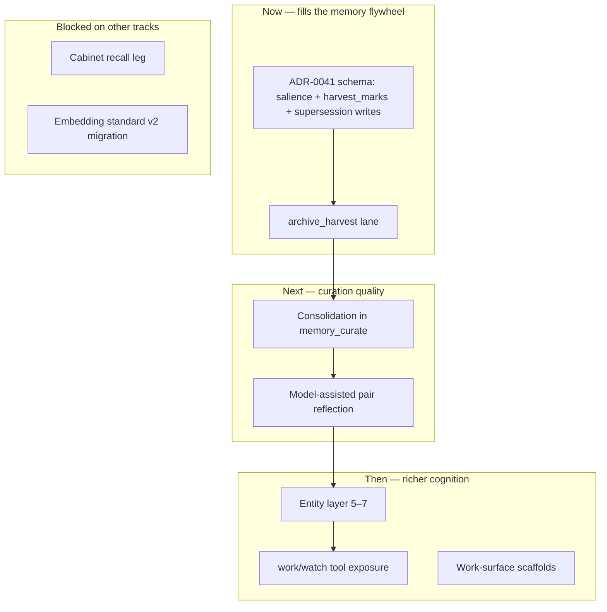

# Bear Memory — Remaining Work Plan

**Status:** Living dashboard (2026-06-17)  
**Purpose:** Single remaining-work picture for Bear memory/cognition — what is landed, what is open, and which detailed plan owns each track.  
**Hub:** [PLAN.md](PLAN.md) (platform-wide priorities)

Canonical architecture: [Memory model](../architecture/memory-model.md), [Den runtime — memory](../architecture/den-runtime.md#memory-model-under-sqlite), [ADR-0031](../decisions/adr-0031-sqlite-first-canonical-store-for-bear-agent-memory-and-tasks.md) (SQLite canonical), [ADR-0038](../decisions/adr-0038-platform-embedding-standard-and-derived-recall-index.md) (derived recall), [ADR-0041](../decisions/adr-0041-archival-recall-and-async-curation.md) (harvest/consolidation/salience), [ADR-0042](../decisions/adr-0042-memory-entity-relationships-and-bear-entity-layer.md) (entity layer).

---

## At a glance

| Track | Landed (high level) | Next unblocker | Canonical detail plan |
|---|---|---|---|
| **Canonical store + tools** | Per-Bear SQLite, logical paths, `pair`/`chat`/`curate` tools, admin + member memory UI | `work`/`watch` tool exposure | [MEMORY_TOOLS_IMPLEMENTATION_PLAN.md](MEMORY_TOOLS_IMPLEMENTATION_PLAN.md) |
| **Legacy memory import tooling** | `den import-legacy-memory`, git-dir + bundle, history/supersession import, fixture tests, bear-admin legacy bundle upload UI | Optional archived-bundle use only; no production migration required | [MEMFS_TO_SQLITE_ETL_IMPLEMENTATION_PLAN.md](MEMFS_TO_SQLITE_ETL_IMPLEMENTATION_PLAN.md) |
| **Derived recall index** | Qdrant optional stack, indexer worker, turn-start recall, hybrid `memory_search` (vector + keyword + graph + temporal), `den reindex` | Cabinet leg (blocked); embedding-standard migration | [DERIVED_RECALL_INDEX_IMPLEMENTATION_PLAN.md](DERIVED_RECALL_INDEX_IMPLEMENTATION_PLAN.md) |
| **Entity layer** | Schema, resolver, relations, access gate, entity-filter recall, graph leg, explicit anchors, read/write/governance tools, `session_info.entities` | Portability/export-import | [BEAR_ENTITY_LAYER_IMPLEMENTATION_PLAN.md](BEAR_ENTITY_LAYER_IMPLEMENTATION_PLAN.md) |
| **Reflection / automation** | `memory_curate` + `recall_index` workers; pair-reflection → proposal enqueue (ACP close) | Model-assisted pair reflection; `archive_harvest`; consolidation | [MEMORY_AUTOMATION_ROADMAP.md](MEMORY_AUTOMATION_ROADMAP.md) |
| **ADR-0041 schema + curation engine** | `valid_from`/`invalid_at`, `salience`, lifecycle/freshness indicators, harvest marks, archive-harvest lane, reviewed supersession writes | richer model-assisted harvest/consolidation quality | [ADR-0041](../decisions/adr-0041-archival-recall-and-async-curation.md), [MEMORY_CURATION_PLAN.md](MEMORY_CURATION_PLAN.md) |
| **Work-surface memory** | Resolver on entity layer; scaffolds in logical-path model | End-to-end scaffolding + resolution UX | [WORK_SURFACE_MEMORY_SCAFFOLDING_PLAN.md](WORK_SURFACE_MEMORY_SCAFFOLDING_PLAN.md), [WORK_SURFACE_RESOLUTION_IMPLEMENTATION_PLAN.md](WORK_SURFACE_RESOLUTION_IMPLEMENTATION_PLAN.md) |
| **Semantic memory schema (ADR-0022)** | Logical-path projection | Resource-scoped write paths, `plan` kind removal | [SEMANTIC_MEMORY_SCHEMA_IMPLEMENTATION_PLAN.md](SEMANTIC_MEMORY_SCHEMA_IMPLEMENTATION_PLAN.md) |

---

## What is landed

### Canonical memory (SQLite)

- Per-Bear SQLite store (`den-memory`): `memory_records`, proposals, promotions, observations, reflection outcomes, entity layer tables.
- Logical-path projection (`core/…`, `{profile}/…`, work-surface paths) — stable anchor UX over append-only rows.
- Single write path via `MemoryStoreManager`; bear-wide sequence allocator.
- Bi-temporal **event time** columns on `memory_records`: `valid_from`, `invalid_at` (additive migration; append sets `valid_from = created_at`).

### Memory tools (agents)

- Implemented for **`pair`**, **`chat`**, **`curate`**: `memory_write_entry`, `memory_status`, `memory_browse`, `memory_read`, `memory_search`, `memory_request_review`; curate review tools include proposal review/core update plus `memory_mark_lifecycle` for stale/superseded/archive-candidate/archive markers.
- **`chat`**: keyword-gated web tool surface; proactive key-memory projection + derived recall on every turn.
- **`memory_search`**: hybrid when Qdrant configured — vector + keyword + bounded-graph + temporal legs; role-scoped throughout.
- **Not exposed:** `work`, `watch` memory tool descriptors (read/write policy TBD).

### Operator / admin surfaces

- Admin hub memory stats; admin memory dashboard, search, browse, record detail (`/admin/bears/{id}/memory…`).
- Member-facing memory + entity browse at `/bear/{slug}/memory…` and `/bear/{slug}/entities…` (read; delete/review gated to bear admins).
- Recall diagnostics in admin when Qdrant enabled.

### MemFS → SQLite ETL

- **`den import-legacy-memory`**: `--bundle` | `--git-dir`, `--dry-run`, `--import-history`, `--include-workflow-artifacts`, `--report`.
- Idempotent re-import (commit+path metadata); branch→scope mapping (`talk` → `chat` profile); supersession chain when `--import-history`.
- Fixture tests in `den-memory/src/import.rs`.
- **Bear-admin UI:** multipart legacy bundle upload (`POST /bear/{slug}/memory/import-legacy`); disabled when bear already has memory (guard commit `e0eff97e`).
- This is retained for archived/ad hoc bundles only. There are no production Letta-runtime Bears to migrate.

### Derived recall index (ADR-0038)

- **Phases 0–3.5 + 5 landed** (see [DERIVED_RECALL_INDEX_IMPLEMENTATION_PLAN.md](DERIVED_RECALL_INDEX_IMPLEMENTATION_PLAN.md)).
- `recall_index` reflection lane + worker; `den reindex (--bear | --all)`.
- Turn assembler `## Recalled memory` (role-scoped, fail-open).
- **Deferred:** Cabinet `source_class=cabinet_passage` (no ingestion pipeline); `migrate-embedding-standard` (no v2 standard / alias plumbing).

### Entity layer (ADR-0042)

- **Phases 0–3 landed:** descriptors, entities/handles, resolver (work-surface first), two-table relations + `memory_links` view.
- **Phase 4 partial:** `AccessContext` fail-closed gate on projection; descriptive `entity_ids` in Qdrant payload; `search_bear_memory_for_entities`; bounded-graph leg + entity-overlap boost in `memory_search`.
- **Phases 5–6 landed/partial:** explicit entity anchors in projection, model/curate tools, `session_info.entities`; **Phase 7 open:** bear-package portability.

### Reflection / pair learning (partial)

- **P0 landed:** ACP close → pair summary + `memory_proposal` + queued `memory_curate` run.
- **`memory_curate` worker** processes queued runs (rule-based executor + optional native briefing turn).
- **`recall_index` worker** reconciles derived index after canonical writes.
- **Pending P0 UI:** surface generated proposal + queued curate run in product UI.

---

## Remaining work (priority order)

### 1. ADR-0041 canonical schema deltas — **unblocks harvest + consolidation**

Legacy memory migration readiness is retired: there are no production legacy-runtime Bears to migrate. `den import-legacy-memory` remains optional tooling for archived bundles, not a roadmap blocker.

---

Several ADR-0041 fields are still missing or not wired on the **write path**:

| Delta | Status | Notes |
|---|---|---|
| `valid_from` / `invalid_at` on `memory_records` | ✅ landed | Recall temporal leg uses them |
| `salience` on **`memory_records`** | ✅ landed | Append path defaults to `normal`; options path accepts `low|normal|high|critical` |
| `memory_harvest_marks` table | ✅ landed | Idempotent source provenance helpers in `den-memory` |
| **`supersedes_memory_id` writes** in curate/consolidation | ✅ landed | Reviewed core updates supersede the prior path head and invalidate predecessors; unsafe/questionable proposals defer or escalate |
| `invalid_at` on supersession | ✅ landed | Append options and reviewed core supersession set predecessor `invalid_at` |
| Freshness trend (derived `stable|strengthening|weakening|stale`) | 🟡 partial | Derived from lifecycle/supersession metadata in SQLite reads, admin/search, and recall payload scoring; deeper corroboration-based `strengthening` remains open |

**Exit:** migration applied; consolidation writes supersession; salience/lifecycle/freshness are readable for recall ranking.

**Plans:** [ADR-0041](../decisions/adr-0041-archival-recall-and-async-curation.md), [MEMORY_CURATION_PLAN.md](MEMORY_CURATION_PLAN.md).

---

### 2. Memory automation — **make pair learning reach `work` safely**

Target pipeline ([MEMORY_AUTOMATION_ROADMAP.md](MEMORY_AUTOMATION_ROADMAP.md)):

```text
pair learns → role-local SQLite → pair reflection → proposals
→ archive_harvest (closed sessions) → memory_curate → core / task context
→ work searches permitted recall scopes (never raw pair/)
```

| Priority | Item | Status |
|---|---|---|
| P0 | UI: show pair-reflection proposal + queued curate run | ◻ |
| P1 | Autonomous **curation conductor** (daily curate conversation, bounded context, approved tools only) | 🟡 worker exists; model-assisted review depth open |
| P2 | **Model-assisted pair reflection** (extract decisions/conventions vs deterministic last-N summary) | ◻ |
| P2.5 | **`archive_harvest` reflection lane** (extraction-first mining of closed sessions / compaction artifacts) | 🟡 lane + compaction-artifact harvest proposals landed; richer model extraction/quality filters open |
| P3 | Derived recall indexing | ✅ (`recall_index` + `den reindex`) |
| P4 | Semantic recall for **`work`** | 🟡 hybrid search exists; **`work` tool exposure** not done |
| — | **Consolidation** (dedup, supersede-on-contradiction, synthesize `reflection` records, promote to shared) | 🟡 reviewed supersession + unsafe-promotion gates landed; semantic dedup/synthesis open |

**Exit:** pair session → proposal → curate promotion → `work` finds it via `memory_search` without reading `pair/`.

---

### 3. Entity layer — **Phases 5–7**

| Phase | Work | Status |
|---|---|---|
| **5 — Anchors** | Generalize projection anchors to `core/people/…`, `core/missions/…`; explicit-anchor-only v1 projection | ✅ v1 landed; richer maintenance/derived fallback deferred |
| **6 — Tools + governance** | `entity_browse`, `entity_resolve`; descriptive relation writes from roles; `entity_merge`/`split` + access-rule writes **curate-only**; resolved entities in `session_info` | ✅ v1 landed |
| **7 — Portability** | Entity tables in cognition export; import re-links `canonical_ref`; access rules fail-closed until re-resolved | ◻ |

**Phase 4 follow-ups still open:**

- Vector-leg **entity overlap score boost** (graph leg has boost; vector primary ranking does not).
- **`applies_when` proactive surfacing** in key memory projection.
- Apply `AccessContext` with **real session identity** (today production passes `empty()` — correct fail-closed default).

**Plan:** [BEAR_ENTITY_LAYER_IMPLEMENTATION_PLAN.md](BEAR_ENTITY_LAYER_IMPLEMENTATION_PLAN.md).

---

### 4. Derived recall — **follow-ups & deferred legs**

| Item | Status | Blocker |
|---|---|---|
| Cabinet cross-corpus recall (`source_class=cabinet_passage`) | ◻ deferred | Cabinet ingestion pipeline ([ADR-0008](../decisions/adr-0008-cabinet-reading-pipeline.md)) |
| `migrate-embedding-standard` / `bears-embed-v2` | ◻ deferred | Second standard + Qdrant alias flip |
| Richer turn recall query (session focus / work surface, not raw human message) | ◻ | Topical work-surface field in assembler `client_context` |
| Persist `recall_diagnostic` to turn telemetry | ◻ | No turn-telemetry sink (diagnostic on `AssembledNativeTurn` + admin today) |
| Live end-to-end with real embedding API key | ◻ | Operator/smoke env |
| Recall ranking uses **`salience`** once on `memory_records` | ✅ landed | Vector payload carries salience and applies score multiplier; hits also carry lifecycle/freshness |
| **`supersedes_memory_id` in indexer head selection** (vs sequence-only heads) | ✅ landed | Reconcile indexes unsuperseded non-invalid heads and removes stale indexed ids |

**Plan:** [DERIVED_RECALL_INDEX_IMPLEMENTATION_PLAN.md](DERIVED_RECALL_INDEX_IMPLEMENTATION_PLAN.md).

---

### 5. Memory tools & profiles

| Item | Status |
|---|---|
| Grant **`work`** / **`watch`** memory read (and scoped write?) per policy | 🟡 read exposed; write remains policy-gated |
| Align [MEMORY_TOOLS](MEMORY_TOOLS_IMPLEMENTATION_PLAN.md) status table with landed hybrid recall + schema deltas |
| Resource-scoped semantic paths (`code/resources/…`) per [SEMANTIC_MEMORY_SCHEMA](SEMANTIC_MEMORY_SCHEMA_IMPLEMENTATION_PLAN.md) | ◻ |
| Work-surface scaffold creation on resolution ([WORK_SURFACE_MEMORY_SCAFFOLDING](WORK_SURFACE_MEMORY_SCAFFOLDING_PLAN.md)) | ◻ |

---

### 6. Platform cleanup shell

Cross-cutting cleanup items after retiring Letta/MemFS runtime paths:

- Retire `memfs_repo_path` / Letta naming in schema and UI after soak.
- Mark ADR-0031 accepted in docs when migration complete.

---

## Suggested sequencing



**Parallel safe:** entity Phase 5–6 can proceed alongside ADR-0041 schema work; archived-bundle MemFS import is optional and independent of harvest.

---

## Explicit non-goals (for this roadmap)

- **Letta archival memory / `.af` files** as canonical — rebuild vectors only via `recall_index` / `den reindex`.
- **MemFS ↔ SQLite dual-write** — one-time import + cutover.
- **Graph DB / RDF** — bounded record↔entity traversal at recall time only ([ADR-0042](../decisions/adr-0042-memory-entity-relationships-and-bear-entity-layer.md)).
- **Transcript auto-promotion** — harvest extracts; curate promotes.

---

## Related documents (detail plans)

| Document | Scope |
|---|---|
| [MEMORY_AUTOMATION_ROADMAP.md](MEMORY_AUTOMATION_ROADMAP.md) | Pair → curate → work pipeline, harvest, consolidation |
| [MEMORY_CURATION_PLAN.md](MEMORY_CURATION_PLAN.md) | `memory_curate` lane design, promotion rules |
| [MEMORY_TOOLS_IMPLEMENTATION_PLAN.md](MEMORY_TOOLS_IMPLEMENTATION_PLAN.md) | Agent-facing tool contracts |
| [DERIVED_RECALL_INDEX_IMPLEMENTATION_PLAN.md](DERIVED_RECALL_INDEX_IMPLEMENTATION_PLAN.md) | Qdrant index phases |
| [BEAR_ENTITY_LAYER_IMPLEMENTATION_PLAN.md](BEAR_ENTITY_LAYER_IMPLEMENTATION_PLAN.md) | Entity + relations |
| [MEMFS_TO_SQLITE_ETL_IMPLEMENTATION_PLAN.md](MEMFS_TO_SQLITE_ETL_IMPLEMENTATION_PLAN.md) | Legacy git → SQLite |
| [den-migration-backfill-and-rollback-plan.md](den-migration-backfill-and-rollback-plan.md) | Historical migration mechanics; not active roadmap work |
| [REFLECTION_SYSTEM_PLAN.md](REFLECTION_SYSTEM_PLAN.md) | Shared reflection infrastructure |

---

## Maintenance

When landing memory work:

1. Update the **At a glance** row and the relevant **Remaining work** checkbox in this file.
2. Update the **canonical detail plan** (do not duplicate long spec here).
3. Refresh [PLAN.md](PLAN.md) dashboard memory row if the platform priority order changes.
