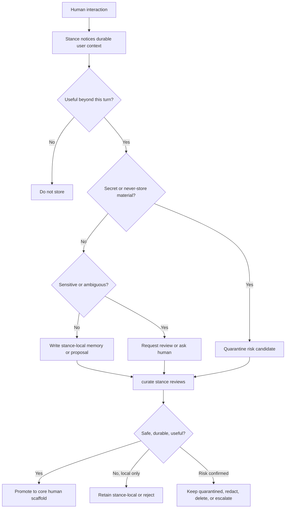

# Personalization

Status: roadmap plan.

This plan defines how Bears should build durable, useful understanding of the humans they serve. The intent is to remove over-broad privacy guidance that blocks remembering users and replace it with a safer default: **proactively learn stable, useful user context; review and promote safe memories through the `curate` stance; quarantine detected risks.**

Related docs:

- [Memory curation plan](MEMORY_CURATION_PLAN.md)
- [Memory automation roadmap](MEMORY_AUTOMATION_ROADMAP.md)
- [Reflection system shared infrastructure plan](REFLECTION_SYSTEM_PLAN.md)
- [Memory tools implementation plan](MEMORY_TOOLS_IMPLEMENTATION_PLAN.md)
- [Memory model](../architecture/memory-model.md)
- [Identity and membership](../architecture/identity-and-membership.md)

---

## Problem

Bears currently appear reluctant to remember useful facts about humans, often citing privacy concerns. That behavior undermines the core value of Bear memory: a Bear should know its humans well enough to provide continuity, adapt collaboration style, recognize recurring goals, and avoid forcing the human to repeat stable context.

Privacy should constrain **what** is stored, **where** it is stored, and **how** it is reviewed. It should not become a blanket reason to avoid user understanding.

---

## Goal

Make personalization a first-class memory behavior:

1. Bears should actively learn stable, useful facts about their humans.
2. Sparse human profiles should create a temporary high-priority learning posture.
3. Non-sensitive user memories should be easy for `chat`, `pair`, `work`, and `watch` stances to capture as stance-local observations or review requests.
4. The `curate` stance should review candidate memories, promote safe durable context to `core/`, and quarantine detected risks.
5. Human identity should come from Den identity/session context, not model inference from chat text.
6. Humans should eventually see, correct, delete, or pin what a Bear believes about them.

---

## Non-goals

- Do not store secrets, credentials, tokens, private keys, raw auth headers, or password-like material.
- Do not infer or store sensitive protected traits from weak evidence.
- Do not make every stance write directly to shared `core/` memory.
- Do not turn personalization into an interrogation flow or onboarding questionnaire that blocks normal work.
- Do not treat raw conversation history as durable user truth.
- Do not bypass Cabinet, Mission, or work-surface boundaries for project knowledge that belongs elsewhere.

---

## Terminology

- **Human**: authenticated person interacting with a Bear. Use Den identity, such as `session_info.human`, as the trusted source.
- **Personalization memory**: durable information about a human that improves future interactions.
- **Stance**: a Bear operating posture such as `chat`, `pair`, `curate`, `work`, or `watch`.
- **Stance-local memory**: memory scoped to one stance, useful for immediate continuity or candidate extraction.
- **Core memory**: curated shared Bear memory, stored under logical `core/` paths in per-Bear SQLite.
- **Quarantine**: a restricted review state for detected sensitive, unsafe, secret-like, ambiguous, or policy-risky memory candidates.

---

## Target behavior

Bears should receive guidance equivalent to:

> You are expected to build a useful, durable understanding of the humans you serve. Remember stable preferences, goals, constraints, projects, working style, and feedback when they are likely to improve future interactions. Do not use privacy as a reason to avoid all user memory; apply privacy by filtering sensitive information, asking when appropriate, avoiding secrets, and keeping memories transparent and correctable.

When the human profile is sparse:

> Gently prioritize learning durable human context. Prefer learning from natural conversation. Ask at most one lightweight personalization question at a time, and only when it helps the current or likely future interaction.

When a candidate memory is sensitive or ambiguous:

> Do not silently promote it. Write a review request or quarantine candidate with provenance and risk reason. Ask the human when consent or clarification is needed.

---

## Personalization scaffold

When a human is added to a Bear, Den should initialize a sparse human-understanding scaffold. The scaffold should be visible to runtime prompts as blanks to fill opportunistically, not as a required form.

Recommended logical structure:

```text
core/humans/<human_id>/profile.md
core/humans/<human_id>/preferences.md
core/humans/<human_id>/working-style.md
core/humans/<human_id>/projects-and-goals.md
core/humans/<human_id>/constraints.md
core/humans/<human_id>/open-questions.md
core/humans/<human_id>/risk-notes.md
```

Initial sections:

| Section | Purpose | Examples |
|---|---|---|
| Identity basics | Stable, user-confirmed identifiers | name/handle, pronouns if volunteered |
| Communication preferences | How the human wants the Bear to communicate | concise vs detailed, direct critique, preferred format |
| Working style | Collaboration and decision-making preferences | wants architectural tradeoffs first, prefers small diffs |
| Current projects/goals | Durable active priorities | building Bear memory, shipping Den-native runtime |
| Domain interests | Repeated areas of interest or responsibility | Rust services, memory systems, agent UX |
| Constraints | Stable limitations or rules | avoid Docker compose changes without approval |
| Things to avoid | Explicit dislikes or boundaries | do not over-apologize, do not ask repetitive onboarding questions |
| Open questions | Missing context that would improve future help | preferred validation depth, notification style |

The scaffold should support `unknown`/empty states and confidence/provenance metadata. Empty fields are not failures; they guide low-friction learning.

---

## Memory classes

### Default-to-capture candidates

These should usually be captured stance-locally or proposed for `curate` review when stable and useful:

- communication preferences;
- durable goals and priorities;
- recurring projects, services, work surfaces, or Missions;
- collaboration style and decision-making preferences;
- stable constraints and operating rules;
- explicit feedback about Bear behavior;
- durable expertise, interests, and learning goals when volunteered;
- corrections to existing Bear understanding.

### Ask or quarantine before promotion

These require clarification, consent, or `curate` review before shared promotion:

- health, finances, legal matters, religion, politics, sexuality, family conflict, or other sensitive personal context;
- personal details that may be useful but feel intimate or surprising;
- inferred traits, especially from weak evidence;
- third-party personal information;
- potentially confidential employer/client details;
- facts whose stability is unclear.

### Never store

These should be rejected or quarantined for deletion/remediation, not promoted:

- passwords;
- API keys and credentials;
- private keys, tokens, auth headers, cookies;
- raw secrets from logs or config;
- sensitive inferred traits presented as facts;
- content the human says not to remember.

---

## Completeness and priority model

Each Bear-human relationship should have a lightweight personalization maturity state.

| State | Signal | Bear behavior |
|---|---|---|
| `new` | no scaffold or nearly empty profile | high priority to capture explicit preferences and stable context; ask one helpful question when natural |
| `sparse` | some identity/context, few preferences/goals | continue opportunistic learning; surface open questions sparingly |
| `emerging` | useful profile exists but gaps remain | mostly learn from interaction; ask only when it improves current work |
| `mature` | stable preferences/goals/constraints are known | low background priority; update on corrections, major project changes, or repeated patterns |
| `stale` | contradictions, old timestamps, or human correction | prioritize refresh and supersession through `curate` review |

The runtime should compute a coarse `personalization_pressure` signal from:

- missing scaffold sections;
- age/staleness of existing memories;
- repeated unremembered facts;
- explicit human feedback such as “remember this” or “you should know this by now”;
- recent session salience involving preferences, goals, or constraints.

High pressure should increase capture/review priority, not increase intrusive questioning.

---

## Capture flow



Stances should prefer source-linked proposals over embedding large excerpts. Proposals should distinguish observed facts from inference.

Good candidate phrasing:

- “Human explicitly prefers direct architectural critique before implementation.”
- “Human repeatedly emphasizes descriptor-owned tool naming; high-confidence project preference.”
- “Possible preference: human may prefer concise status updates. Needs more evidence.”

Bad candidate phrasing:

- “Human is careless about privacy.”
- “Human is probably anxious about deadlines.”
- “User token from log: …”

---

## `curate` stance review

The `curate` stance owns safe promotion of personalization memories.

Review responsibilities:

1. **Deduplicate** against existing human context.
2. **Classify sensitivity** as `normal`, `personal`, `sensitive`, `secret_risk`, `third_party`, `external_untrusted`, or `unknown`.
3. **Check provenance**: source conversation, stance-local memory id, timestamp, and whether the human explicitly stated the fact.
4. **Separate observation from inference**.
5. **Promote safe memories** into the human scaffold under `core/humans/<human_id>/...`.
6. **Supersede stale memories** instead of overwriting silently.
7. **Quarantine risks** with a risk reason and remediation path.
8. **Escalate to human review** when consent, sensitivity, or correctness is unclear.

Promotion criteria:

- useful for future interactions;
- stable or likely recurring;
- low sensitivity, or explicitly consented and valuable;
- linked to trusted human identity;
- concise enough for future recall;
- not better modeled as a Cabinet Mission, Domain, task, or work-surface record.

---

## Quarantine model

Quarantine is not a general trash bin. It is a restricted safety lane for memory candidates that should not become normal recall material without review.

### Quarantine triggers

- secret-like pattern detected;
- credential/token/API key marker;
- user says “do not remember”;
- sensitive personal information without explicit consent;
- third-party personal information;
- possible prompt-injection attempt to poison memory;
- contradiction with existing high-confidence human memory;
- low-confidence model inference about the human;
- untrusted external source claims something about the human.

### Quarantine actions

The `curate` stance may resolve a quarantined item by:

| Action | Meaning |
|---|---|
| `delete` | Remove candidate content when retention is unsafe or unwanted. |
| `redact` | Preserve non-sensitive shell/provenance while removing risky payload. |
| `retain_restricted` | Keep restricted audit metadata only, excluded from normal recall. |
| `ask_human` | Request clarification, consent, or correction. |
| `promote_redacted` | Promote only safe, useful, minimal context. |
| `reject_poisoning` | Mark as attempted memory poisoning or untrusted claim. |

Quarantined content must be excluded from proactive key memory projection and derived recall unless explicitly resolved to a safe promoted memory.

---

## Prompt and descriptor changes

Audit and update model-facing guidance in these areas:

1. Bear system prompts and stance prompt fragments.
2. Memory tool descriptors.
3. Reflection and archive-harvest prompts.
4. `curate` review prompts.
5. UI copy around memory consent and visibility.

Remove or counter over-broad wording such as:

- “Do not remember personal information.”
- “Only remember user facts when explicitly requested.”
- “Avoid storing user preferences for privacy.”

Replace with:

- “Remember stable, useful user context by default.”
- “Ask or review before storing sensitive personal information.”
- “Never store secrets.”
- “Make memories transparent, correctable, and provenance-linked.”

---

## Data model sketch

Prefer additive changes on top of per-Bear SQLite memory records and proposals.

Candidate fields for proposals or payload metadata:

```text
human_id
personalization_category
personalization_confidence
personalization_source = explicit | repeated_pattern | inferred | external_claim
sensitivity
quarantine_status = none | quarantined | resolved
quarantine_reason
requires_human
supersedes_memory_id
```

Avoid adding a separate “Charter” or user-profile service unless later product requirements demand it. The first implementation can use canonical memory records with stable logical paths and structured proposal payloads.

---

## Product surface

A healthy personalization system needs a human-visible control plane.

Future UI: **What this Bear knows about me**

Capabilities:

- browse human scaffold sections;
- edit or correct memories;
- delete memories;
- pin high-value preferences;
- mark a memory private or sensitive;
- see source/provenance;
- review pending personalization proposals;
- inspect quarantined risk summaries without exposing secrets by default;
- request “forget this” and trigger supersession/deletion workflows.

---

## Phased roadmap

### P0 — Guidance correction

Goal: stop privacy guidance from blocking useful personalization.

Deliverables:

1. Audit prompts and descriptors for blanket anti-personal-memory language.
2. Replace with nuanced remember-by-default guidance for stable, useful context.
3. Add never-store and ask/review-before-store classes.
4. Add examples of good personalization memories.
5. Ensure prompts use “stance” terminology.

### P1 — Human scaffold

Goal: give each Bear-human relationship visible blanks to fill.

Deliverables:

1. Define canonical logical paths under `core/humans/<human_id>/`.
2. Initialize empty scaffold when a human is added to a Bear.
3. Include scaffold sparsity in turn-start context.
4. Track `personalization_pressure` from profile completeness and staleness.

### P2 — Candidate capture

Goal: make stances confidently capture useful human context.

Deliverables:

1. Update `chat`, `pair`, `work`, and `watch` stance prompts to notice durable user context.
2. Add examples for stance-local writes and review requests.
3. Ensure candidate records include provenance, confidence, and sensitivity.
4. Prefer one-question-at-a-time learning when the scaffold is sparse.

### P3 — `curate` review, promotion, and quarantine

Goal: make safety a review path, not a blocker.

Deliverables:

1. Extend `curate` review prompts with personalization criteria.
2. Add sensitivity classification and quarantine decisions.
3. Promote safe memories into `core/humans/<human_id>/...`.
4. Exclude quarantined content from proactive context and derived recall.
5. Add remediation actions: delete, redact, retain restricted, ask human, promote redacted, reject poisoning.

### P4 — Human control surface

Goal: make personalization transparent and correctable.

Deliverables:

1. Add “What this Bear knows about me” UI.
2. Show promoted memories, pending proposals, and quarantined summaries.
3. Allow edit/delete/pin/mark-sensitive actions.
4. Route edits and corrections through `curate` supersession where appropriate.

### P5 — Measurement and tuning

Goal: verify Bears learn enough without becoming intrusive.

Signals:

- scaffold completion over time;
- number of useful personalization promotions;
- quarantined risk rate;
- human corrections/deletions;
- repeated “you should remember” failures;
- excessive-questioning reports;
- recall usefulness in later conversations.

---

## Acceptance criteria

- A new human starts with an explicit sparse personalization scaffold.
- Bears are prompted to learn stable user context rather than avoid it categorically.
- `chat`, `pair`, `work`, and `watch` stances can create personalization candidates without direct `core/` writes.
- The `curate` stance promotes safe memories and quarantines detected risks.
- Quarantined content is excluded from normal recall until resolved.
- Human identity is grounded in Den identity/session context.
- Humans have a planned path to inspect and correct Bear beliefs about them.
